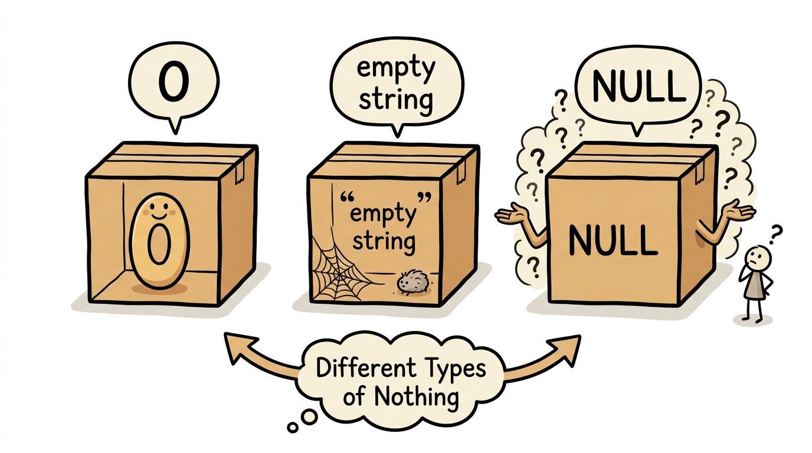
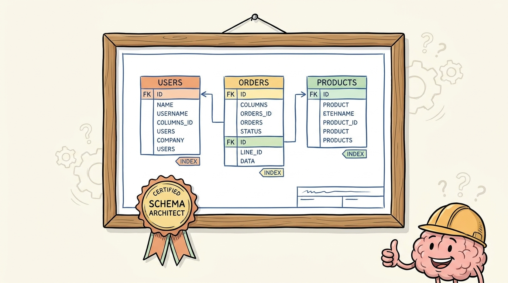

# Crash Course Overview

## SQL Fundamentals in 10 Minutes (or: The Top 10% That Does 90% of the Work)

> 🏷️ Start Here

---

**Read time:** ~10 min


*Ten days of SQL, distilled to the moves you'll actually use.*

> 🎙️ Welcome to Module 0 -- the very beginning. If you've never touched a database before, perfect. If you've used spreadsheets, even better -- because you already understand more than you think. We're about to learn how to talk to databases using a language called SQL, and by the end of this module, you'll have created your first database, built a table, stuffed data into it, and asked it questions. Let's go.

This crash course is the highlight reel. The full 10-day course walks you through every keyword, every gotcha, and every exercise. Here, we're hitting only the beats that come up in nearly every real query you'll ever write: tables and constraints, SELECT with WHERE, GROUP BY with aggregates, JOINs, and the optimization habits that separate hobby SQL from professional SQL.

---

## Tables are filing cabinets, not cardboard boxes


*Database = cabinet. Table = drawer. Row = folder.*

> 🎙️ Think of it this way. You wouldn't just dump a thousand paper records into a cardboard box and call it "organized." You'd file them into labeled folders, in labeled drawers, in a cabinet. A relational database does the same thing -- but digitally, and with the ability to search through millions of records in milliseconds.

A relational database is just a collection of tables. Tables have columns (the labeled fields) and rows (the actual records). Once you see the cabinet, the rest of SQL is just learning the language for opening drawers, reading folders, and putting new ones in.

---

## Constraints are the database's safety net


*Constraints are bouncers. They keep bad data out before it can hurt you.*

> 🎙️ Here's the mindset shift. Without constraints, YOU are responsible for making sure every piece of data is valid -- every time, forever. With constraints, the DATABASE is responsible. It never gets tired, it never forgets to check, and it never lets bad data slip through because it's Friday afternoon and everyone wants to go home. Constraints are your safety net. Use them generously.

When you `CREATE TABLE`, declare types (INTEGER, TEXT, REAL), mark required columns `NOT NULL`, point at parents with `FOREIGN KEY`, and pick a `PRIMARY KEY`. The database will then refuse to accept garbage on your behalf -- forever.

---

## SELECT picks the columns, WHERE filters the rows


*WHERE is a funnel. Comparisons in, matching rows out.*

> 🎙️ The WHERE clause is where SQL goes from "show me a table" to "answer my question." Every comparison operator gives you a different way to slice the data. Equal, not equal, greater than, less than -- these are the fundamental building blocks of every filter you'll ever write.

```sql
SELECT first_name, last_name, gpa
FROM students
WHERE major = 'CS' AND gpa >= 3.5;
```

That's the shape of nearly every query you'll write: pick the columns, name the table, filter the rows. Layer on `BETWEEN`, `IN`, and `LIKE` for ranges, lists, and fuzzy text -- but `SELECT ... FROM ... WHERE` is the spine.

---

## NULL is not zero, and it will bite you


*NULL means "I don't know." It is not zero, not empty string, not false.*

> 🎙️ NULL will bite you if you're not careful. It's not zero, it's not an empty string, it's not false -- it's the complete absence of data. And because of that, normal comparison operators don't work with it. You must use IS NULL and IS NOT NULL. Burn this into your brain. You will forget it at least once, spend twenty minutes debugging, and then remember this warning.

`column = NULL` will silently match nothing. Always reach for `IS NULL` or `IS NOT NULL`. This is the single most common gotcha in SQL, and now you've been warned.

---

## Aggregates zoom out from rows to patterns


*Aggregates turn lookup queries into analysis queries.*

> 🎙️ Five functions, five superpowers. COUNT tells you "how many." SUM tells you "how much total." AVG tells you "what's typical." MIN and MAX tell you "what are the extremes." Individually, they're useful. Combined -- and especially combined with GROUP BY, which we'll cover next -- they're transformative.

`GROUP BY` slices the table into buckets, and the aggregate runs once per bucket. "Average GPA per major" is a one-liner: `SELECT major, AVG(gpa) FROM students GROUP BY major;`. That's the move that turns SQL from a lookup tool into a reporting tool.

---

## WHERE for rows, HAVING for groups


*WHERE filters rows. HAVING filters the groups that come out of GROUP BY.*

> 🎙️ WHERE versus HAVING is probably the single most asked-about distinction in SQL. Here's the easy way to remember it: if you can point to the value in a single row of the original table, use WHERE. If you need to calculate the value across multiple rows first -- like a count or an average -- use HAVING. WHERE for rows, HAVING for groups. Tattoo it on your arm if you have to.

That's the entire rule. `WHERE gpa > 3.5` (a row value) versus `HAVING COUNT(*) > 10` (a calculated group value). Once it clicks, it stays clicked.

---

## JOINs are the whole point of relational databases


*One table at a time is one chapter. Joins let you read the whole book.*

> 🎙️ Welcome to Module 6, and honestly? This is the one. If there's a single concept that separates someone who "knows a little SQL" from someone who actually gets relational databases, it's joins. Everything you've done so far has been querying one table at a time. That's like reading one chapter of a book and saying you've read the whole thing. Joins let you read the whole story.

Data lives in separate tables on purpose -- one fact, one place. `INNER JOIN` returns only matched rows. `LEFT JOIN` keeps everything from the left table even when there's no match on the right. Master those two and you handle the overwhelming majority of joins you'll ever write.

> 🎙️ Don't stress about RIGHT JOIN or FULL OUTER JOIN too much. RIGHT JOIN is just a LEFT JOIN with the tables swapped, and FULL OUTER JOIN is rare in the wild. If you master INNER JOIN and LEFT JOIN, you'll handle 95% of the joins you'll ever write. The other 5%? You'll Google them and be fine.

---

## Indexes are trade-offs, not free speed


*Indexes make reads faster and writes slower. Pick your spots.*

> 🎙️ Indexing is about trade-offs. Every index you create makes reads faster and writes slower. The art is finding the columns where the read benefit far outweighs the write cost. In most applications, that's your WHERE columns, your JOIN columns, and your ORDER BY columns.

You don't change a single query to use an index -- the database optimizer picks it up automatically. Use `EXPLAIN QUERY PLAN` to confirm: `SCAN` means it's reading the whole table, `SEARCH USING INDEX` means it's taking the shortcut.

---

## Where to next


*The full course turns these beats into hands-on muscle memory.*

> 🎙️ You've gone from zero to a solid foundation in SQL. That's not a small thing. Databases are everywhere -- behind every website, every app, every system that stores and retrieves information. You now speak their language. Go build something.

That's the top 10% -- the moves that show up in nearly every real query. From here, walk through the 10 modules in order: each one drills one beat into muscle memory with exercises, gotchas, and a quiz. By the end of Module 9 you'll be designing normalized schemas, optimizing with indexes, and defending against SQL injection. See you in Module 0.
