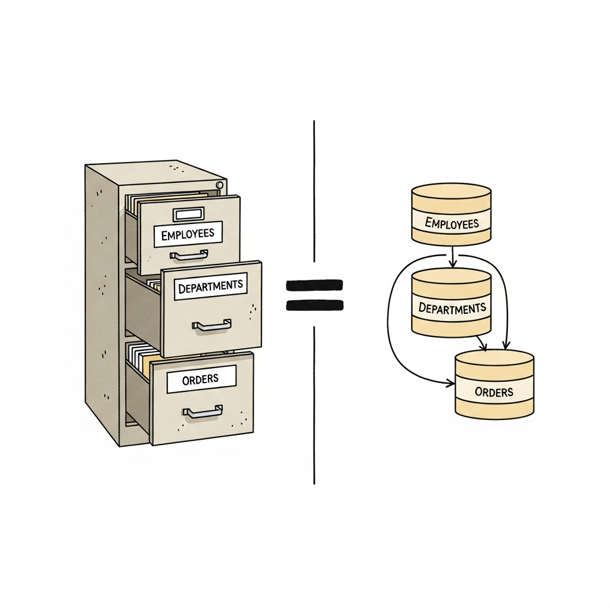
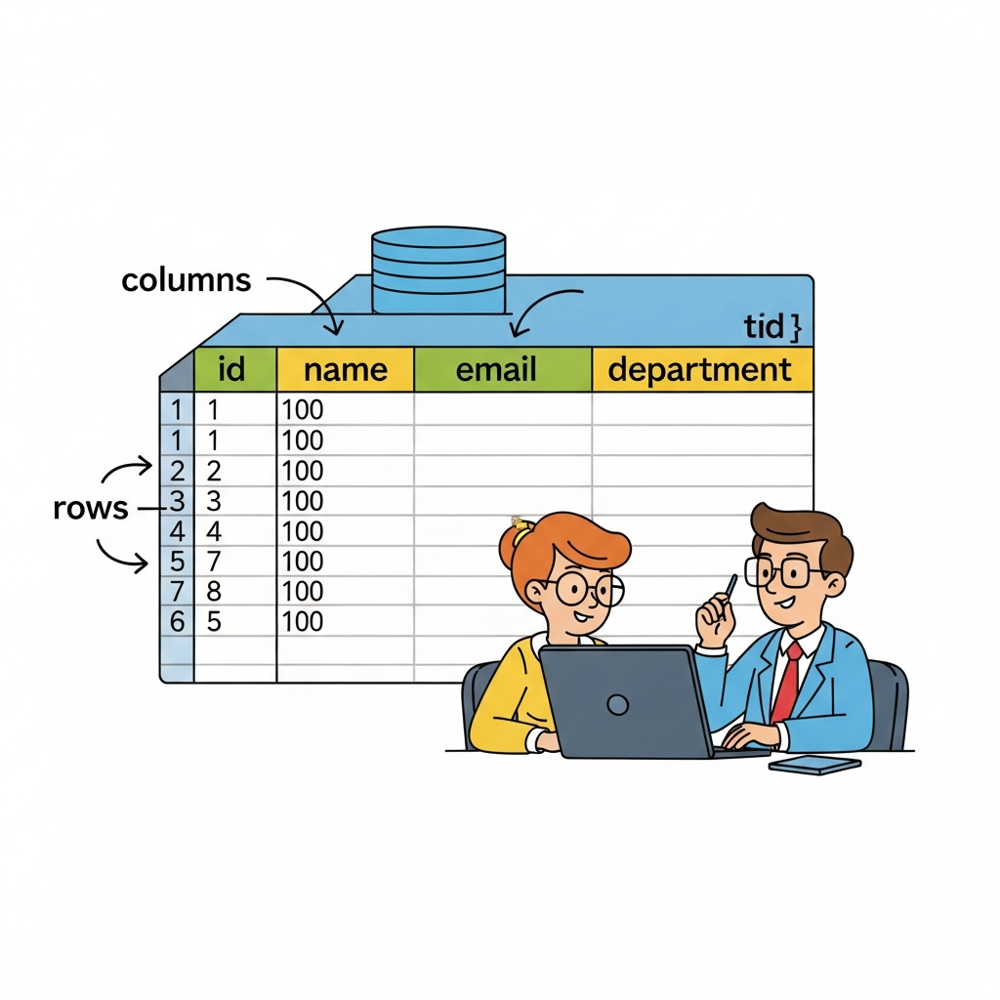
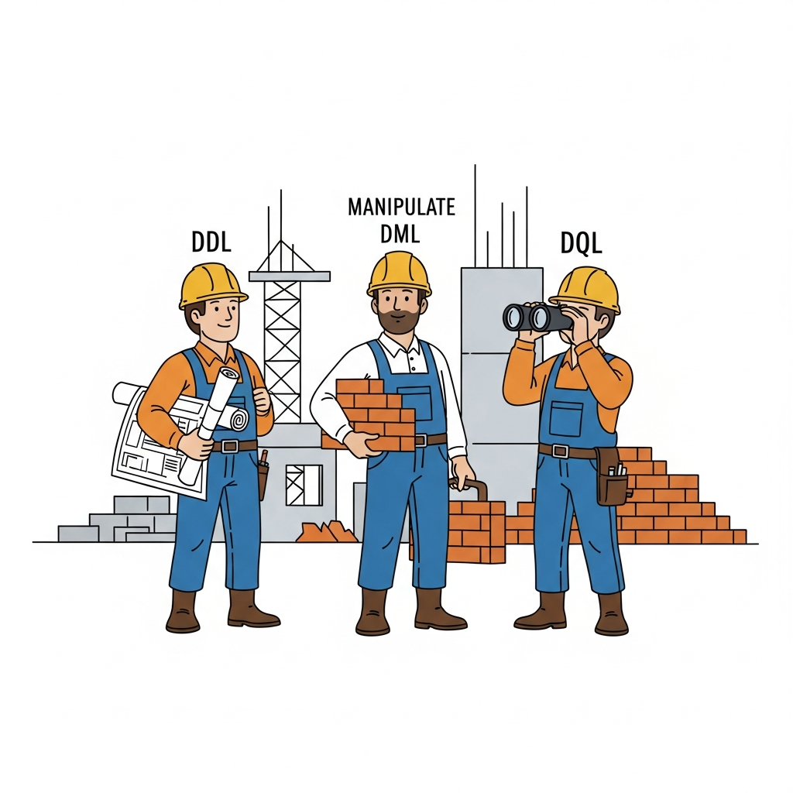

# Module 0: What Is SQL?

## Your Database Journey Starts Here (or: How to Talk to a Very Organized Robot)

> 🏷️ Start Here

---


*Welcome to the world of databases. Don't worry -- they're friendlier than they look.*

> 🎯 **Teach:** SQL is a language that lets you communicate with databases -- structured collections of data organized into tables.
> **See:** The big picture of what a database is, why it matters, and what SQL actually does.
> **Feel:** Excited and reassured that this is learnable, practical, and immediately useful.

> 🎙️ Welcome to Module 0 -- the very beginning. If you've never touched a database before, perfect. If you've used spreadsheets, even better -- because you already understand more than you think. We're about to learn how to talk to databases using a language called SQL, and by the end of this module, you'll have created your first database, built a table, stuffed data into it, and asked it questions. Let's go.

---

## So what IS a database, anyway?

> 🎯 **Teach:** A relational database is just an organized collection of tables -- like a filing cabinet full of well-labeled spreadsheets.
> **See:** The analogy between spreadsheets (familiar) and database tables (new), and the jump from filing cabinets to RDBMS software.
> **Feel:** A moment of "oh, I already get the basic idea."

> 🔄 **Where this fits:** This is the foundation. Everything else in this course -- creating tables, querying data, joining tables together -- builds on understanding what a database actually is.

You already know what a database is. Seriously.

Ever used a spreadsheet? You've got columns across the top (Name, Age, Email) and rows going down (one row per person). That's basically a table. A **relational database** is a collection of these tables, stored in a structured way so you can ask questions about the data.

Here's the mental model:

- **A filing cabinet** = a database
- **Each drawer** = a table
- **The labels on the drawer** = column names (fields)
- **Each folder in the drawer** = a row (one record)


*If you can organize a filing cabinet, you can understand a database.*

The software that manages all of this is called a **Relational Database Management System** -- RDBMS for short. Examples include SQLite, MySQL, PostgreSQL, Microsoft SQL Server, and Oracle. They all speak the same basic language: SQL.

> 🎙️ Think of it this way. You wouldn't just dump a thousand paper records into a cardboard box and call it "organized." You'd file them into labeled folders, in labeled drawers, in a cabinet. A relational database does the same thing -- but digitally, and with the ability to search through millions of records in milliseconds.

---

## Tables: The Heart of Everything

> 🎯 **Teach:** Tables have columns (what kind of data) and rows (the actual data) -- exactly like a spreadsheet, but with rules.
> **See:** A concrete employees table with columns and rows, side by side with how it would look in a spreadsheet.
> **Feel:** Comfortable that tables are just structured grids of information.

Let's make this concrete. Here's a table called `employees`:

| id | first_name | last_name | department | salary |
|----|-----------|-----------|------------|--------|
| 1  | Alice     | Johnson   | Engineering | 85000.00 |
| 2  | Bob       | Smith     | Marketing   | 62000.00 |
| 3  | Carol     | Williams  | Engineering | 91000.00 |
| 4  | David     | Brown     | Sales       | 57000.00 |
| 5  | Eve       | Davis     | Marketing   | 68000.00 |

Look familiar? It should. It's a spreadsheet. The only differences are:

- **Columns** define the *type* of data (text, numbers, dates)
- **Rows** are individual records (one per employee)
- There are **rules** about what data is allowed (we'll get to those in Module 1)
- You can have **multiple tables** that relate to each other (that's the "relational" part)


*Columns define the structure. Rows hold the data. You already knew this.*

> 💡 **Remember this one thing:** A database table = columns (the structure) + rows (the data). If you can read a spreadsheet, you can read a table.

---

## Enter SQL: Speaking Database

> 🎯 **Teach:** SQL is the language you use to talk to databases -- it lets you create structures, put data in, and ask questions about it.
> **See:** The three categories of SQL commands (DDL, DML, DQL) as different types of conversations you can have with a database.
> **Feel:** Intrigued that one language can do so many different things, and that the categories make intuitive sense.

OK, so databases store data in tables. Great. But how do you actually *interact* with them?

You use **SQL** -- Structured Query Language. Think of it as the language your database speaks. You type SQL commands, and the database responds.

Here's the cool part: all SQL commands fall into just three categories. Think of them as three types of conversations:

### The Three Flavors of SQL

| Category | Full Name | What It Does | You're Saying... |
|----------|-----------|-------------|------------------|
| **DDL** | Data Definition Language | Create and modify the structure | "Build me a table that looks like THIS" |
| **DML** | Data Manipulation Language | Add, change, or remove data | "Put this data IN / change it / take it OUT" |
| **DQL** | Data Query Language | Ask questions about data | "Show me the data WHERE..." |


*DDL builds the container. DML fills it up. DQL lets you peek inside.*

Some concrete examples:

```sql
-- DDL: Building structure
CREATE TABLE employees (...);
ALTER TABLE employees ADD COLUMN phone TEXT;
DROP TABLE old_stuff;

-- DML: Working with data
INSERT INTO employees VALUES (...);
UPDATE employees SET salary = 90000 WHERE id = 1;
DELETE FROM employees WHERE id = 5;

-- DQL: Asking questions
SELECT * FROM employees;
SELECT first_name FROM employees WHERE department = 'Engineering';
```

> 🎙️ Here's a way to remember the three categories. DDL is the architect -- it designs the building. DML is the moving crew -- it puts stuff in, rearranges it, and takes stuff out. DQL is the detective -- it asks questions and finds answers. Architect, movers, detective. That's all of SQL.

Don't worry about memorizing syntax right now. We'll build that muscle one piece at a time across this entire course. Right now, just understand that SQL is *how you talk to databases*, and it comes in three flavors.

---

## Why SQLite? (And What Are the Alternatives?)

> 🎯 **Teach:** SQLite is the simplest way to learn SQL because it requires zero setup -- your entire database is a single file.
> **See:** The comparison between SQLite (lightweight, file-based) and the "big" databases (MySQL, PostgreSQL) that require servers.
> **Feel:** Relieved that you don't need to install a server or configure anything complicated.

There are many database systems out there, and they all speak SQL. So why are we using SQLite?

**Because it's the easiest one to start with.** Period.

| Feature | SQLite | MySQL | PostgreSQL |
|---------|--------|-------|------------|
| Setup | No server needed -- single file | Requires server installation | Requires server installation |
| Use case | Learning, prototyping, mobile apps | Web applications | Enterprise, complex apps |
| Concurrency | Limited (file-level locking) | Good | Excellent |
| Data types | Flexible (type affinity) | Strict | Strict |
| Your database is... | A single `.db` file | Running on a server | Running on a server |

With MySQL or PostgreSQL, you'd spend the first 30 minutes installing a server, configuring users, setting up passwords, and troubleshooting connection issues. With SQLite, you type one command and you're in.

```bash
sqlite3 my_database.db
```

That's it. That command creates a database file (if it doesn't exist) and drops you into the SQLite shell. No server. No passwords. No configuration. Just you and your data.

> 🎙️ Real talk -- the SQL you learn with SQLite works in MySQL, PostgreSQL, and everywhere else. The language is the same. So we're using the simplest tool to learn the universal skill. Once you know SQL, switching databases later is like switching from driving an automatic to a manual -- same road, same rules, just a few different controls.

> 💡 **Remember this one thing:** SQLite is not a "toy" database. It's used in every iPhone, every Android phone, every web browser, and most embedded systems. It just happens to also be the easiest way to learn SQL.

---

## The SQLite Shell: Your Command Center

> 🎯 **Teach:** The SQLite shell has two kinds of commands -- SQL statements (ending with semicolons) and dot-commands (starting with a period) for shell control.
> **See:** The distinction between SQL (talks to the database) and dot-commands (talks to the shell itself).
> **Feel:** Confident about navigating the SQLite shell without getting lost.

When you open `sqlite3`, you get a prompt that looks like this:

```
sqlite>
```

This is the **SQLite shell** -- your command center. There are two types of things you can type here:

### 1. SQL Statements
These talk to the **database**. They end with a semicolon (`;`).

```sql
SELECT * FROM employees;
CREATE TABLE pets (id INTEGER, name TEXT);
```

### 2. Dot-Commands
These talk to the **shell itself**. They start with a period (`.`) and do NOT use semicolons.

```
.help        -- Show all available dot-commands
.tables      -- List all tables in the database
.schema      -- Show the CREATE TABLE statements
.headers on  -- Display column headers in query output
.mode column -- Format output in aligned columns
.quit        -- Exit the SQLite shell
```

> **Watch it!** If you type a SQL statement and forget the semicolon, SQLite will show `...>` on the next line -- it's waiting for you to finish the statement. Just type `;` and hit Enter to complete it. This trips up *everyone* at first.

```
sqlite> SELECT * FROM employees
   ...> ;
```

> 🎙️ Here's a common gotcha. You type a query, hit Enter, and... nothing happens. Just a weird `...>` prompt staring at you. Don't panic. You just forgot the semicolon at the end. Type a semicolon, hit Enter, and your query will run. Every single person learning SQL hits this at least once. Now you know the fix.

---

## 🗨️ There Are No Dumb Questions

> 🎯 **Teach:** Address the most common beginner anxieties about databases and SQL head-on.
> **See:** Reassuring answers to the questions most beginners are too embarrassed to ask.
> **Feel:** Relief and confidence that these are normal questions with simple answers.

**Q: Do I need to be good at math to use SQL?**

A: Nope. SQL is about organizing and retrieving data, not calculus. If you can say "show me all employees in Marketing," you can write SQL. The hardest math you'll do in this course is addition and comparison (greater than, less than).

**Q: Is SQL a "real" programming language?**

A: It depends on who you ask, and it honestly doesn't matter. SQL is a **domain-specific language** -- it's designed specifically for working with data. You won't build a video game with it, but you *will* use it in almost every software job that exists. It's one of the most in-demand skills in tech, period.

**Q: Will my data disappear when I close the terminal?**

A: No! That's the beauty of SQLite. Your database is a file on disk (like `day01.db`). Close the terminal, reopen it, run `sqlite3 day01.db`, and all your data is still there. That file IS your database.

**Q: What if I mess something up?**

A: You will, and that's fine. This is a learning environment. You can always delete the `.db` file and start fresh, or use `DROP TABLE` to remove a table and recreate it. Breaking things is one of the best ways to learn how things work.

**Q: What's the difference between SQL and SQLite?**

A: SQL is the *language*. SQLite is one specific *database system* that speaks that language. It's like the difference between "English" and "a person who speaks English." MySQL and PostgreSQL are other database systems that also speak SQL.

---

## Let's Do This: Your First Database

> 🎯 **Teach:** Walk through creating a database, building a table, inserting data, and querying it -- the complete lifecycle.
> **See:** The full sequence from empty terminal to actual data appearing on screen.
> **Feel:** The thrill of making a database do something real for the first time.

Enough theory. Let's build something.

### Step 1: Open SQLite and Create a Database

Open your terminal and type:

```bash
sqlite3 day01.db
```

You should see something like:

```
SQLite version 3.45.1 2024-01-30 16:01:20
Enter ".help" for usage hints.
sqlite>
```

Congratulations -- you just created a database. The file `day01.db` now exists on your computer. It's empty, but it's real.

### Step 2: Create a Table

Let's create that `employees` table:

```sql
CREATE TABLE employees (
    id INTEGER PRIMARY KEY,
    first_name TEXT,
    last_name TEXT,
    department TEXT,
    salary REAL
);
```

Now verify it exists:

```
sqlite> .tables
employees
sqlite> .schema employees
CREATE TABLE employees (
    id INTEGER PRIMARY KEY,
    first_name TEXT,
    last_name TEXT,
    department TEXT,
    salary REAL
);
```

### Step 3: Insert Some Data

```sql
INSERT INTO employees (first_name, last_name, department, salary)
VALUES ('Alice', 'Johnson', 'Engineering', 85000.00);

INSERT INTO employees (first_name, last_name, department, salary)
VALUES ('Bob', 'Smith', 'Marketing', 62000.00);

INSERT INTO employees (first_name, last_name, department, salary)
VALUES ('Carol', 'Williams', 'Engineering', 91000.00);

INSERT INTO employees (first_name, last_name, department, salary)
VALUES ('David', 'Brown', 'Sales', 57000.00);

INSERT INTO employees (first_name, last_name, department, salary)
VALUES ('Eve', 'Davis', 'Marketing', 68000.00);
```

### Step 4: Ask the Database a Question

First, let's make the output readable:

```sql
.headers on
.mode column
```

Now ask the database to show you everything:

```sql
SELECT * FROM employees;
```

You should see:

```
id  first_name  last_name  department   salary
--  ----------  ---------  -----------  -------
1   Alice       Johnson    Engineering  85000.0
2   Bob         Smith      Marketing    62000.0
3   Carol       Williams   Engineering  91000.0
4   David       Brown      Sales        57000.0
5   Eve         Davis      Marketing    68000.0
```

**You just created a database, designed a table, loaded it with data, and queried it.** That's the entire lifecycle of SQL in four steps. Everything else in this course is about doing these same things with more power and precision.

> 🎙️ Take a moment here. You just went from an empty terminal to a fully functioning database with five employee records. That first SELECT query -- where data you typed actually comes back in a nice organized table -- that's the moment it clicks for most people. You told the database what you wanted, and it delivered. That's SQL.

---

## Playing Detective: Asking Better Questions

> 🎯 **Teach:** SELECT isn't just "show me everything" -- you can ask for specific columns and count rows.
> **See:** The difference between SELECT * (everything) and SELECT with specific columns, plus COUNT for quick summaries.
> **Feel:** Curious about what other questions you can ask (spoiler: many, many more in later modules).

That `SELECT *` query is the "show me everything" button. But you can be more specific:

```sql
-- Just names and departments
SELECT first_name, department FROM employees;
```

```
first_name  department
----------  -----------
Alice       Engineering
Bob         Marketing
Carol       Engineering
David       Sales
Eve         Marketing
```

Or ask "how many?":

```sql
SELECT COUNT(*) FROM employees;
```

```
COUNT(*)
--------
5
```

We'll spend entire modules on SELECT queries later (they're the bread and butter of SQL). For now, just know that you can ask specific questions, not just "show me everything."

---

## ✏️ Sharpen Your Pencil

> 🎯 **Teach:** Hands-on practice is where the learning actually happens -- reading about SQL and doing SQL are completely different skills.
> **See:** Six concrete exercises that walk you from installation through independent table creation.
> **Feel:** Motivated to open a terminal and actually do these, not just read them.

Time to get your hands dirty. Open a terminal and work through each of these.

### Exercise 1: Install and Verify SQLite

Run this in your terminal:

```bash
sqlite3 --version
```

Record the version number. If `sqlite3` isn't installed:

- **Ubuntu/Debian:** `sudo apt install sqlite3`
- **macOS:** Already installed (or `brew install sqlite3`)
- **Arch Linux:** `sudo pacman -S sqlite`

### Exercise 2: Create Your Database

```bash
sqlite3 day01.db
```

Confirm you see the `sqlite>` prompt.

### Exercise 3: Explore Dot-Commands

Inside the SQLite shell, run each of these:

1. `.help` -- Skim the list. Write down 3 commands that look interesting to you.
2. `.tables` -- This should show nothing yet (no tables exist).
3. `.quit` -- Exit, then reopen with `sqlite3 day01.db` to confirm the file persists.

### Exercise 4: Create the Employees Table

Type the `CREATE TABLE employees` statement from earlier in this module. Run `.tables` and `.schema employees` to verify.

### Exercise 5: Insert and Query Data

1. Insert all 5 employees from the example above.
2. Turn on headers and column mode (`.headers on` and `.mode column`).
3. Run `SELECT * FROM employees;` and record the output.
4. Run `SELECT first_name, department FROM employees;` and record the output.
5. Run `SELECT COUNT(*) FROM employees;` and record the output.

### Exercise 6: Build a Table on Your Own

This one's on you. Create a `departments` table with these columns:

| Column | Type | Notes |
|--------|------|-------|
| id | INTEGER | Primary key |
| name | TEXT | Department name |
| building | TEXT | Building location |

Write the `CREATE TABLE` statement yourself -- don't copy the employees one, adapt the pattern.

Then:
1. Insert 3 rows for Engineering, Marketing, and Sales (make up building names).
2. Run `.tables` to confirm both tables appear.
3. Run `SELECT * FROM departments;` and record the output.

> 🎙️ Exercise 6 is the important one. Anyone can copy and paste a CREATE TABLE statement. Writing one from scratch -- adapting a pattern you've seen to a new situation -- that's where learning happens. Take your time with it. Get it wrong. Fix it. That's the process.

---

## Bullet Points

- **A relational database** stores data in tables (columns + rows), like organized spreadsheets in a filing cabinet.
- **SQL** (Structured Query Language) is how you talk to databases. Three flavors: DDL (build structure), DML (manage data), DQL (ask questions).
- **SQLite** is the simplest database to start with -- no server, no config, just a single file. The SQL you learn here works everywhere.
- **The SQLite shell** has two kinds of commands: SQL statements (end with `;`) and dot-commands (start with `.`).
- **Creating a table** defines the structure. **Inserting data** fills it. **SELECT** asks questions. That's the lifecycle.
- **Forgot the semicolon?** You'll see `...>`. Just type `;` and hit Enter.
- **Your database is a file.** Close the terminal, reopen it, your data is still there.

> 🎙️ Here's your recap. You learned what databases are -- organized collections of tables. You learned what SQL is -- the language databases speak. You installed SQLite, created a database file, built a table, loaded data into it, and asked questions about that data. And you built a second table on your own. That's a real foundation. In the next module, we'll learn how to design better tables with rules that keep bad data out.

---

## Up Next

> 🎯 **Teach:** The next module takes table creation to the next level -- constraints, data types, and designing tables that protect themselves.
> **See:** The link to Module 1 and the promise that your tables are about to get much smarter.
> **Feel:** Eager to learn how to build tables that reject bad data automatically.

[Module 1: Creating Tables](./module-01-creating-tables.md) -- Your tables in this module were wide open -- anyone could shove anything in there. Next, we'll add data types, constraints, and rules that make your tables smart enough to reject bad data before it ever gets in.

> 🎙️ That wraps up Module 0. You've got a database, you've got data in it, and you've got the basics down. Next up, we're going to learn how to build tables that are much smarter -- tables with rules, constraints, and guardrails that keep bad data out. See you in Module 1.
