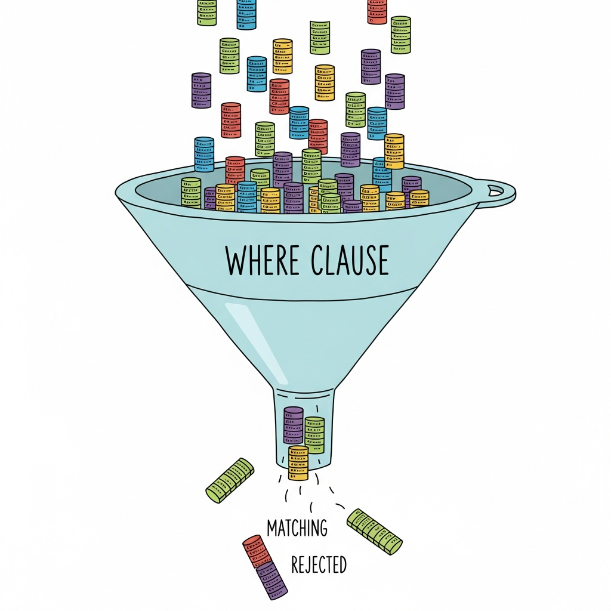
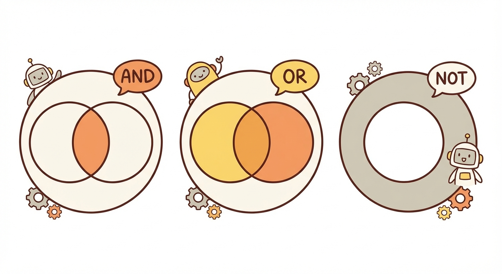

# Module 3: SELECT and Filtering

## Your Data Has Answers. Time to Ask the Right Questions.

> 🏷️ Useful Soon

---


*Your database is full of answers. You just need to learn how to ask.*

> 🎯 **Teach:** The SELECT statement combined with WHERE is how you interrogate your data -- turning a passive table into an active source of answers.
> **See:** The progression from "give me everything" to "give me exactly what I need."
> **Feel:** Empowered that you can now ask precise questions and get precise answers.

> 🎙️ Welcome to Module 3. This is where SQL stops being a toy and starts being a tool. Up until now, you've been looking at tables and understanding structure. Now? Now you're going to learn how to ask your database questions -- specific questions, filtered questions, fuzzy questions. By the end of this module, you'll be able to pull exactly the data you need from any table. Let's go.

---

## SELECT: The Foundation of Every Question

> 🎯 **Teach:** SELECT is the verb that starts every SQL query -- it tells the database what columns you want to see.
> **See:** The difference between selecting all columns vs. picking specific ones.
> **Feel:** Comfortable writing basic SELECT statements from memory.

> 🔄 **Where this fits:** SELECT is the first keyword in every query you'll ever write. Everything else -- filtering, sorting, grouping -- builds on top of this foundation.

Every conversation with your database starts the same way: with the word `SELECT`.

Think of it like walking into a library and telling the librarian what you're looking for. You wouldn't just say "give me... stuff." You'd say "I'm looking for books about marine biology" or "show me everything you have by Octavia Butler."

SQL works the same way. You tell it *what* you want and *where* to find it.

### Give me everything

The simplest query in SQL grabs every column from a table:

```sql
SELECT * FROM students;
```

That `*` is a wildcard -- it means "all columns." It's the equivalent of saying "show me everything you've got."

And you'll get back every row, every column. The whole table. Unfiltered, unsorted, just... all of it.

### Give me specific columns

But most of the time, you don't want everything. You want specific pieces of information:

```sql
SELECT first_name, last_name, email
FROM students;
```

Now you're being precise. You're telling the database: "I only care about names and emails. Don't bother with student IDs, GPAs, enrollment dates, or anything else."

**Why does this matter?** Two reasons:

1. **Clarity** -- you see only what you need, making results easier to read
2. **Performance** -- on large databases, selecting fewer columns is faster (the database doesn't have to fetch data it's just going to throw away)

```sql
-- Want just majors? Easy.
SELECT major FROM students;

-- How about names and GPAs?
SELECT first_name, last_name, gpa FROM students;

-- Student IDs and enrollment dates?
SELECT student_id, enrollment_date FROM students;
```

> 🎙️ Here's a habit to build early: stop using SELECT star in production code. It's fine for quick exploration -- like when you're poking around a table to see what's in there. But when you're writing a real query, name your columns. It's clearer, it's faster, and it won't break when someone adds a new column to the table next month.

> 💡 **Remember this one thing:** `SELECT *` is for exploring. `SELECT column1, column2` is for real work. Name your columns.

---

## Column Aliases: Giving Your Results Better Names

> 🎯 **Teach:** The AS keyword lets you rename columns in your output -- making results more readable without changing the actual table.
> **See:** How cryptic column names become human-friendly labels.
> **Feel:** Relieved that you can clean up ugly output without altering the database.

Sometimes column names are... not great. Maybe the database designer was in a hurry. Maybe `stu_fn` made sense to someone in 2003. Either way, you can rename columns in your output using `AS`:

```sql
SELECT first_name AS "First Name",
       last_name AS "Last Name",
       gpa AS "Grade Point Average"
FROM students;
```

The actual table doesn't change. The columns are still called `first_name`, `last_name`, and `gpa` in the database. But your *results* will display the prettier names.

A few things to know about aliases:

- Use double quotes if your alias has spaces: `AS "First Name"`
- Without spaces, quotes are optional: `AS FirstName` works fine
- Aliases are cosmetic -- they only affect the output of *this* query

```sql
-- This is especially useful when you start doing calculations later
SELECT first_name,
       last_name,
       gpa * 25 AS "GPA Percentage"
FROM students;
```

> 🎙️ Aliases might seem like a small thing, but they make your query results dramatically more readable. When you're presenting data to someone who doesn't know what "stu_fn" means, aliases are your best friend. Get in the habit of using them whenever column names aren't self-explanatory.

---

## WHERE: Your Search Filter

> 🎯 **Teach:** The WHERE clause filters rows based on conditions -- it's how you go from "show me everything" to "show me exactly what I need."
> **See:** How adding WHERE transforms a broad query into a precise one.
> **Feel:** The click of realizing that WHERE is the most powerful single word in SQL.

OK. This is the big one.

`SELECT` tells the database *what columns* to show. `WHERE` tells it *which rows* to include.


*WHERE is your funnel. Data goes in the top, only matching rows come out the bottom.*

```sql
SELECT first_name, last_name, major
FROM students
WHERE major = 'Computer Science';
```

That query says: "Show me the first name, last name, and major of every student -- but only the ones majoring in Computer Science."

The database looks at every row in the `students` table, checks whether `major` equals `'Computer Science'`, and only includes the rows where it does.

### Comparison Operators

You've got the full toolkit:

| Operator | Meaning | Example |
|----------|---------|---------|
| `=` | Equal to | `WHERE gpa = 4.0` |
| `!=` or `<>` | Not equal to | `WHERE major != 'Art'` |
| `<` | Less than | `WHERE gpa < 2.0` |
| `>` | Greater than | `WHERE gpa > 3.5` |
| `<=` | Less than or equal | `WHERE credits <= 60` |
| `>=` | Greater than or equal | `WHERE gpa >= 3.0` |

```sql
-- Students with a GPA above 3.5
SELECT first_name, last_name, gpa
FROM students
WHERE gpa > 3.5;

-- Students who are NOT majoring in Biology
SELECT first_name, last_name, major
FROM students
WHERE major != 'Biology';

-- Students with fewer than 30 credits
SELECT first_name, last_name, credits
FROM students
WHERE credits < 30;
```

> **Watch it!** Notice that SQL uses `=` for comparison, not `==`. If you're coming from Python or JavaScript, this will trip you up at least once. Probably twice. It's OK. We've all been there.

> 🎙️ The WHERE clause is where SQL goes from "show me a table" to "answer my question." Every comparison operator gives you a different way to slice the data. Equal, not equal, greater than, less than -- these are the fundamental building blocks of every filter you'll ever write.

---

## Logical Operators: Combining Conditions

> 🎯 **Teach:** AND, OR, and NOT let you combine multiple conditions into complex, precise filters.
> **See:** How simple conditions chain together to answer sophisticated questions.
> **Feel:** Confident that you can express any filtering logic, no matter how specific.

One condition is nice. But real questions usually need more than one filter.

### AND -- Both conditions must be true

```sql
-- Computer Science majors with a GPA above 3.5
SELECT first_name, last_name, major, gpa
FROM students
WHERE major = 'Computer Science'
  AND gpa > 3.5;
```

Both conditions must be satisfied. If a student is in Computer Science but has a 3.2 GPA? Excluded. If a student has a 3.8 GPA but majors in History? Also excluded.

### OR -- At least one condition must be true

```sql
-- Students in Computer Science OR Mathematics
SELECT first_name, last_name, major
FROM students
WHERE major = 'Computer Science'
   OR major = 'Mathematics';
```

Now you're casting a wider net. Either condition being true is enough to include the row.

### NOT -- Flip the condition

```sql
-- Everyone EXCEPT Computer Science majors
SELECT first_name, last_name, major
FROM students
WHERE NOT major = 'Computer Science';
```

NOT inverts whatever condition follows it. True becomes false, false becomes true.



### Parentheses: Because Order Matters

Here's where people get tripped up. What does this query return?

```sql
SELECT first_name, last_name, major, gpa
FROM students
WHERE major = 'Computer Science'
   OR major = 'Mathematics'
  AND gpa > 3.5;
```

If you said "CS or Math students with GPAs above 3.5," you'd be **wrong**.

AND has higher precedence than OR (just like multiplication before addition in math). So this actually means: "Computer Science students (any GPA) OR Mathematics students with GPAs above 3.5."

The fix? **Parentheses.**

```sql
SELECT first_name, last_name, major, gpa
FROM students
WHERE (major = 'Computer Science' OR major = 'Mathematics')
  AND gpa > 3.5;
```

NOW it means what you intended: students in either CS or Math, but only if their GPA is above 3.5.

> 💡 **Remember this one thing:** When mixing AND and OR, always use parentheses. Always. Even when you think you don't need them. Future-you will thank present-you.

> 🎙️ AND and OR are straightforward on their own. The trouble starts when you combine them. AND binds tighter than OR -- just like multiplication before addition. The solution is simple: use parentheses every single time you mix AND and OR in the same WHERE clause. It makes your intent crystal clear and prevents bugs that are really hard to spot.

---

## BETWEEN: Range Queries Made Easy

> 🎯 **Teach:** BETWEEN provides a clean, readable way to check if a value falls within a range (inclusive on both ends).
> **See:** How BETWEEN simplifies what would otherwise be two comparison operators joined by AND.
> **Feel:** Appreciation for SQL's readability features.

Need to find values within a range? You could use two comparisons:

```sql
SELECT first_name, last_name, gpa
FROM students
WHERE gpa >= 3.0 AND gpa <= 3.5;
```

Or you could use `BETWEEN`, which does exactly the same thing but reads like English:

```sql
SELECT first_name, last_name, gpa
FROM students
WHERE gpa BETWEEN 3.0 AND 3.5;
```

Same result. Easier to read. Easier to write. **Both endpoints are included** -- 3.0 and 3.5 are both part of the results.

```sql
-- Students who enrolled in 2023
SELECT first_name, last_name, enrollment_date
FROM students
WHERE enrollment_date BETWEEN '2023-01-01' AND '2023-12-31';

-- Students with 60-90 credits
SELECT first_name, last_name, credits
FROM students
WHERE credits BETWEEN 60 AND 90;
```

You can also negate it:

```sql
-- Students whose GPA is NOT between 2.0 and 3.0
SELECT first_name, last_name, gpa
FROM students
WHERE gpa NOT BETWEEN 2.0 AND 3.0;
```

> 🎙️ BETWEEN is syntactic sugar -- it doesn't do anything you can't do with greater-than-or-equal and less-than-or-equal. But it reads better, and readable SQL is maintainable SQL. One thing to remember: BETWEEN is inclusive on both ends. If you say BETWEEN 3.0 AND 3.5, both 3.0 and 3.5 are included.

---

## IN: Matching Against a List

> 🎯 **Teach:** IN lets you check whether a value matches any item in a list -- replacing multiple OR conditions with one clean expression.
> **See:** How a chain of OR comparisons collapses into a single, readable IN clause.
> **Feel:** Grateful that SQL has a shortcut for "is it one of these things?"

Remember that OR example earlier?

```sql
WHERE major = 'Computer Science'
   OR major = 'Mathematics'
   OR major = 'Physics'
   OR major = 'Chemistry';
```

That gets old fast. `IN` is the shortcut:

```sql
SELECT first_name, last_name, major
FROM students
WHERE major IN ('Computer Science', 'Mathematics', 'Physics', 'Chemistry');
```

Same result. One-quarter of the typing. And it scales beautifully -- adding another major is just another item in the list.

```sql
-- Students in specific class years
SELECT first_name, last_name, class_year
FROM students
WHERE class_year IN (2024, 2025);

-- You can negate it too
SELECT first_name, last_name, major
FROM students
WHERE major NOT IN ('Undeclared', 'General Studies');
```

> 🎙️ IN is one of those features that, once you learn it, you'll use constantly. Any time you find yourself writing three or more OR conditions on the same column, switch to IN. It's cleaner, it's shorter, and it's less likely to have a bug hiding in it.

---

## LIKE: Fuzzy Pattern Matching

> 🎯 **Teach:** LIKE enables pattern matching with wildcards -- letting you search for partial matches rather than exact ones.
> **See:** How % and _ wildcards work together to find patterns in text data.
> **Feel:** The power of being able to search for "names that start with J" or "emails ending in .edu."

Sometimes you don't know the exact value. You know it starts with "J" or contains "son" or ends with "@university.edu". That's where `LIKE` comes in.

`LIKE` uses two wildcards:

| Wildcard | Meaning | Example |
|----------|---------|---------|
| `%` | Any number of characters (including zero) | `'J%'` matches "John", "Jane", "J" |
| `_` | Exactly one character | `'_ohn'` matches "John" but not "Jjohn" |


```sql
-- Students whose first name starts with 'J'
SELECT first_name, last_name
FROM students
WHERE first_name LIKE 'J%';

-- Students whose last name ends with 'son'
SELECT first_name, last_name
FROM students
WHERE last_name LIKE '%son';

-- Students whose email contains 'gmail'
SELECT first_name, email
FROM students
WHERE email LIKE '%gmail%';

-- Students with exactly 4-letter first names
SELECT first_name
FROM students
WHERE first_name LIKE '____';
```

You can combine wildcards:

```sql
-- Names starting with 'A' and ending with 'a' (like Anna, Amanda, Andrea)
SELECT first_name
FROM students
WHERE first_name LIKE 'A%a';

-- Second letter is 'a' (like Sam, Dan, Max, etc.)
SELECT first_name
FROM students
WHERE first_name LIKE '_a%';
```

> **Watch it!** LIKE is case-sensitive in many databases. In SQLite, `LIKE` is case-insensitive for ASCII characters by default, which is convenient but not universal. If you move to PostgreSQL or MySQL, be aware that case sensitivity rules differ.

> 🎙️ LIKE is your fuzzy search. The percent sign matches any number of characters, the underscore matches exactly one. Between these two wildcards, you can express just about any text pattern you need. It's especially useful for searching names, emails, and any free-text field where exact matching would be too rigid.

---

## IS NULL / IS NOT NULL: The Special Case

> 🎯 **Teach:** NULL is not a value -- it's the absence of a value -- and it requires special operators to detect.
> **See:** Why `= NULL` doesn't work and `IS NULL` does.
> **Feel:** Understanding of a concept that trips up even experienced developers.

Here's something that confuses almost everyone at first: NULL is not a value. It's the *absence* of a value. It means "unknown" or "not applicable."

And because it's not a value, you can't compare it with `=`:

```sql
-- THIS DOES NOT WORK
SELECT first_name, last_name
FROM students
WHERE advisor = NULL;   -- WRONG! Returns nothing.
```

NULL isn't equal to anything -- not even itself. `NULL = NULL` is not true. It's... NULL. (Welcome to three-valued logic. It's weird. Just roll with it.)

The correct way:

```sql
-- Students without an advisor
SELECT first_name, last_name
FROM students
WHERE advisor IS NULL;

-- Students who DO have an advisor
SELECT first_name, last_name
FROM students
WHERE advisor IS NOT NULL;
```

```sql
-- Students with no declared major
SELECT first_name, last_name
FROM students
WHERE major IS NULL;

-- Students who have both a major and an email on file
SELECT first_name, last_name
FROM students
WHERE major IS NOT NULL
  AND email IS NOT NULL;
```

> 💡 **Remember this one thing:** Never use `= NULL` or `!= NULL`. Always use `IS NULL` and `IS NOT NULL`. This is non-negotiable. It's one of the most common SQL bugs in existence.

> 🎙️ NULL will bite you if you're not careful. It's not zero, it's not an empty string, it's not false -- it's the complete absence of data. And because of that, normal comparison operators don't work with it. You must use IS NULL and IS NOT NULL. Burn this into your brain. You will forget it at least once, spend twenty minutes debugging, and then remember this warning.

---

## Putting It All Together: Complex Queries

> 🎯 **Teach:** Real-world queries combine multiple filtering techniques into a single, powerful statement.
> **See:** How SELECT, WHERE, comparisons, logical operators, BETWEEN, IN, LIKE, and NULL checks work together.
> **Feel:** Confidence that you can construct queries to answer any question about your data.

Now let's build some real queries. The kind you'd actually write at a job.

```sql
-- Dean's List candidates: GPA >= 3.7, enrolled in STEM, with an advisor
SELECT first_name, last_name, major, gpa
FROM students
WHERE gpa >= 3.7
  AND major IN ('Computer Science', 'Mathematics', 'Physics',
                'Chemistry', 'Biology', 'Engineering')
  AND advisor IS NOT NULL;
```

```sql
-- Find students who might need academic support:
-- GPA below 2.0, or missing email (can't be contacted)
SELECT student_id, first_name, last_name, gpa, email
FROM students
WHERE gpa < 2.0
   OR email IS NULL;
```

```sql
-- Search for a student whose name you half-remember
-- You think it starts with "Mar" and they're a junior or senior
SELECT first_name, last_name, major, class_year
FROM students
WHERE first_name LIKE 'Mar%'
  AND class_year IN (2024, 2025);
```

```sql
-- Scholarship eligibility: GPA between 3.5 and 4.0,
-- not in General Studies, enrolled after 2022
SELECT first_name AS "First",
       last_name AS "Last",
       gpa AS "GPA",
       major AS "Major",
       enrollment_date AS "Enrolled"
FROM students
WHERE gpa BETWEEN 3.5 AND 4.0
  AND major NOT IN ('General Studies', 'Undeclared')
  AND enrollment_date >= '2022-01-01'
  AND advisor IS NOT NULL;
```

> 🎙️ These complex queries are where everything comes together. Notice how each one reads almost like English: "Show me students where GPA is above 3.7 and major is in this list and they have an advisor." That's the beauty of SQL -- when you write it well, it tells you exactly what it does. No decoding required.

---

## 🗨️ There Are No Dumb Questions

> 🎯 **Teach:** Common stumbling points about SELECT and filtering, addressed honestly and directly.
> **See:** Clear answers to questions students actually ask (and are sometimes embarrassed to ask).
> **Feel:** Reassured that the confusing parts are confusing for everyone.

**Q: Does the order of conditions in WHERE matter?**

A: Logically, no -- `WHERE gpa > 3.0 AND major = 'CS'` gives the same results as `WHERE major = 'CS' AND gpa > 3.0`. The database optimizer will figure out the most efficient order to evaluate them. That said, putting the most restrictive condition first can make your query easier to *read*, even if the database doesn't care.

**Q: What's the difference between `!=` and `<>`?**

A: Nothing. They both mean "not equal." `<>` is the SQL standard, `!=` is more common in programming languages. Most databases accept both. Use whichever your team prefers -- just be consistent.

**Q: Can I use LIKE with numbers?**

A: Technically, some databases will let you, but it's generally a bad idea. LIKE is designed for text/string matching. For numbers, stick with comparison operators and BETWEEN.

**Q: Why can't I use `WHERE major = NULL` again?**

A: Because NULL represents "unknown." Asking "does unknown equal unknown?" isn't meaningful -- the answer is "I don't know" (which is NULL, not TRUE). SQL uses three-valued logic: TRUE, FALSE, and NULL. The `= NULL` comparison always evaluates to NULL, which is treated as "not true," so no rows match. Use `IS NULL` instead.

**Q: Is `BETWEEN 1 AND 10` the same as `>= 1 AND <= 10`?**

A: Yes, exactly the same. BETWEEN includes both endpoints. It's just more readable.

> 🎙️ That NULL question comes up every single time, and it trips up people who've been writing SQL for years. There's no shame in finding it confusing. Three-valued logic is genuinely weird. The practical takeaway is simple: for NULL, always use IS NULL or IS NOT NULL. For everything else, use equals.

---

## ✏️ Sharpen Your Pencil

> 🎯 **Teach:** Practice writing queries that combine the filtering techniques from this module.
> **See:** Realistic scenarios that require choosing the right operators and combining them.
> **Feel:** The satisfaction of translating a plain-English question into working SQL.

Try writing these queries on your own before looking at any solutions:

1. **The Basics:** Write a query to show the first name, last name, and email of all students. Then modify it to show only Computer Science majors.

2. **Range Check:** Find all students with a GPA between 2.5 and 3.5. Display their name, major, and GPA. Use a column alias to label the GPA column as "Current GPA".

3. **The Search:** A student's parent calls -- they think their child's last name starts with "Wil" and they're either a freshman or sophomore (class years 2027 or 2028). Write a query to find matching students.

4. **The Complex One:** Find students who meet ALL of these criteria:
   - Major is Computer Science, Mathematics, or Physics
   - GPA is 3.0 or higher
   - They have an email address on file (not NULL)
   - Their first name does NOT start with 'Z'

5. **Think About It:** What's wrong with this query? How would you fix it?
   ```sql
   SELECT first_name, last_name
   FROM students
   WHERE major = 'Computer Science'
      OR major = 'Mathematics'
     AND gpa > 3.0;
   ```

> 🎙️ Exercises 3 and 4 are the real test here. They force you to combine multiple techniques in a single query. Don't skip exercise 5 either -- understanding operator precedence with AND and OR will save you hours of debugging in your career.

---

## Bullet Points

- **SELECT** tells the database which columns to return. Use `*` for all columns, or list specific ones.
- **WHERE** filters rows based on conditions. It's the most powerful clause in SQL.
- **Comparison operators** (`=`, `!=`, `<`, `>`, `<=`, `>=`) compare values.
- **AND** requires all conditions to be true. **OR** requires at least one. **NOT** inverts a condition.
- **Use parentheses** when mixing AND and OR -- precedence rules will surprise you.
- **BETWEEN** checks if a value falls within a range (inclusive on both ends).
- **IN** checks if a value matches any item in a list -- cleaner than chaining ORs.
- **LIKE** does pattern matching: `%` matches any characters, `_` matches exactly one.
- **IS NULL / IS NOT NULL** are the only way to check for NULL values. Never use `= NULL`.
- **AS** creates column aliases for friendlier output names.

> 🎙️ Let's wrap up Module 3. You now have the tools to ask your database precise questions. SELECT picks the columns, WHERE filters the rows, and everything in between -- the comparisons, the logical operators, BETWEEN, IN, LIKE, IS NULL -- gives you the precision to find exactly what you need. In the next module, you'll learn how to sort and organize those results.

---

## Up Next

[Module 4: Sorting and Limiting](./module-04-sorting-and-limiting.md) -- You've got results. Now let's put them in order, grab just the top 10, and learn how to page through large result sets like a pro.

> 🎙️ Now that you can filter your data, the next question is: how do you organize it? Module 4 covers sorting, limiting, and pagination -- the tools that turn a pile of matching rows into a clean, presentable result set. See you there.
