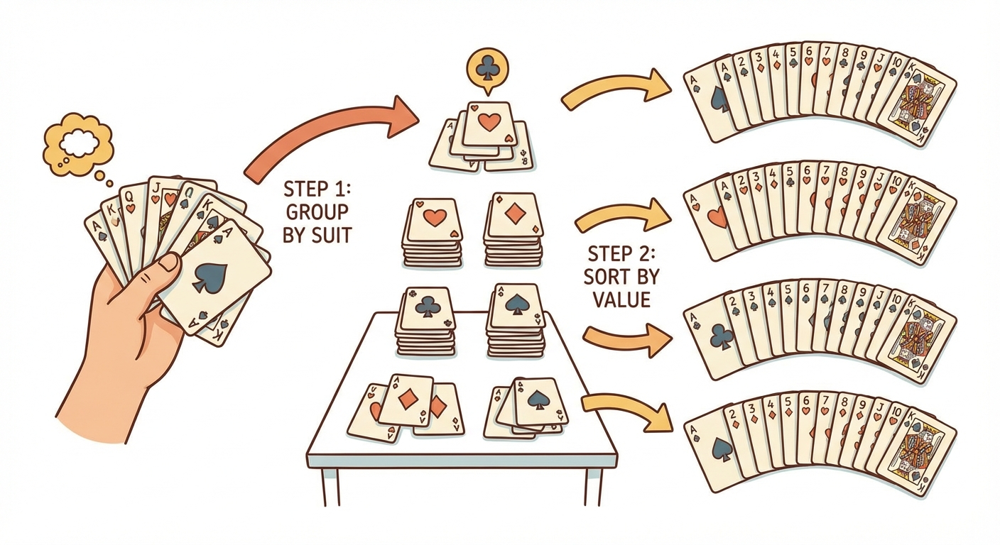

# Module 4: Sorting and Limiting

## Taming the Chaos (or: How to Stop Drowning in Results)

> 🏷️ Querying Data

---


*Same data. Wildly different usefulness.*

> 🎯 **Teach:** ORDER BY, LIMIT, OFFSET, and DISTINCT transform raw query results into organized, manageable, presentation-ready data.
> **See:** The progression from an unsorted dump of rows to a polished, paginated result set.
> **Feel:** The satisfaction of going from "here's 5,000 rows" to "here are the top 10 students by GPA."

> 🎙️ Welcome to Module 4. In the last module, you learned how to filter data -- how to ask the right questions. But getting the right rows is only half the battle. If your results come back in random order, or you get 10,000 rows when you only need the top 5, you've got a presentation problem. This module solves that. We're going to sort, limit, paginate, and deduplicate your results until they're exactly what you need.

---

## ORDER BY: Sorting Your Results

> 🎯 **Teach:** ORDER BY arranges your results in a specific sequence -- ascending or descending, by one or more columns.
> **See:** How the same data looks completely different depending on how it's sorted.
> **Feel:** Control over the presentation of your data.

> 🔄 **Where this fits:** ORDER BY is applied after WHERE filters the rows. First you pick which rows you want, then you decide how to arrange them.

Here's a truth about SQL that surprises people: **without ORDER BY, the database makes no promises about row order.** You might run the same query twice and get rows in a different order. It's not guaranteed to be insertion order, or alphabetical order, or any order at all.

If you want your results sorted, you have to ask.

```sql
SELECT first_name, last_name, gpa
FROM students
ORDER BY gpa;
```

By default, ORDER BY sorts in **ascending order** (smallest to largest, A to Z). That's the same as explicitly writing:

```sql
SELECT first_name, last_name, gpa
FROM students
ORDER BY gpa ASC;
```

### Descending Order

Want the highest GPAs first? Flip it:

```sql
SELECT first_name, last_name, gpa
FROM students
ORDER BY gpa DESC;
```

`DESC` means descending -- largest to smallest, Z to A.

### Sorting Text

ORDER BY works on text columns too. It sorts alphabetically:

```sql
-- Alphabetical student directory
SELECT last_name, first_name, email
FROM students
ORDER BY last_name ASC;
```

Think of it like sorting a deck of index cards. Numbers sort numerically. Text sorts alphabetically. Dates sort chronologically. ORDER BY handles all of them.

> 🎙️ The key mental model is this: without ORDER BY, you have a pile of cards tossed on a table. With ORDER BY, you have a neatly arranged stack. The database will not sort for you automatically -- ever. If order matters to you, say so explicitly.

---

## Multi-Column Sorting: The Tiebreaker

> 🎯 **Teach:** Sorting by multiple columns lets you define primary and secondary sort orders -- like sorting by last name, then first name within each last name.
> **See:** How multi-column sorts handle ties gracefully and predictably.
> **Feel:** The clarity of knowing exactly how your results will be ordered.

What happens when two students have the same GPA? Or the same last name? You need a tiebreaker.

```sql
-- Sort by GPA (highest first), then by last name alphabetically for ties
SELECT first_name, last_name, gpa
FROM students
ORDER BY gpa DESC, last_name ASC;
```

This is like sorting a class roster: first by grade (descending), and within each grade, alphabetically by last name. The second column only matters when the first column has a tie.

You can chain as many columns as you need:

```sql
-- Sort by major, then by GPA within each major, then by last name
SELECT first_name, last_name, major, gpa
FROM students
ORDER BY major ASC, gpa DESC, last_name ASC;
```

**Each column can have its own direction.** Major ascending, GPA descending, last name ascending -- all in the same query. The database processes them left to right: sort by the first column, break ties with the second, break remaining ties with the third, and so on.

```
Think of it like sorting a hand of cards:

  First: Sort by suit (Clubs, Diamonds, Hearts, Spades)
  Then:  Within each suit, sort by value (2, 3, 4... Ace)

  Multi-column ORDER BY is the same idea:
  First: Sort by major (ascending)
  Then:  Within each major, sort by GPA (descending)
  Then:  Within tied GPAs, sort by last name (ascending)
```



> 🎙️ Multi-column sorting is one of those features that feels obvious once you see it, but it's surprisingly powerful. Any time you need a "sort by this, then by that" structure -- which is most of the time in real applications -- this is how you do it.

---

## NULL Sorting: The Odd One Out

> 🎯 **Teach:** NULLs have specific sorting behavior that varies by database -- in SQLite, they sort first in ascending order.
> **See:** Where NULL values end up in sorted results and why it matters.
> **Feel:** Prepared for a quirk that catches people off guard.

What happens when you sort a column that contains NULL values? Where do they end up?

In SQLite, **NULLs sort first in ascending order** (they appear at the top) and **last in descending order** (they appear at the bottom).

```sql
-- If some students have no GPA recorded (NULL):
SELECT first_name, last_name, gpa
FROM students
ORDER BY gpa ASC;

-- Results might look like:
-- NULL     (students with no GPA appear first)
-- NULL
-- 1.8
-- 2.3
-- 3.5
-- 4.0
```

> **Watch it!** This behavior differs across databases. PostgreSQL puts NULLs last by default in ascending order. Some databases support `NULLS FIRST` and `NULLS LAST` keywords to control placement explicitly. SQLite doesn't support those keywords, but it's good to know they exist.

If NULLs at the top of your results bother you (and they usually do), you can filter them out:

```sql
SELECT first_name, last_name, gpa
FROM students
WHERE gpa IS NOT NULL
ORDER BY gpa ASC;
```

Problem solved. Filter first, then sort.

> 🎙️ NULL sorting is one of those details that bites you exactly once, and then you remember it forever. In SQLite, NULLs come first when sorting ascending. If that's not what you want, filter them out with WHERE IS NOT NULL before sorting.

---

## LIMIT: Just the Top N, Please

> 🎯 **Teach:** LIMIT restricts how many rows are returned -- essential for top-N queries and keeping result sets manageable.
> **See:** How LIMIT turns "all 5,000 students" into "the top 10 students."
> **Feel:** Relief that you don't have to scroll through thousands of rows.

You don't always want every matching row. Sometimes you want the top 5. Or the first 10. Or just one.

```sql
-- Top 5 students by GPA
SELECT first_name, last_name, gpa
FROM students
ORDER BY gpa DESC
LIMIT 5;
```

LIMIT chops off the results after the specified number of rows. Combined with ORDER BY, it becomes a "top N" query.

```sql
-- The single student with the highest GPA
SELECT first_name, last_name, gpa
FROM students
ORDER BY gpa DESC
LIMIT 1;

-- 10 most recently enrolled students
SELECT first_name, last_name, enrollment_date
FROM students
ORDER BY enrollment_date DESC
LIMIT 10;

-- 3 students with the lowest credit count
SELECT first_name, last_name, credits
FROM students
ORDER BY credits ASC
LIMIT 3;
```

> **Watch it!** LIMIT without ORDER BY gives you an *arbitrary* set of rows. The database just grabs however many rows are convenient. If you want the top 5 or bottom 5 of anything, you NEED ORDER BY before LIMIT. Otherwise you're getting a random grab bag.

> 🎙️ LIMIT plus ORDER BY is one of the most common query patterns in all of SQL. "Show me the top 10 by sales." "Show me the 5 most recent orders." "What's the single most expensive product?" You'll write this pattern hundreds of times in your career. It's simple, it's powerful, and it's everywhere.

---

## OFFSET: Skipping Ahead

> 🎯 **Teach:** OFFSET skips a specified number of rows before returning results -- enabling pagination when combined with LIMIT.
> **See:** How OFFSET and LIMIT together create a "page" of results, just like search engine pages.
> **Feel:** The ability to build real-world pagination from two simple keywords.

LIMIT says "give me this many rows." OFFSET says "but skip the first N."

Together, they create pagination -- like the page numbers at the bottom of a Google search.

```sql
-- Page 1: first 10 students
SELECT first_name, last_name, gpa
FROM students
ORDER BY last_name ASC
LIMIT 10 OFFSET 0;

-- Page 2: next 10 students
SELECT first_name, last_name, gpa
FROM students
ORDER BY last_name ASC
LIMIT 10 OFFSET 10;

-- Page 3: next 10 students
SELECT first_name, last_name, gpa
FROM students
ORDER BY last_name ASC
LIMIT 10 OFFSET 20;
```


*Each "page" is just a different OFFSET with the same LIMIT.*

See the pattern?

### The Pagination Formula

```
OFFSET = (page_number - 1) * page_size

Page 1:  LIMIT 10 OFFSET 0    (skip 0, show 10)
Page 2:  LIMIT 10 OFFSET 10   (skip 10, show 10)
Page 3:  LIMIT 10 OFFSET 20   (skip 20, show 10)
Page N:  LIMIT 10 OFFSET (N-1)*10
```

This is exactly how most web applications implement their "Previous / Next" buttons. Every time you click "Next" on a search results page, the application is running the same query with a higher OFFSET.

```sql
-- Showing results 21-25 (page 5, 5 per page)
SELECT first_name, last_name, major
FROM students
ORDER BY last_name ASC
LIMIT 5 OFFSET 20;
```

> **Watch it!** OFFSET-based pagination gets slow on very large tables because the database still has to *find and skip* all those rows. For a 5,000-row student table, it's fine. For a table with 50 million rows, there are better approaches (cursor-based pagination). But that's a problem for future-you.

> 🎙️ The pagination formula is worth memorizing: offset equals page number minus one, times page size. It's one of those formulas that comes up in almost every web application. Any time you see a "page 2 of 47" interface, there's probably a LIMIT and OFFSET query running behind it.

---

## DISTINCT: Removing Duplicates

> 🎯 **Teach:** DISTINCT eliminates duplicate rows from your results -- giving you a list of unique values.
> **See:** How DISTINCT collapses repeated values into a single entry.
> **Feel:** The satisfaction of getting a clean list without manual deduplication.

Sometimes you don't want individual rows -- you want a list of unique values.

```sql
-- What majors exist in our student body?
SELECT DISTINCT major
FROM students;
```

Without DISTINCT, if 200 students major in Computer Science, you'd see "Computer Science" 200 times. With DISTINCT, you see it once.


```sql
-- What class years are represented?
SELECT DISTINCT class_year
FROM students
ORDER BY class_year;

-- What unique combinations of major and class year exist?
SELECT DISTINCT major, class_year
FROM students
ORDER BY major, class_year;
```

That last example is important: **DISTINCT applies to the entire row.** When you select multiple columns, DISTINCT removes rows that are identical *across all selected columns*. A Computer Science student from 2024 and a Computer Science student from 2025 would both appear, because the combination is different.

```sql
-- How many different states are our students from?
SELECT DISTINCT state
FROM students
WHERE state IS NOT NULL
ORDER BY state;
```

> 🎙️ DISTINCT is your deduplication tool. Need a list of all majors? All states? All departments? DISTINCT gives you the unique values. Just remember: when you SELECT DISTINCT with multiple columns, it's looking for unique combinations, not unique values in each individual column.

---

## The Power Combo: WHERE + ORDER BY + LIMIT

> 🎯 **Teach:** The most common real-world queries combine filtering, sorting, and limiting into one statement.
> **See:** Complete, practical queries that answer the kinds of questions you'd actually be asked at work.
> **Feel:** Ready to write production-quality queries for real scenarios.

Here's where it all comes together. The order of clauses in a query always follows this structure:

```sql
SELECT columns
FROM table
WHERE conditions      -- filter rows
ORDER BY columns      -- sort results
LIMIT n OFFSET m;     -- restrict and paginate
```

**This order is not optional.** SQL requires these clauses in this specific sequence. WHERE always comes before ORDER BY, and ORDER BY always comes before LIMIT.

Let's build some real queries:

### The Student Directory

```sql
-- Alphabetical directory of CS majors
SELECT first_name AS "First",
       last_name AS "Last",
       email AS "Email"
FROM students
WHERE major = 'Computer Science'
  AND email IS NOT NULL
ORDER BY last_name ASC, first_name ASC;
```

### Top N by Category

```sql
-- Top 5 GPA students in the Engineering department
SELECT first_name, last_name, gpa
FROM students
WHERE major = 'Engineering'
  AND gpa IS NOT NULL
ORDER BY gpa DESC
LIMIT 5;
```

### The Academic Watch List

```sql
-- Students at risk: GPA below 2.0, sorted worst-first, top 20
SELECT student_id,
       first_name AS "First",
       last_name AS "Last",
       gpa AS "GPA",
       major AS "Major"
FROM students
WHERE gpa < 2.0
  AND gpa IS NOT NULL
ORDER BY gpa ASC
LIMIT 20;
```

### Paginated Search Results

```sql
-- Page 3 of the full student directory (15 per page)
SELECT first_name, last_name, major, gpa
FROM students
ORDER BY last_name ASC, first_name ASC
LIMIT 15 OFFSET 30;
```

### Grade Distribution Snapshot

```sql
-- Find the distinct GPA values for Psychology majors, sorted
SELECT DISTINCT gpa
FROM students
WHERE major = 'Psychology'
  AND gpa IS NOT NULL
ORDER BY gpa DESC;
```

> 🎙️ Notice the pattern in all of these: filter with WHERE, sort with ORDER BY, restrict with LIMIT. That three-step combo is the bread and butter of SQL. You'll write it so often it'll become muscle memory. And remember -- the clause order matters. SQL is very particular about that.

---

## 🗨️ There Are No Dumb Questions

> 🎯 **Teach:** Common questions about sorting, limiting, and deduplication answered clearly.
> **See:** Practical answers to the questions students actually struggle with.
> **Feel:** Clarity on the edge cases and gotchas.

**Q: Can I ORDER BY a column that's not in my SELECT?**

A: Yes! You can absolutely sort by a column you're not displaying. `SELECT first_name FROM students ORDER BY gpa DESC;` is perfectly valid. The database uses the GPA for sorting but only shows you the name.

**Q: What if I use LIMIT without ORDER BY?**

A: You'll get rows, but which rows is essentially random (or at least unpredictable). The database returns whichever rows it finds first internally. This is almost never what you want. Always pair LIMIT with ORDER BY.

**Q: Can I use DISTINCT with ORDER BY?**

A: Yes, but in some databases the column you ORDER BY must be in the SELECT list when using DISTINCT. SQLite is fairly flexible about this, but it's a good habit to sort by columns you're selecting.

**Q: Is there a maximum value for LIMIT?**

A: No technical maximum in SQLite. You can LIMIT 1000000 if you want. Whether your application can handle that many rows is another question entirely.

**Q: Does OFFSET 0 do anything?**

A: It skips zero rows, which is the same as not having an OFFSET at all. It's explicitly saying "start from the beginning." Some people include it for clarity, especially when building pagination dynamically.

**Q: Why not just use DISTINCT everywhere to be safe?**

A: Because DISTINCT has a cost. The database has to compare every row to find duplicates, which takes time and memory. Only use it when you actually need unique values. On a properly designed query, you usually don't need it.

> 🎙️ The most common mistake I see is LIMIT without ORDER BY. Without ORDER BY, LIMIT just gives you arbitrary rows. It's like asking for "the top 5" without saying what they're the top 5 of. Always sort first, then limit.

---

## ✏️ Sharpen Your Pencil

> 🎯 **Teach:** Practice combining sorting, limiting, and deduplication with filtering.
> **See:** Scenarios that require thoughtful use of ORDER BY, LIMIT, OFFSET, and DISTINCT.
> **Feel:** Confidence in writing organized, well-structured queries.

1. **Simple Sort:** Write a query to display all students sorted by enrollment date, most recent first. Show their name, major, and enrollment date.

2. **Top N:** Find the top 3 students by GPA in the Mathematics major. Display their name and GPA.

3. **Multi-Column Sort:** Create an alphabetical student directory sorted by last name, then first name. Only include students who have an email address on file.

4. **Pagination:** You're building a student search page that shows 20 results per page. Write the query for page 4.

5. **Unique Values:** What distinct majors are represented among students with a GPA of 3.5 or higher? Sort them alphabetically.

6. **The Full Combo:** Write a single query that:
   - Shows first name, last name, major, and GPA
   - Only includes students in Science or Engineering majors
   - Excludes students with no GPA on record
   - Sorts by GPA descending, then by last name ascending
   - Returns only the first 10 results

> 🎙️ Exercise 6 is the real test. It combines everything from both this module and the last one -- filtering, sorting, limiting, and NULL handling -- into a single query. If you can write that one from scratch without looking back, you're in great shape.

---

## Bullet Points

- **ORDER BY** sorts your results. ASC (ascending) is the default; DESC reverses the order.
- **Multi-column sorting** handles ties: sort by the first column, break ties with the second, and so on.
- **NULLs sort first** in ascending order in SQLite. Filter them out with WHERE IS NOT NULL if needed.
- **LIMIT** restricts how many rows are returned. Always pair it with ORDER BY.
- **OFFSET** skips rows before returning results. The pagination formula: `OFFSET = (page - 1) * page_size`.
- **DISTINCT** removes duplicate rows from results. It applies to the entire row, not individual columns.
- **Clause order matters:** SELECT ... FROM ... WHERE ... ORDER BY ... LIMIT ... OFFSET.
- The **WHERE + ORDER BY + LIMIT** combo is the most common query pattern in real-world SQL.

> 🎙️ Here's the summary for Module 4. ORDER BY sorts, LIMIT restricts, OFFSET paginates, and DISTINCT deduplicates. Combined with the filtering you learned in Module 3, you now have all the tools to write clean, organized, presentation-ready queries. Next up: we stop looking at individual rows and start looking at patterns. Aggregate functions are next.

---

## Up Next

[Module 5: Aggregate Functions](./module-05-aggregate-functions.md) -- Stop looking at individual rows and start seeing the big picture. COUNT, SUM, AVG, MIN, MAX, and GROUP BY let you ask questions like "what's the average GPA by major?" and "how many students are in each department?"

> 🎙️ You've learned to filter and sort individual rows. But what if you want to zoom out? What's the average GPA? How many students per major? What's the highest enrollment year? Module 5 introduces aggregate functions -- the tools that let you see patterns instead of individual data points. See you there.
