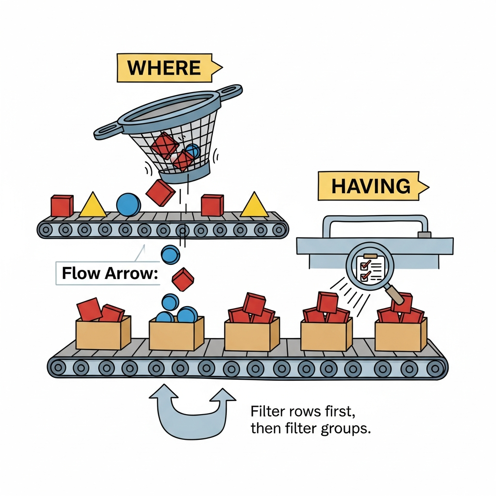

# Module 5: Aggregate Functions

## Zooming Out (or: Stop Counting Rows and Start Seeing Patterns)

> 🏷️ Querying Data

---


*Individual data points are interesting. Patterns are powerful.*

> 🎯 **Teach:** Aggregate functions collapse many rows into summary statistics -- transforming raw data into insights about groups and trends.
> **See:** The shift from looking at individual student records to answering questions like "what's the average GPA by major?"
> **Feel:** The thrill of going from "here are 5,000 rows" to "here are the 3 insights that actually matter."

> 🎙️ Welcome to Module 5, and welcome to a fundamental shift in how you think about data. Up until now, every query you've written has returned individual rows -- individual students, individual records. That's useful, but it's like reading a city one house at a time. Aggregate functions let you zoom out and see the neighborhoods, the districts, the whole skyline. This is where SQL stops being a lookup tool and starts being an analysis tool.

---

## The Big Five: COUNT, SUM, AVG, MIN, MAX

> 🎯 **Teach:** The five core aggregate functions each collapse a column of values into a single number.
> **See:** What each function does, with clear examples on familiar data.
> **Feel:** Comfortable using each function independently before combining them.

> 🔄 **Where this fits:** Aggregate functions are the bridge between raw data (Modules 3-4) and grouped analysis (GROUP BY, later in this module). You need to understand them individually before combining them with groups.

Think of aggregate functions as calculators that eat an entire column and spit out a single number.

### COUNT -- How many?

```sql
-- How many students are in the table?
SELECT COUNT(*) AS "Total Students"
FROM students;
```

`COUNT(*)` counts all rows, including rows with NULL values. If you want to count only rows where a specific column has a value:

```sql
-- How many students have an email on file?
SELECT COUNT(email) AS "Students With Email"
FROM students;

-- How many students have a declared major?
SELECT COUNT(major) AS "Declared Majors"
FROM students;
```

`COUNT(column_name)` ignores NULLs. `COUNT(*)` counts everything. This distinction matters more than you'd think.

```sql
-- How many different majors exist?
SELECT COUNT(DISTINCT major) AS "Number of Majors"
FROM students;
```

That `COUNT(DISTINCT major)` combo is particularly handy -- it counts unique values, not total values.

### SUM -- What's the total?

```sql
-- Total credits earned across all students
SELECT SUM(credits) AS "Total Credits Earned"
FROM students;
```

SUM only works on numeric columns. Trying to SUM a text column will give you an error (or nonsense, depending on the database).

### AVG -- What's the average?

```sql
-- Average GPA across all students
SELECT AVG(gpa) AS "Average GPA"
FROM students;
```

> **Watch it!** AVG ignores NULL values. If 100 students are in the table but only 80 have a GPA recorded, AVG calculates the average of those 80 values, not 100. This is usually what you want, but it's worth knowing.

### MIN and MAX -- The extremes

```sql
-- Highest and lowest GPA
SELECT MIN(gpa) AS "Lowest GPA",
       MAX(gpa) AS "Highest GPA"
FROM students;

-- Earliest and most recent enrollment
SELECT MIN(enrollment_date) AS "First Enrollment",
       MAX(enrollment_date) AS "Most Recent Enrollment"
FROM students;
```

MIN and MAX work on text too -- they find the first and last values alphabetically:

```sql
-- First and last names alphabetically
SELECT MIN(last_name) AS "First Alphabetically",
       MAX(last_name) AS "Last Alphabetically"
FROM students;
```

### Combining Them

You can use multiple aggregate functions in a single query:

```sql
SELECT COUNT(*) AS "Total Students",
       AVG(gpa) AS "Average GPA",
       MIN(gpa) AS "Lowest GPA",
       MAX(gpa) AS "Highest GPA",
       SUM(credits) AS "Total Credits"
FROM students;
```

One query, five insights. That's the power of aggregation.


> 🎙️ Five functions, five superpowers. COUNT tells you "how many." SUM tells you "how much total." AVG tells you "what's typical." MIN and MAX tell you "what are the extremes." Individually, they're useful. Combined -- and especially combined with GROUP BY, which we'll cover next -- they're transformative.

> 💡 **Remember this one thing:** All aggregate functions except `COUNT(*)` ignore NULL values. This is usually the right behavior, but it can lead to surprises if you're not expecting it.

---

## Aggregates with WHERE: Filtered Summaries

> 🎯 **Teach:** You can combine WHERE with aggregate functions to get summaries of filtered subsets of your data.
> **See:** How WHERE narrows the rows BEFORE aggregation happens.
> **Feel:** The ability to answer targeted statistical questions.

Aggregate functions work with WHERE just like any other query. The WHERE clause filters the rows *first*, then the aggregate function runs on whatever's left.

```sql
-- Average GPA of Computer Science majors
SELECT AVG(gpa) AS "CS Average GPA"
FROM students
WHERE major = 'Computer Science';

-- How many students have a GPA above 3.5?
SELECT COUNT(*) AS "Honor Students"
FROM students
WHERE gpa > 3.5;

-- Total credits earned by Engineering students
SELECT SUM(credits) AS "Engineering Credits"
FROM students
WHERE major = 'Engineering';

-- Highest GPA among students enrolled after 2023
SELECT MAX(gpa) AS "Top GPA (Post-2023)"
FROM students
WHERE enrollment_date > '2023-01-01';
```

The flow is:

```
FROM students          -- start with all rows
WHERE gpa > 3.5        -- filter down to matching rows
SELECT COUNT(*)        -- count what's left
```

The database doesn't count all rows and then filter. It filters first, counts second. This ordering matters for understanding what your query actually does.

> 🎙️ Think of it as a two-step process. Step one: WHERE removes the rows you don't care about. Step two: the aggregate function summarizes what's left. The WHERE always happens first. This will become very important when we compare WHERE to HAVING in a few minutes.

---

## GROUP BY: The Game Changer

> 🎯 **Teach:** GROUP BY splits your data into groups based on a column's values, then applies aggregate functions to each group independently.
> **See:** How one query can answer "what's the average GPA for EACH major?" instead of just "what's the average GPA?"
> **Feel:** The paradigm shift from one summary number to a summary per category.

This is the big one. This is where aggregate functions go from "nice" to "incredible."

Without GROUP BY, aggregate functions summarize the *entire table* into one row. With GROUP BY, they summarize *each group* into its own row.


*GROUP BY is like sorting M&Ms by color and counting each pile. Same bag of candy, but now you can see the distribution.*

```sql
-- Average GPA for EACH major
SELECT major,
       AVG(gpa) AS "Average GPA"
FROM students
GROUP BY major;
```

Instead of one number, you get one row per major -- each with its own average. That's the magic.

```
Results might look like:
major                  | Average GPA
-----------------------|------------
Biology                | 3.21
Chemistry              | 3.05
Computer Science       | 3.45
Engineering            | 3.38
Mathematics            | 3.52
Psychology             | 3.18
```

One query. Six insights. Each major gets its own summary.

### More GROUP BY Examples

```sql
-- Number of students in each major
SELECT major,
       COUNT(*) AS "Student Count"
FROM students
GROUP BY major;

-- Average GPA and student count per class year
SELECT class_year,
       COUNT(*) AS "Students",
       AVG(gpa) AS "Avg GPA",
       MIN(gpa) AS "Lowest GPA",
       MAX(gpa) AS "Highest GPA"
FROM students
GROUP BY class_year;

-- Total credits per major
SELECT major,
       SUM(credits) AS "Total Credits",
       AVG(credits) AS "Avg Credits Per Student"
FROM students
GROUP BY major;
```

### The Golden Rule of GROUP BY

Here it is, and it's non-negotiable:

**Every column in your SELECT must either be inside an aggregate function OR listed in the GROUP BY clause.**

```sql
-- CORRECT: major is in GROUP BY, gpa is inside AVG()
SELECT major, AVG(gpa)
FROM students
GROUP BY major;

-- WRONG: first_name is not in GROUP BY and not in an aggregate
SELECT major, first_name, AVG(gpa)
FROM students
GROUP BY major;
```

Why? Think about it: if you're grouping by major, there are dozens of first names within each major. Which first_name should the database show? It doesn't know. Some databases will give you a random one. SQLite will actually let you get away with this (it picks an arbitrary value), but it's a logic error. Don't do it.

> 💡 **Remember this one thing:** If it's in SELECT and not in an aggregate function, it must be in GROUP BY. No exceptions. Even if your database doesn't complain, it's wrong.

> 🎙️ GROUP BY is the single most important concept in this module. Without it, aggregate functions give you one summary for the whole table. With it, you get a summary for each group. It's the difference between "the average temperature this year was 65 degrees" and "here's the average temperature for each month." Both are useful, but the monthly breakdown tells a story.

---

## GROUP BY with Multiple Columns

> 🎯 **Teach:** Grouping by multiple columns creates finer-grained groups -- like breaking down statistics by both major AND class year.
> **See:** How adding columns to GROUP BY creates more specific subgroups.
> **Feel:** The ability to drill down into data at whatever level of detail you need.

You can group by more than one column. Each unique *combination* becomes its own group.

```sql
-- Average GPA by major AND class year
SELECT major,
       class_year,
       COUNT(*) AS "Students",
       AVG(gpa) AS "Avg GPA"
FROM students
GROUP BY major, class_year
ORDER BY major, class_year;
```

Now instead of one row per major, you get one row for each major-year combination: Computer Science 2024, Computer Science 2025, Computer Science 2026, Mathematics 2024, Mathematics 2025, and so on.

```
Results might look like:
major              | class_year | Students | Avg GPA
-------------------|------------|----------|--------
Computer Science   | 2024       | 15       | 3.51
Computer Science   | 2025       | 22       | 3.42
Computer Science   | 2026       | 18       | 3.38
Mathematics        | 2024       | 8        | 3.61
Mathematics        | 2025       | 12       | 3.48
...
```

This is like going from "how many M&Ms of each color?" to "how many M&Ms of each color *in each bag*?"

```sql
-- Enrollment counts by major and whether they have an advisor
SELECT major,
       CASE WHEN advisor IS NOT NULL THEN 'Has Advisor'
            ELSE 'No Advisor' END AS "Advisor Status",
       COUNT(*) AS "Students"
FROM students
GROUP BY major, CASE WHEN advisor IS NOT NULL THEN 'Has Advisor'
                     ELSE 'No Advisor' END;
```

> 🎙️ Multi-column GROUP BY gives you drill-down capability. Need stats by department? Group by one column. Need stats by department and year? Group by two. Department, year, and advisor status? Three. Each additional column creates finer and finer slices of your data.

---

## HAVING: Filtering Groups

> 🎯 **Teach:** HAVING filters groups AFTER aggregation, while WHERE filters rows BEFORE aggregation -- and understanding this distinction is critical.
> **See:** The clear difference between "which rows go into the groups" (WHERE) vs. "which groups appear in the results" (HAVING).
> **Feel:** Clarity on one of SQL's most commonly confused concepts.

Here's a question: "Which majors have an average GPA above 3.5?"

Your first instinct might be to use WHERE:

```sql
-- THIS DOES NOT WORK
SELECT major, AVG(gpa) AS "Avg GPA"
FROM students
WHERE AVG(gpa) > 3.5    -- ERROR!
GROUP BY major;
```

This fails because **WHERE runs before GROUP BY.** When WHERE is executing, the groups don't exist yet. The averages haven't been calculated yet. You can't filter on something that doesn't exist.

The solution is `HAVING`:

```sql
-- This works!
SELECT major, AVG(gpa) AS "Avg GPA"
FROM students
GROUP BY major
HAVING AVG(gpa) > 3.5;
```

HAVING runs *after* GROUP BY. The groups have been formed, the averages have been calculated, and NOW you can filter based on those aggregate values.


*WHERE filters individual rows BEFORE grouping. HAVING filters groups AFTER grouping.*

### The Execution Order

This is crucial. Here's the order SQL processes a query:

```
1. FROM      -- pick the table
2. WHERE     -- filter individual rows
3. GROUP BY  -- form groups from remaining rows
4. HAVING    -- filter groups based on aggregate values
5. SELECT    -- choose columns and compute expressions
6. ORDER BY  -- sort the results
7. LIMIT     -- restrict the number of rows returned
```

WHERE and HAVING are both filters, but they operate at different stages:

- **WHERE** filters *rows* (before grouping)
- **HAVING** filters *groups* (after grouping)

### Combining WHERE and HAVING

You can (and often should) use both in the same query:

```sql
-- Among students enrolled after 2022,
-- which majors have more than 10 students?
SELECT major,
       COUNT(*) AS "Student Count",
       AVG(gpa) AS "Avg GPA"
FROM students
WHERE enrollment_date > '2022-01-01'     -- filter rows first
GROUP BY major
HAVING COUNT(*) > 10                      -- then filter groups
ORDER BY "Student Count" DESC;
```

Here's what happens:
1. **WHERE** removes students enrolled before 2022
2. **GROUP BY** groups remaining students by major
3. **HAVING** removes any major with 10 or fewer students
4. **ORDER BY** sorts the surviving groups by count

```sql
-- Departments where the lowest GPA is still above 2.5
SELECT major AS "Department",
       MIN(gpa) AS "Lowest GPA",
       MAX(gpa) AS "Highest GPA",
       COUNT(*) AS "Students"
FROM students
WHERE gpa IS NOT NULL
GROUP BY major
HAVING MIN(gpa) > 2.5;

-- Majors with at least 5 students and average GPA between 3.0 and 3.5
SELECT major,
       COUNT(*) AS "Students",
       AVG(gpa) AS "Avg GPA"
FROM students
GROUP BY major
HAVING COUNT(*) >= 5
   AND AVG(gpa) BETWEEN 3.0 AND 3.5;
```

> 💡 **Remember this one thing:** WHERE is for rows. HAVING is for groups. If you're filtering on an aggregate (COUNT, AVG, SUM, MIN, MAX), you need HAVING. If you're filtering on individual column values, use WHERE.

> 🎙️ WHERE versus HAVING is probably the single most asked-about distinction in SQL. Here's the easy way to remember it: if you can point to the value in a single row of the original table, use WHERE. If you need to calculate the value across multiple rows first -- like a count or an average -- use HAVING. WHERE for rows, HAVING for groups. Tattoo it on your arm if you have to.

---

## Practical Queries: Real-World Analysis

> 🎯 **Teach:** Real-world aggregate queries combine everything from this module into actionable insights.
> **See:** Complete, production-ready queries that answer the kinds of questions stakeholders actually ask.
> **Feel:** Prepared to write aggregate queries for real reporting scenarios.

Let's put it all together with queries you might actually write at a university.

### Enrollment Report by Department

```sql
SELECT major AS "Department",
       COUNT(*) AS "Enrolled",
       AVG(gpa) AS "Avg GPA",
       MIN(gpa) AS "Min GPA",
       MAX(gpa) AS "Max GPA"
FROM students
WHERE major IS NOT NULL
GROUP BY major
ORDER BY "Enrolled" DESC;
```

### Academic Standing Summary

```sql
SELECT CASE
         WHEN gpa >= 3.7 THEN 'Dean''s List'
         WHEN gpa >= 3.0 THEN 'Good Standing'
         WHEN gpa >= 2.0 THEN 'Satisfactory'
         ELSE 'Academic Probation'
       END AS "Standing",
       COUNT(*) AS "Students"
FROM students
WHERE gpa IS NOT NULL
GROUP BY CASE
         WHEN gpa >= 3.7 THEN 'Dean''s List'
         WHEN gpa >= 3.0 THEN 'Good Standing'
         WHEN gpa >= 2.0 THEN 'Satisfactory'
         ELSE 'Academic Probation'
       END
ORDER BY MIN(gpa) DESC;
```

### Year-over-Year Enrollment Trends

```sql
SELECT class_year AS "Class Year",
       COUNT(*) AS "Students",
       AVG(gpa) AS "Avg GPA",
       COUNT(DISTINCT major) AS "Majors Represented"
FROM students
GROUP BY class_year
ORDER BY class_year;
```

### Identifying Under-Resourced Departments

```sql
-- Majors with lots of students but many without advisors
SELECT major,
       COUNT(*) AS "Total Students",
       COUNT(advisor) AS "Have Advisor",
       COUNT(*) - COUNT(advisor) AS "Need Advisor"
FROM students
WHERE major IS NOT NULL
GROUP BY major
HAVING COUNT(*) - COUNT(advisor) > 5
ORDER BY "Need Advisor" DESC;
```

> 🎙️ These are the kinds of queries that get you noticed at work. Not because they're complicated -- they're not -- but because they answer real questions. "How many students need advisors?" "Which departments are struggling?" "What's our enrollment trend?" Aggregate queries turn data into decisions.

---

## 🗨️ There Are No Dumb Questions

> 🎯 **Teach:** Common misconceptions about aggregation, GROUP BY, and HAVING, answered directly.
> **See:** Clear explanations for the pitfalls that trip up even experienced SQL writers.
> **Feel:** Reassured that the confusing parts are legitimately confusing.

**Q: Can I use a column alias in HAVING? Like `HAVING "Avg GPA" > 3.5`?**

A: It depends on the database. SQLite does allow this, but many other databases (including PostgreSQL and SQL Server) do not. To be safe and portable, repeat the aggregate expression: `HAVING AVG(gpa) > 3.5`. It's redundant-looking but reliable.

**Q: What happens if every row has a NULL value for the column I'm aggregating?**

A: SUM, AVG, MIN, and MAX will return NULL. COUNT(column) will return 0. COUNT(*) still counts the rows regardless.

**Q: Can I GROUP BY a column that's not in my SELECT?**

A: Yes. You can `GROUP BY major` without selecting `major`. The groups are still formed; you just don't see the group label in the output. This is legal but usually confusing -- why would you group by something you're not showing?

**Q: Does the order of columns in GROUP BY matter?**

A: For the results? No -- `GROUP BY major, class_year` creates the same groups as `GROUP BY class_year, major`. For readability? Yes -- put the primary grouping first.

**Q: Can I use WHERE and HAVING to filter on the same column?**

A: Yes. `WHERE gpa > 2.0` filters out individual low-GPA students before grouping. `HAVING AVG(gpa) > 3.0` then filters out groups whose average (of the remaining students) is too low. They do different things even on the same underlying column.

**Q: Why does AVG ignore NULLs instead of treating them as zero?**

A: Because NULL means "unknown," not "zero." If a student's GPA is unknown, including them as 0 would drag the average down unfairly. Ignoring unknowns gives a more accurate average of the known values. If you want NULLs treated as zero, use `AVG(COALESCE(gpa, 0))`.

> 🎙️ That last question about NULLs is a great one. NULL means "I don't know this value." It doesn't mean zero. If you have three students with GPAs of 4.0, 3.0, and NULL, the average should be 3.5 (average of the two known values), not 2.33 (which is what you'd get if NULL were treated as zero). SQL's default behavior is correct here, even if it's surprising at first.

---

## ✏️ Sharpen Your Pencil

> 🎯 **Teach:** Practice writing aggregate queries that combine GROUP BY, HAVING, WHERE, and the Big Five functions.
> **See:** Progressively complex scenarios that build confidence with grouping and filtering.
> **Feel:** Confident you can write aggregate queries from scratch.

1. **Basic Aggregation:** Write a query that shows the total number of students, average GPA, and the highest GPA across all students.

2. **Filtered Aggregation:** How many Computer Science students have a GPA above 3.0? What's their average GPA?

3. **GROUP BY:** Show the number of students in each major, sorted from most to fewest. Include only majors where at least one student is enrolled.

4. **GROUP BY with Aggregates:** For each class year, show the number of students, average GPA, and the range (difference between MAX and MIN GPA). Sort by class year.

5. **WHERE vs HAVING:** Write a query that finds majors where the average GPA of students enrolled after 2023 is above 3.3. This requires BOTH WHERE and HAVING.

6. **Multi-Column GROUP BY:** Show enrollment counts broken down by both major and class year, but only show combinations that have at least 3 students. Sort by major, then class year.

7. **Challenge:** Without running it, predict the difference in results between these two queries:
   ```sql
   -- Query A
   SELECT major, COUNT(*) FROM students
   GROUP BY major;

   -- Query B
   SELECT major, COUNT(*) FROM students
   WHERE gpa IS NOT NULL
   GROUP BY major;
   ```

> 🎙️ Exercise 5 is the critical one. It forces you to think about when WHERE runs versus when HAVING runs. If you can get that one right without help, you've got the WHERE-versus-HAVING distinction nailed. Exercise 7 is a thinking exercise -- the answer reveals how WHERE interacts with COUNT star in subtle ways.

---

## Bullet Points

- **COUNT, SUM, AVG, MIN, MAX** are the five core aggregate functions. They collapse many rows into one summary value.
- **COUNT(*)** counts all rows. **COUNT(column)** counts non-NULL values. **COUNT(DISTINCT column)** counts unique values.
- **All aggregates except COUNT(*)** ignore NULL values.
- **GROUP BY** splits data into groups and applies aggregates to each group independently.
- **The Golden Rule:** every SELECT column must be in an aggregate function or in the GROUP BY clause.
- **HAVING** filters groups after aggregation. **WHERE** filters rows before grouping.
- **Execution order:** FROM, WHERE, GROUP BY, HAVING, SELECT, ORDER BY, LIMIT.
- **WHERE + HAVING** in the same query is not only legal -- it's common and powerful.
- Aggregate queries are how you turn raw data into **insights, reports, and decisions**.

> 🎙️ That's Module 5. You've made the leap from looking at individual rows to seeing patterns across your entire dataset. COUNT, SUM, AVG, MIN, MAX -- these are your summary tools. GROUP BY splits data into meaningful categories. HAVING lets you filter those categories. Combined with WHERE, ORDER BY, and LIMIT from the previous modules, you now have a seriously powerful SQL toolkit. In the next module, we'll connect tables together with JOINs -- and that's where things get really interesting.

---

## Up Next

[Module 6: JOINs](./module-06-joins.md) -- Your data lives in multiple tables. JOINs let you connect them, combining students with courses, courses with instructors, and instructors with departments -- all in a single query.

> 🎙️ So far, every query we've written has pulled from a single table. But real databases have many tables, and the interesting questions usually span more than one. How many courses is each student taking? Which professor teaches the most popular class? Module 6 introduces JOINs -- the tool that connects tables together. That's where SQL really opens up. See you there.
