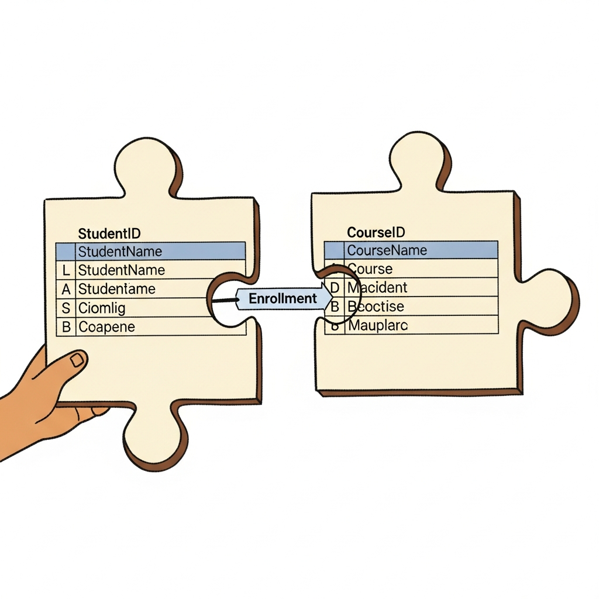
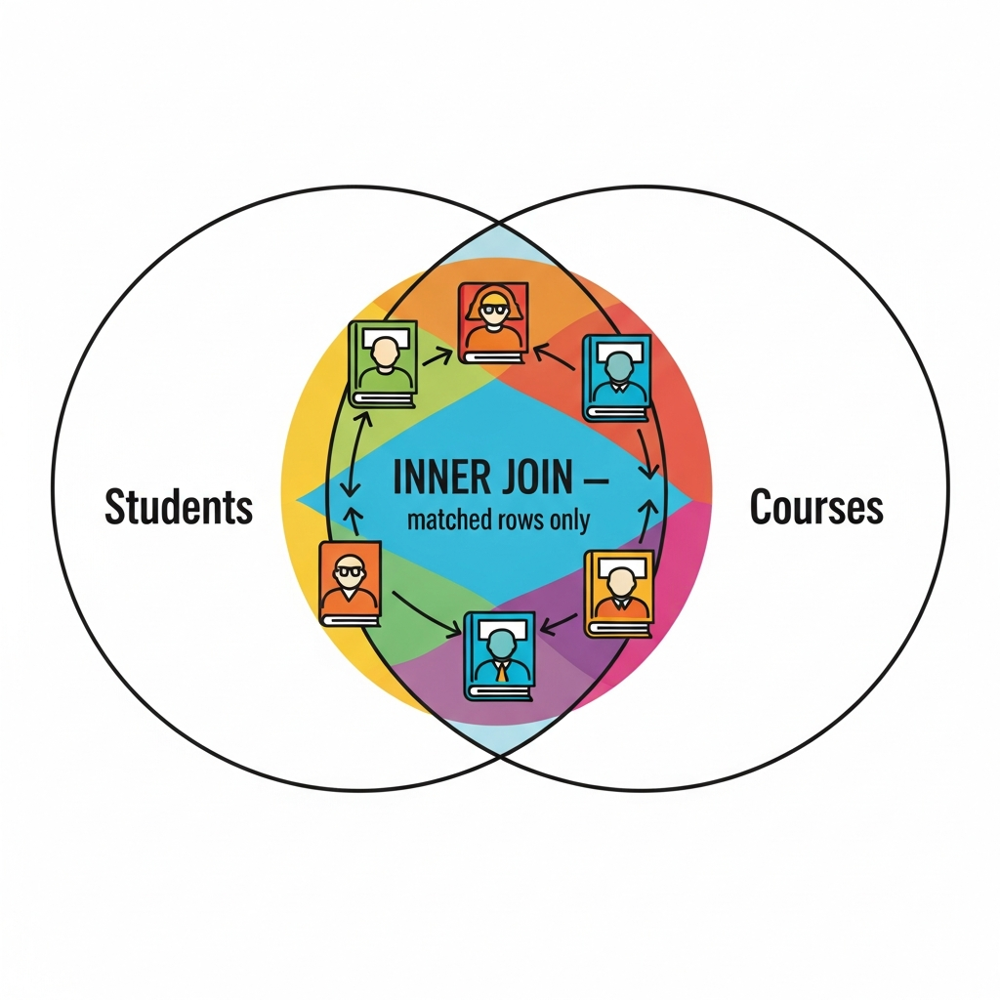
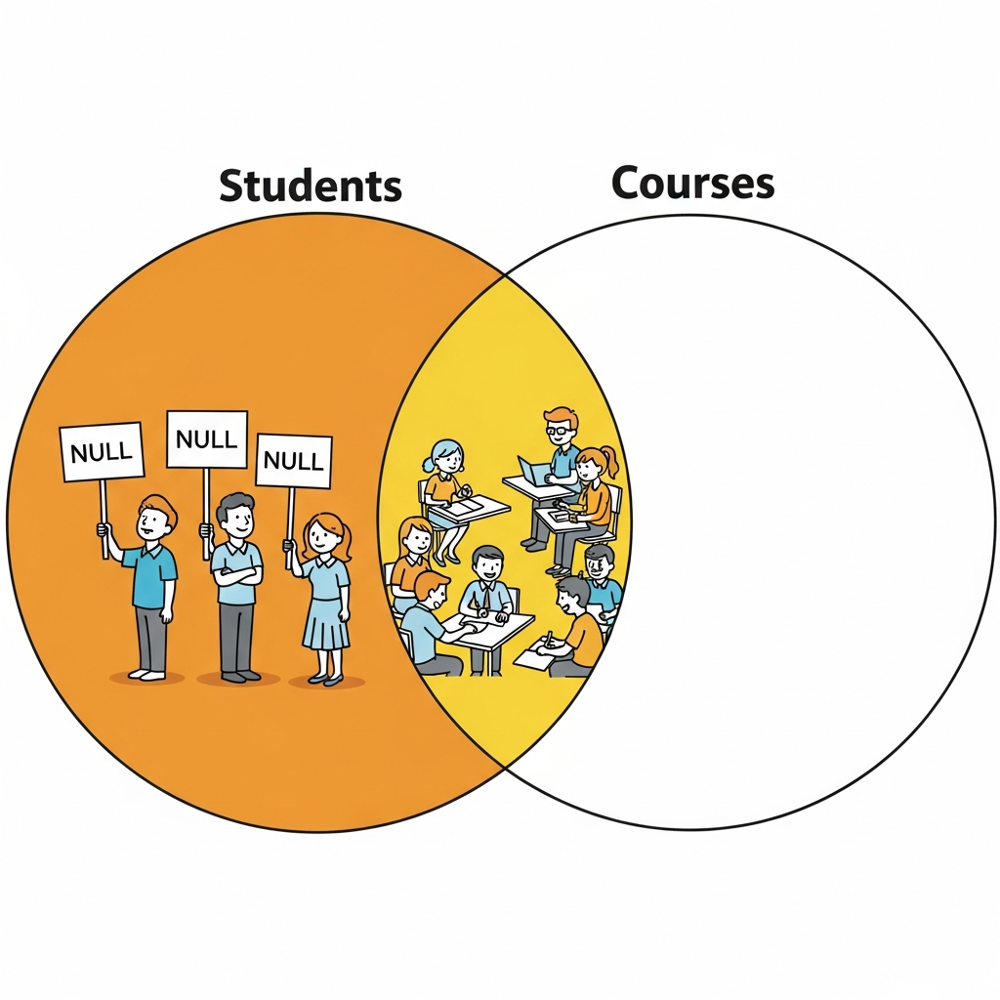
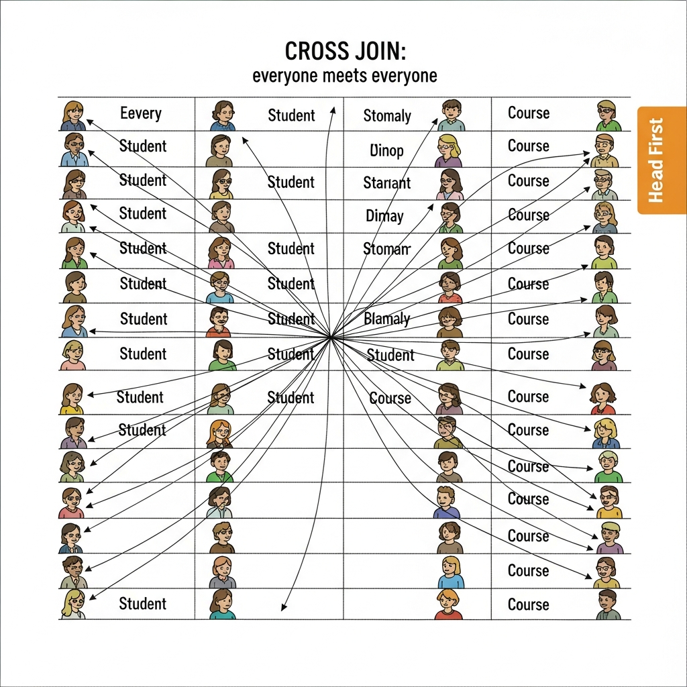
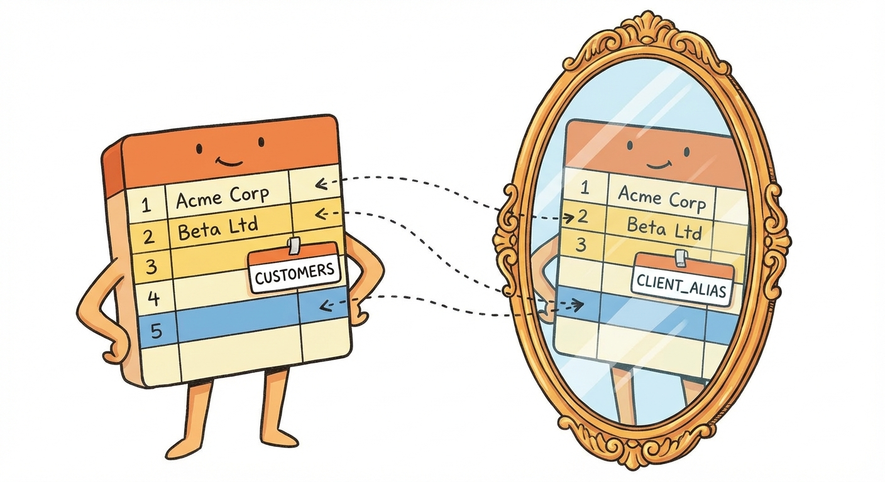

# Module 6: Joins

## Two Tables Walk Into a Bar...

> 🏷️ Combining and Modifying

---


*Everything you've done so far? One table at a time. That's about to change.*

> 🎯 **Teach:** Joins are how relational databases connect data spread across multiple tables -- they are THE defining feature of relational databases.
> **See:** The big picture of why data lives in separate tables and how joins bring it back together.
> **Feel:** Excited that you're about to unlock the real power of SQL.

> 🎙️ Welcome to Module 6, and honestly? This is the one. If there's a single concept that separates someone who "knows a little SQL" from someone who actually gets relational databases, it's joins. Everything you've done so far has been querying one table at a time. That's like reading one chapter of a book and saying you've read the whole thing. Joins let you read the whole story.

---

## Why Do We Even Need Joins?

> 🎯 **Teach:** Data is split across tables on purpose (normalization), and joins are how you reassemble it for queries.
> **See:** The relationship between students, enrollments, and courses -- three tables that tell one story.
> **Feel:** Understanding that separate tables aren't a problem to solve; they're a design choice that joins make powerful.

> 🔄 **Where this fits:** You learned about filtering rows in Module 4 and aggregating data in Module 5. Joins add a new dimension -- combining data from multiple tables before you filter or aggregate.

Remember back in Module 2 when we created separate tables for students, courses, and enrollments? You might have wondered: "Why not just put everything in one giant table?"

Great question. Here's why:

Imagine a student named Alex is enrolled in 3 courses. In a single giant table, you'd have Alex's name, email, age, and major repeated three times -- once for each course. Now imagine 1,000 students each enrolled in 5 courses. That's 5,000 rows with massively duplicated data.

**Separate tables keep data clean. Joins bring it back together when you need it.**

Think of it like a filing system. You don't photocopy a student's entire file and stuff it into every course folder. You keep one student file, one course file, and a cross-reference sheet (enrollments) that says "this student is in this course." When you need the full picture, you *join* them together.

```sql
-- The three tables that tell one story:
-- students:     id, name, email, age, major, gpa
-- courses:      id, name, department, credits
-- enrollments:  id, student_id, course_id, grade, semester
```

That `student_id` in the enrollments table? That's the bridge. That's what makes joins possible.

> 🎙️ The reason data lives in separate tables has a fancy name -- normalization -- but the idea is simple. Don't repeat yourself. Keep each fact in one place. When you need to see the full picture, joins reassemble the pieces. It's elegant, it's efficient, and once you get it, you'll never want to go back to spreadsheet-style everything-in-one-table thinking.

---

## Table Aliases: Your Sanity Savers

> 🎯 **Teach:** Table aliases give short nicknames to tables, making join queries readable instead of painful.
> **See:** The difference between a query with full table names versus clean aliases.
> **Feel:** Relief that you don't have to type `enrollments.student_id` fifty times.

Before we dive into join types, let's talk about something that will save your fingers and your sanity: **table aliases**.

When you're joining tables, you need to specify which table a column comes from. Without aliases, things get ugly fast:

```sql
-- Without aliases: painful
SELECT students.name, courses.name, enrollments.grade
FROM students
INNER JOIN enrollments ON students.id = enrollments.student_id
INNER JOIN courses ON courses.id = enrollments.course_id;
```

With aliases, same query, much nicer:

```sql
-- With aliases: clean
SELECT s.name, c.name, e.grade
FROM students s
INNER JOIN enrollments e ON s.id = e.student_id
INNER JOIN courses c ON c.id = e.course_id;
```

You can use the `AS` keyword (`FROM students AS s`) or just put the alias right after the table name (`FROM students s`). Both work. Most people skip the `AS` because, well, less typing.

> 💡 **Remember this one thing:** Pick short, meaningful aliases. `s` for students, `c` for courses, `e` for enrollments. Your future self will thank you when reading queries at 2 AM.

> 🎙️ Aliases look trivial, but they're one of those habits that separates cramped SQL from readable SQL. Pick the first letter of the table, or an abbreviation if that clashes. Stay consistent across your queries -- if s means students on Monday, it should still mean students on Friday. And once you start writing self-joins and derived tables in the next modules, aliases stop being optional. They become the only way the query makes sense at all.

---

## INNER JOIN: Only the Matched Pairs Dance

> 🎯 **Teach:** INNER JOIN returns only rows where there is a matching value in both tables.
> **See:** A clear visual of two tables being compared, with only the overlapping rows surviving.
> **Feel:** Confident understanding of the most common join type.


*Think of a dance where only people with a partner get on the floor. No partner? You sit this one out.*

Here's the mental model: imagine a school dance. **INNER JOIN is the rule that says you can only dance if you have a partner from the other group.** No match? You sit down.

Let's see it in action:

```sql
-- Show each student alongside their enrollment info
SELECT s.name, e.grade, e.semester
FROM students s
INNER JOIN enrollments e ON s.id = e.student_id;
```

The `ON` clause is the matchmaking condition. It says: "Connect a student row to an enrollment row when the student's `id` matches the enrollment's `student_id`."

**What happens to students with no enrollments?** They disappear from the results. That's the whole point of INNER JOIN -- if there's no match, the row is excluded.

**What happens to enrollments with no valid student?** Same thing. Gone.

Only the matches survive.

```sql
-- Let's say we have:
-- students: Alice (id=1), Bob (id=2), Charlie (id=3)
-- enrollments: student_id=1 (grade A), student_id=1 (grade B), student_id=2 (grade C)

-- INNER JOIN result:
-- Alice  | A
-- Alice  | B
-- Bob    | C
-- (Charlie is missing -- no enrollment match!)
```

> 🎙️ INNER JOIN is the most common join you'll write. If someone just says "join" without specifying a type, they almost always mean INNER JOIN. In fact, you can even drop the word INNER -- just writing JOIN by itself defaults to an inner join. But I'd recommend being explicit, at least while you're learning. Say what you mean.

---

## LEFT JOIN: Everyone From the Left Gets In

> 🎯 **Teach:** LEFT JOIN keeps ALL rows from the left table and fills in NULLs where the right table has no match.
> **See:** The same dance analogy, but now everyone from the left side gets on the floor -- partnerless people dance alone.
> **Feel:** Understanding of when and why you'd choose LEFT JOIN over INNER JOIN.


*LEFT JOIN is the inclusive dance. Everyone from the left side gets on the floor. No partner? You dance solo, and we put NULL where your partner would be.*

Back to our dance. **LEFT JOIN says: "Everyone from the left table dances, no matter what."** If they have a partner from the right table, great -- they dance together. If not, they dance alone, and the partner columns show up as `NULL`.

```sql
-- Show ALL students, even those with no enrollments
SELECT s.name, e.grade, e.semester
FROM students s
LEFT JOIN enrollments e ON s.id = e.student_id;
```

Now Charlie shows up:

```sql
-- LEFT JOIN result:
-- Alice    | A    | Fall 2024
-- Alice    | B    | Fall 2024
-- Bob      | C    | Fall 2024
-- Charlie  | NULL | NULL          <-- Charlie's here! Just with NULLs.
```

This is incredibly useful for finding things that *don't* have a match:

```sql
-- Find students who aren't enrolled in anything
SELECT s.name, s.email
FROM students s
LEFT JOIN enrollments e ON s.id = e.student_id
WHERE e.id IS NULL;
```

That `WHERE e.id IS NULL` trick is one of the most useful patterns in SQL. The LEFT JOIN brings everyone in, and then the WHERE clause filters to only the ones who had no match. It's like checking the dance floor and finding everyone dancing alone.

> 💡 **Remember this one thing:** LEFT JOIN + `WHERE right_table.column IS NULL` = "find everything in the left table that has NO match in the right table." You'll use this pattern constantly.

> 🎙️ Here's a pro tip that will save you from a common mistake. The table order matters in a LEFT JOIN. The left table -- the one listed first, after FROM -- is the one that keeps all its rows. If you write FROM students LEFT JOIN enrollments, all students are preserved. Flip the order and you preserve all enrollments instead. The word "left" refers to position in the query, not some abstract concept.

---

## RIGHT JOIN and FULL OUTER JOIN: The Ones SQLite Skipped

> 🎯 **Teach:** RIGHT JOIN and FULL OUTER JOIN exist in other databases but not in SQLite -- and you can work around both.
> **See:** How to simulate RIGHT JOIN by swapping table order, and the concept behind FULL OUTER JOIN.
> **Feel:** Comfortable knowing the concepts even though SQLite doesn't support them directly.

Time for some honesty: **SQLite doesn't support RIGHT JOIN or FULL OUTER JOIN.** But you should know what they are, because you'll encounter them in PostgreSQL, MySQL, SQL Server, and job interviews.

### RIGHT JOIN

A RIGHT JOIN is just a LEFT JOIN with the tables reversed. Literally. "Keep all rows from the right table."

```sql
-- In PostgreSQL/MySQL you could write:
SELECT s.name, e.grade
FROM students s
RIGHT JOIN enrollments e ON s.id = e.student_id;

-- In SQLite, just swap the table order and use LEFT JOIN:
SELECT s.name, e.grade
FROM enrollments e
LEFT JOIN students s ON s.id = e.student_id;
```

Same result. Different syntax. That's it.

### FULL OUTER JOIN

A FULL OUTER JOIN keeps ALL rows from BOTH tables. No match on either side? Fill in NULLs.

```sql
-- Conceptually (not supported in SQLite):
SELECT s.name, e.grade
FROM students s
FULL OUTER JOIN enrollments e ON s.id = e.student_id;

-- Result: ALL students (even unmatched) AND all enrollments (even unmatched)
```

In SQLite, you can simulate this with a UNION of a LEFT JOIN and a reverse LEFT JOIN:

```sql
-- FULL OUTER JOIN workaround in SQLite
SELECT s.name, e.grade
FROM students s
LEFT JOIN enrollments e ON s.id = e.student_id

UNION

SELECT s.name, e.grade
FROM enrollments e
LEFT JOIN students s ON s.id = e.student_id;
```

It's not pretty, but it works. In practice, FULL OUTER JOIN is rarely needed -- LEFT JOIN covers most real-world scenarios.

> 🎙️ Don't stress about RIGHT JOIN or FULL OUTER JOIN too much. RIGHT JOIN is just a LEFT JOIN with the tables swapped, and FULL OUTER JOIN is rare in the wild. If you master INNER JOIN and LEFT JOIN, you'll handle 95% of the joins you'll ever write. The other 5%? You'll Google them and be fine.

---

## CROSS JOIN: Speed Dating for Tables

> 🎯 **Teach:** CROSS JOIN produces the Cartesian product -- every row from one table paired with every row from the other.
> **See:** The explosive growth in result rows when you cross join even small tables.
> **Feel:** A healthy respect for CROSS JOIN's power (and a little fear of its row count).


*Speed dating. Everyone meets everyone. 5 students x 4 courses = 20 combinations.*

Remember speed dating? Everyone rotates and meets everyone else. **CROSS JOIN does exactly that with table rows.** Every row from the left table gets paired with every row from the right table.

```sql
-- Every student paired with every course
SELECT s.name AS student, c.name AS course
FROM students s
CROSS JOIN courses c;
```

If you have 10 students and 5 courses, you get **50 rows**. 100 students and 20 courses? **2,000 rows.** See where this is going?

CROSS JOIN has no `ON` clause -- there's no matching condition because *everything* matches *everything*.

**When would you actually use this?** More often than you'd think:

- Generating all possible combinations (e.g., all student-course pairings for scheduling)
- Creating test data
- Building a calendar grid (all dates x all time slots)

But be careful. CROSS JOIN a 10,000-row table with another 10,000-row table and you get 100,000,000 rows. Your database will not be amused.

> 💡 **Remember this one thing:** CROSS JOIN = multiplication. Rows in Table A x Rows in Table B = Result rows. Always do the math before running one.

> 🎙️ CROSS JOIN is the one you'll use the least, but when you need it, nothing else will do. The classic legitimate use is generating all valid combinations -- every day paired with every time slot to build a schedule, every product paired with every region for a sales matrix. Just remember it multiplies. Two tables of a hundred rows each becomes ten thousand rows. Check the size first or you'll lock up your session.

---

## Self-Joins: Comparing Yourself to Your Classmates

> 🎯 **Teach:** A self-join joins a table to itself, which is useful for comparing rows within the same table.
> **See:** How aliases make self-joins possible by giving the same table two different identities.
> **Feel:** The "aha" moment of realizing a table can play two roles in the same query.

This one bends your brain a little, but stay with me.

What if you want to find all pairs of students who share the same major? You need to compare the students table... to itself. That's a **self-join**.

The trick: give the same table **two different aliases** so SQL can tell them apart:



```sql
-- Find pairs of students in the same major
SELECT a.name AS student_1, b.name AS student_2, a.major
FROM students a
JOIN students b ON a.major = b.major AND a.id < b.id;
```

Wait, what's that `a.id < b.id` about? Without it, you'd get:
- Alice & Bob (good)
- Bob & Alice (duplicate, just reversed)
- Alice & Alice (comparing someone to themselves -- not useful)

The `a.id < b.id` condition ensures each pair appears exactly once and nobody is paired with themselves. It's like saying "only list each handshake once."

```sql
-- Result:
-- student_1  | student_2  | major
-- Alice      | Charlie    | Computer Science
-- Bob        | Diana      | Mathematics
```

> 🎙️ Self-joins are one of those things that seem weird until they click, and then you see uses for them everywhere. The key insight is that aliases let the same table pretend to be two different tables. Table "a" is one copy of students, table "b" is another copy. SQL doesn't care that they're actually the same table -- it treats them as two separate participants in the join.

---

## Joining 3+ Tables: The Full Picture

> 🎯 **Teach:** You can chain multiple joins to connect three or more tables, following the foreign key relationships.
> **See:** The step-by-step building of a three-table join from students through enrollments to courses.
> **Feel:** Confidence that multi-table joins are just single joins stacked together.

Here's where it all comes together. Our database has three tables: students, enrollments, and courses. The enrollments table sits in the middle, connecting students to courses through `student_id` and `course_id`.

To get the full picture -- which student is in which course with what grade -- you need to join all three:

```sql
-- The big join: students -> enrollments -> courses
SELECT s.name AS student,
       c.name AS course,
       c.department,
       e.grade,
       e.semester
FROM students s
INNER JOIN enrollments e ON s.id = e.student_id
INNER JOIN courses c ON c.id = e.course_id
ORDER BY s.name, c.name;
```

Think of it as a chain: **students** links to **enrollments** via `student_id`, and **enrollments** links to **courses** via `course_id`. Each JOIN adds one more link in the chain.

You can keep going. Four tables? Five? Same pattern -- just add more JOIN clauses. Each one needs an `ON` condition that specifies how the new table connects to something already in the query.

```sql
-- Hypothetical four-table join:
SELECT s.name, c.name, e.grade, p.name AS professor
FROM students s
JOIN enrollments e ON s.id = e.student_id
JOIN courses c ON c.id = e.course_id
JOIN professors p ON p.id = c.professor_id;
```

> 💡 **Remember this one thing:** Multi-table joins follow the foreign key trail. Look at your foreign keys and you have your join conditions written for you.

> 🎙️ Three-table joins feel like a big leap until you realize they're just two joins stacked together. Students connect to enrollments. Enrollments connect to courses. Each join statement handles one connection, and the database walks the chain for you. Your foreign keys are the map -- they literally tell you which columns belong in each ON clause. Follow the foreign keys and the query writes itself.

---

## Complex Join Queries: Joins + GROUP BY + HAVING

> 🎯 **Teach:** Joins become truly powerful when combined with GROUP BY, HAVING, and aggregate functions.
> **See:** Real-world queries that join, group, filter, and aggregate -- all in one statement.
> **Feel:** Capable of writing sophisticated analytical queries that pull from multiple tables.

> 🔄 **Where this fits:** This combines joins (this module) with aggregate functions and GROUP BY (Module 5). If GROUP BY or HAVING feel fuzzy, revisit Module 5 before diving in.

Now let's combine joins with everything you learned in Module 5. This is where SQL gets genuinely powerful.

### How many courses is each student enrolled in?

```sql
SELECT s.name, COUNT(*) AS course_count
FROM students s
INNER JOIN enrollments e ON s.id = e.student_id
GROUP BY s.id, s.name
ORDER BY course_count DESC;
```

### Which students are enrolled in more than 2 courses?

```sql
SELECT s.name, COUNT(*) AS course_count
FROM students s
INNER JOIN enrollments e ON s.id = e.student_id
GROUP BY s.id, s.name
HAVING COUNT(*) > 2;
```

### Enrollment count per department:

```sql
SELECT c.department, COUNT(*) AS total_enrollments
FROM courses c
INNER JOIN enrollments e ON c.id = e.course_id
GROUP BY c.department
ORDER BY total_enrollments DESC;
```

### List all grades received in each course (using GROUP_CONCAT):

```sql
SELECT c.name AS course,
       COUNT(*) AS enrollment_count,
       GROUP_CONCAT(DISTINCT e.grade) AS grades_received
FROM courses c
INNER JOIN enrollments e ON c.id = e.course_id
GROUP BY c.id, c.name
ORDER BY c.name;
```

`GROUP_CONCAT` is a SQLite function that smooshes multiple values into a single comma-separated string. `DISTINCT` inside it ensures each grade appears only once. So instead of "A,A,B,C,A" you get "A,B,C". Very handy for summary reports.

### Find all students who received an 'A' in any course:

```sql
SELECT DISTINCT s.name, c.name AS course, e.grade
FROM students s
INNER JOIN enrollments e ON s.id = e.student_id
INNER JOIN courses c ON c.id = e.course_id
WHERE e.grade = 'A'
ORDER BY s.name;
```

> 🎙️ These complex queries are the payoff for everything you've learned so far. Joins bring the tables together. WHERE filters individual rows. GROUP BY collapses rows into groups. HAVING filters those groups. Aggregate functions crunch the numbers. And ORDER BY presents the results the way you want. Each piece you've learned is a tool, and now you're combining all of them in a single query. This is real SQL.

---

## 🗨️ There Are No Dumb Questions

> 🎯 **Teach:** Address common confusions about joins -- when to use which type, performance, table order, and NULL behavior.
> **See:** Clear, practical answers to the questions every beginner has about joins.
> **Feel:** Reassured that the confusing parts are normal and manageable.

**Q: When should I use INNER JOIN vs. LEFT JOIN?**

A: Ask yourself: "Do I need to see rows from the left table that have NO match?" If yes, use LEFT JOIN. If you only care about matched rows, use INNER JOIN. Example: "Show me all students and their grades" (INNER JOIN -- skip students with no grades). "Show me all students, even those not enrolled" (LEFT JOIN).

**Q: Does the order of tables in a JOIN matter?**

A: For INNER JOIN, no -- the result is the same regardless of order. For LEFT JOIN, absolutely yes -- the table after FROM is the "left" table that keeps all its rows. Swapping the table order in a LEFT JOIN changes the result.

**Q: Can I join on multiple conditions?**

A: Yes! Use AND in the ON clause: `ON a.col1 = b.col1 AND a.col2 = b.col2`. You saw this in self-joins where we used `a.major = b.major AND a.id < b.id`.

**Q: What happens if my join condition matches multiple rows?**

A: You get multiple result rows. If student Alice has 3 enrollments, she'll appear 3 times in the output -- once for each enrollment. This is normal and expected. That's why we sometimes use DISTINCT or GROUP BY.

**Q: Are joins slow?**

A: They can be, especially on large tables without proper indexes. The golden rule: make sure columns used in JOIN conditions (like `student_id`, `course_id`) are indexed. We'll cover indexes in Module 10.

> 🎙️ The most common confusion I see is people using INNER JOIN when they should be using LEFT JOIN, and then wondering why some rows disappeared from their results. If rows are vanishing, check your join type. INNER JOIN drops unmatched rows. LEFT JOIN keeps everything from the left side. That's usually the answer.

---

## ✏️ Sharpen Your Pencil

> 🎯 **Teach:** Practice applying joins in progressively more complex scenarios.
> **See:** Exercises that build from basic two-table joins to multi-table queries with aggregation.
> **Feel:** Motivated to try these queries and see the results for yourself.

Try these on your own before peeking at any solutions:

1. **Basic INNER JOIN:** Write a query to show each student's name alongside every course they're enrolled in (course name, not ID). Use table aliases.

2. **LEFT JOIN + NULL check:** Find all courses that have zero enrollments. Display the course name and department.

3. **Self-join:** Find all pairs of students who are the same age. Show both names and the shared age. Make sure each pair appears only once.

4. **Three-table join with filtering:** Show the name of every student who received a 'B' grade, along with the course name and department. Order by student name.

5. **Join + GROUP BY + HAVING:** Find departments that have more than 3 total student enrollments. Show the department name and the total enrollment count.

6. **LEFT JOIN with aggregation:** Show every student's name and the number of courses they're enrolled in. Students with no enrollments should show 0. (Hint: use COUNT with the enrollment ID, not COUNT(*).)

> 🎙️ Exercise 6 is the tricky one. When you use LEFT JOIN with COUNT, you need to count a column from the right table, not use COUNT star. COUNT star counts all rows including the NULL ones from the left join, which would give you 1 instead of 0 for unenrolled students. COUNT of a specific column skips NULLs. Try it both ways and see the difference.

---

## Bullet Points

> 🎯 **Teach:** A concise summary of all join types and key patterns from this module.
> **See:** Each major concept distilled into a single scannable line.
> **Feel:** Confident that you can reference this list when choosing a join type.

- **Table aliases** (`FROM students s`) make join queries readable. Use them. Always.
- **INNER JOIN** returns only rows with matches in both tables. No match = no row.
- **LEFT JOIN** returns all rows from the left table, with NULLs for unmatched right-side columns.
- **LEFT JOIN + WHERE IS NULL** finds rows with no match -- one of the most useful patterns in SQL.
- **RIGHT JOIN** is just LEFT JOIN with the tables swapped. SQLite doesn't support it, but you don't need it.
- **FULL OUTER JOIN** keeps all rows from both tables. Rare in practice. Not supported in SQLite.
- **CROSS JOIN** produces every possible combination. Rows x Rows = lots of rows. Use with caution.
- **Self-joins** compare a table to itself using two aliases. Great for finding pairs or relationships within a single table.
- **Multi-table joins** chain together following foreign key relationships. Just add more JOIN clauses.
- **Joins + GROUP BY + HAVING** = powerful analytical queries across multiple tables.
- **GROUP_CONCAT** smooshes multiple values into one comma-separated string -- perfect for summary reports.

> 🎙️ Here's your cheat sheet. INNER JOIN for matched rows only. LEFT JOIN for everything from the left plus matches from the right. CROSS JOIN for every possible combination. Self-join when you need to compare rows within the same table. And when in doubt, start with LEFT JOIN -- you can always see what's missing and then switch to INNER JOIN if you don't need the unmatched rows.

---

## Up Next

> 🎯 **Teach:** The next module introduces subqueries and views -- queries nested inside queries, and virtual tables you can reuse.
> **See:** The link to Module 7 and a teaser of what becomes possible.
> **Feel:** Eager to learn how to nest queries like Russian dolls.

[Module 7: Subqueries and Views](./module-07-subqueries-and-views.md) -- What if you could put a query *inside* another query? And what if you could save your favorite complex queries as virtual tables you can reuse anytime? That's subqueries and views, and they're next.

> 🎙️ You just learned how to connect tables together with joins. In the next module, you'll learn how to nest queries inside other queries -- like Russian dolls made of SQL. Combined with joins, subqueries let you answer questions that would be nearly impossible with a single flat query. See you in Module 7.
