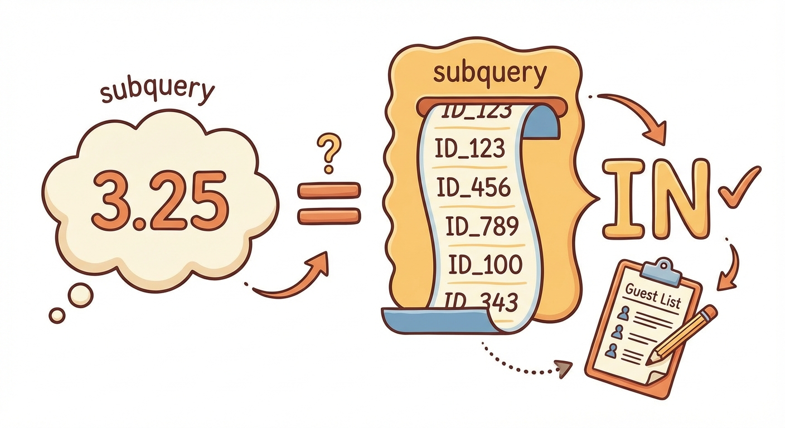
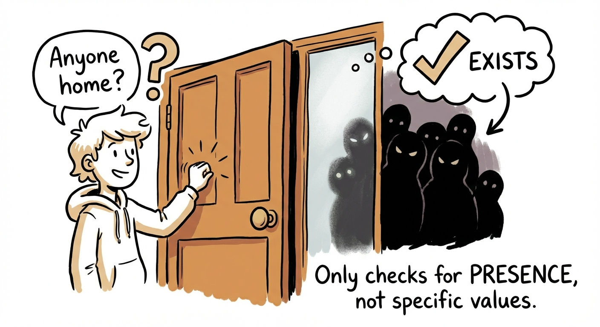
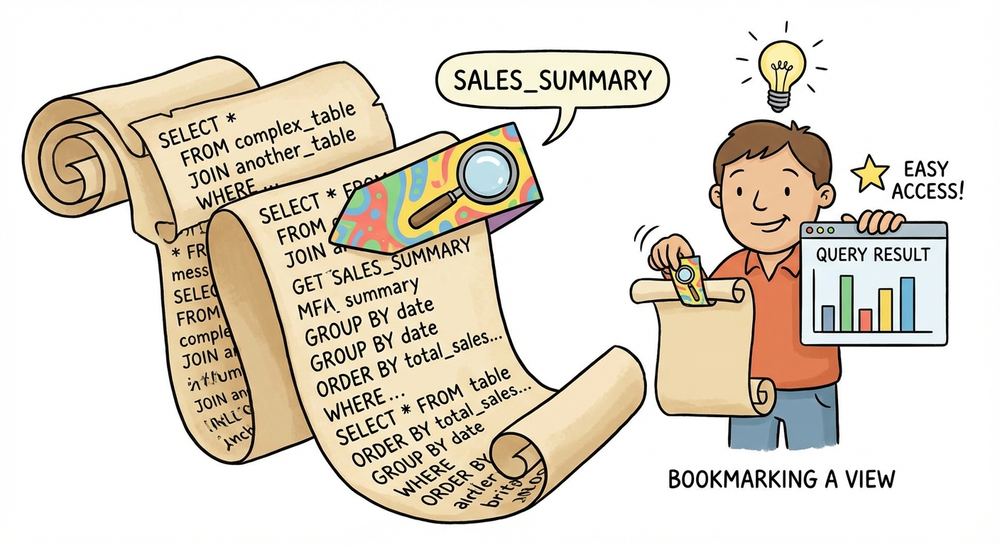

# Module 7: Subqueries and Views

## A Query Inside a Query (Inside a Query...)

> 🏷️ Combining and Modifying

---


*Queries inside queries. It's not as scary as it sounds.*

> 🎯 **Teach:** Subqueries let you use the result of one query as input to another, and views let you save complex queries as reusable virtual tables.
> **See:** The big picture of how subqueries and views build on everything learned so far.
> **Feel:** Curious about how nesting queries opens up a new level of problem-solving power.

> 🎙️ Welcome to Module 7. You've already learned how to pull data from one table, filter it, aggregate it, and join multiple tables together. Now we're going to take it up a notch. What if the answer to your question depends on the answer to another question first? That's what subqueries are for -- a query inside a query. And once you've built a complex query you love, views let you save it and reuse it like a bookmark. Let's dig in.

---

## What Is a Subquery, Really?

> 🎯 **Teach:** A subquery is a SELECT statement nested inside another SQL statement -- it runs first, and its result feeds into the outer query.
> **See:** A simple example showing how the inner query resolves to a value before the outer query uses it.
> **Feel:** The "oh, that's not so bad" moment of realizing subqueries are just queries you already know how to write.

> 🔄 **Where this fits:** Subqueries build on SELECT, WHERE, and aggregate functions (Modules 4-5). They also combine naturally with joins (Module 6) when you need to filter based on related table data.

Here's the deal. You already know how to write a query that finds the average GPA:

```sql
SELECT AVG(gpa) FROM students;
-- Result: 3.25
```

And you know how to find students above a certain GPA:

```sql
SELECT name, gpa FROM students WHERE gpa > 3.25;
```

But what if you don't want to hardcode 3.25? What if you want to say "find students whose GPA is above the average" and let SQL figure out what the average is?

**Put the first query inside the second one:**

```sql
SELECT name, gpa
FROM students
WHERE gpa > (SELECT AVG(gpa) FROM students);
```

That's it. That's a subquery. The part in parentheses runs first, produces a value, and then the outer query uses that value. It's like a calculator doing the inner parentheses first in math class. Same idea.

> 💡 **Remember this one thing:** Subqueries always go in parentheses, and they run from the inside out. The inner query finishes first, then the outer query uses its result.

> 🎙️ If you can write a SELECT statement -- and you can, because you've been doing it for six modules -- then you can write a subquery. It's just a SELECT inside parentheses, tucked into another query. The database runs the inner query first, gets the result, and then plugs that result into the outer query. Inside out. That's the whole secret.

---

## Scalar Subqueries: One Value to Rule Them All

> 🎯 **Teach:** A scalar subquery returns exactly one value (one row, one column) and can be used anywhere a single value is expected.
> **See:** Multiple examples of scalar subqueries used with comparison operators in WHERE clauses.
> **Feel:** Comfortable writing subqueries that return a single answer.

A **scalar subquery** returns a single value -- one row, one column. Think of it as a subquery that resolves to a number, a string, or a date. You can use it with any comparison operator: `=`, `>`, `<`, `>=`, `<=`, `<>`.

```sql
-- Find the youngest student(s)
SELECT name, age
FROM students
WHERE age = (SELECT MIN(age) FROM students);
```

```sql
-- Find courses with more credits than average
SELECT name, department, credits
FROM courses
WHERE credits > (SELECT AVG(credits) FROM courses);
```

The inner query must return exactly one value. If it returns multiple rows or columns, SQL will throw an error. That's the "scalar" part -- one cell, one value.

**You can also use scalar subqueries in the SELECT list:**

```sql
-- Show each student's GPA and how it compares to the average
SELECT name,
       gpa,
       gpa - (SELECT AVG(gpa) FROM students) AS gpa_above_avg
FROM students
ORDER BY gpa_above_avg DESC;
```

That's slick, right? The subquery runs once, gets the average, and then it's subtracted from each student's GPA to create a new calculated column.

> 🎙️ Scalar subqueries are the simplest type and the easiest to reason about. The inner query returns one number. The outer query uses that number in a comparison. If you can write "find the average" or "find the minimum," you can turn it into a scalar subquery by wrapping it in parentheses and dropping it into a WHERE clause.

---

## List Subqueries: IN and NOT IN

> 🎯 **Teach:** When a subquery returns multiple values (a list), you use IN or NOT IN to check membership.
> **See:** The contrast between scalar subqueries (one value, use =) and list subqueries (many values, use IN).
> **Feel:** Recognition that IN with a subquery is a natural extension of the IN operator you already know.

What if your subquery returns not one value, but a whole list? You can't use `=` for that. Instead, you use `IN`.

Think of it like a guest list at a party. The subquery produces the guest list, and then you check who's on it.



```sql
-- Find all students who are enrolled in at least one course
SELECT name, email
FROM students
WHERE id IN (SELECT student_id FROM enrollments);
```

The inner query returns a list of student IDs from the enrollments table. The outer query then says: "Give me students whose ID appears in that list."

**NOT IN does the opposite -- who's NOT on the guest list:**

```sql
-- Find students NOT enrolled in any course
SELECT name, email
FROM students
WHERE id NOT IN (SELECT student_id FROM enrollments);
```

Here's a practical example. Want to find students enrolled in a specific course?

```sql
-- Find students enrolled in course_id 3
SELECT name, major
FROM students
WHERE id IN (
    SELECT student_id
    FROM enrollments
    WHERE course_id = 3
);
```

The inner query finds all `student_id` values for course 3. The outer query looks up those students by ID. Two steps, one query.

> **Watch it!** Be careful with NOT IN when NULLs are involved. If the subquery returns any NULL values, `NOT IN` will return no results at all. This is because `NULL` comparisons are always unknown, and SQL plays it safe. If NULLs are possible, use `NOT EXISTS` instead (coming up next).

> 🎙️ IN with a subquery is one of those patterns you'll reach for all the time. "Find me everyone who has done X" -- subquery finds who did X, IN matches them. "Find me everyone who hasn't done X" -- same thing with NOT IN. Just watch out for NULLs with NOT IN. That gotcha has tripped up more experienced developers than I can count.

---

## EXISTS and NOT EXISTS: Is There At Least One?

> 🎯 **Teach:** EXISTS checks whether a subquery returns any rows at all -- it's a true/false test, not a value lookup.
> **See:** How EXISTS differs from IN -- it doesn't care about specific values, just whether rows exist.
> **Feel:** Understanding of when EXISTS is the right tool (and why it handles NULLs better than IN).

`EXISTS` is a different animal from `IN`. It doesn't care about *what* the subquery returns -- only *whether it returns anything at all*.

Think of it as knocking on a door. You're not asking "who's home?" You're asking "is *anyone* home?"



```sql
-- Find students who have at least one enrollment
SELECT name
FROM students s
WHERE EXISTS (
    SELECT 1
    FROM enrollments e
    WHERE e.student_id = s.id
);
```

That `SELECT 1` in the subquery looks weird, right? It doesn't matter what you select -- `SELECT 1`, `SELECT *`, `SELECT 'pizza'` -- because EXISTS only checks if any rows come back. It's convention to use `SELECT 1` because it's cheap and makes the intent clear: "I'm just checking if something exists."

**NOT EXISTS finds the absence:**

```sql
-- Find students with NO enrollments
SELECT name, email
FROM students s
WHERE NOT EXISTS (
    SELECT 1
    FROM enrollments e
    WHERE e.student_id = s.id
);
```

### EXISTS vs. IN: When to Use Which

Both can solve similar problems. Here's the practical difference:

- **IN** is simpler to read for straightforward lookups
- **EXISTS** handles NULLs correctly (no surprise empty results)
- **EXISTS** can be faster on large datasets because it stops as soon as it finds one match
- **EXISTS** is required when your subquery references the outer query (correlated subqueries -- coming up next)

```sql
-- These two queries produce the same result:

-- Using IN:
SELECT name FROM students
WHERE id IN (SELECT student_id FROM enrollments);

-- Using EXISTS:
SELECT name FROM students s
WHERE EXISTS (SELECT 1 FROM enrollments e WHERE e.student_id = s.id);
```

> 💡 **Remember this one thing:** Use IN when you have a simple list to check against. Use EXISTS when you need to check for the *existence* of related rows, especially when NULLs might be lurking in the data.

> 🎙️ Here's my rule of thumb. If you're thinking "is this value in a list?" use IN. If you're thinking "does a related row exist?" use EXISTS. And if you're using NOT IN and getting weird empty results, switch to NOT EXISTS -- NULLs are probably the culprit. EXISTS is the more robust choice when NULLs are possible.

---

## Derived Tables: Subqueries in the FROM Clause

> 🎯 **Teach:** A subquery in the FROM clause creates a temporary, inline table (called a derived table) that the outer query can select from.
> **See:** How derived tables let you pre-process data before querying it further.
> **Feel:** The power of breaking complex problems into two steps -- build the table, then query it.

So far we've put subqueries in WHERE clauses. But you can also put them in the **FROM clause**, creating a temporary table on the fly. These are called **derived tables** (or sometimes "inline views").

Think of it as building a mini-table of intermediate results, then querying that mini-table.

```sql
-- Find the major with the highest average GPA
SELECT major, avg_gpa
FROM (
    SELECT major, ROUND(AVG(gpa), 2) AS avg_gpa
    FROM students
    GROUP BY major
) AS major_stats
ORDER BY avg_gpa DESC
LIMIT 1;
```

The inner query creates a table called `major_stats` with two columns: `major` and `avg_gpa`. The outer query then sorts that table and grabs the top row.

**Why not just do it in one query?** Sometimes you can. But derived tables are great when:

- You need to filter on an aggregate (and HAVING isn't flexible enough)
- You want to join against a summary
- You need to layer calculations

```sql
-- Find majors with above-average student count
SELECT major, student_count
FROM (
    SELECT major, COUNT(*) AS student_count
    FROM students
    GROUP BY major
) AS counts
WHERE student_count > (
    SELECT AVG(student_count)
    FROM (
        SELECT COUNT(*) AS student_count
        FROM students
        GROUP BY major
    ) AS avg_counts
);
```

OK, that last one is getting deep. Multiple levels of nesting. This is where the Russian doll metaphor really kicks in. Each layer resolves from the inside out.

> **Watch it!** Derived tables **must** have an alias in most SQL databases. That `AS major_stats` isn't optional -- without it, SQL doesn't know what to call your temporary table and will complain.

> 🎙️ Derived tables are one of those features that makes you feel like a SQL wizard. You're basically saying to the database, "First, build me this little summary table. OK, now query THAT." It's a two-step thought process packed into one statement. The key thing to remember is that the derived table needs an alias -- give it a name, or SQL won't know how to reference it.

---

## Correlated Subqueries: The Ones That Phone Home

> 🎯 **Teach:** A correlated subquery references the outer query and runs once per row of the outer query -- it's powerful but can be slow.
> **See:** How correlated subqueries differ from regular subqueries in execution and when they're necessary.
> **Feel:** Appreciation for when correlated subqueries are the right (or only) tool, with awareness of their performance cost.

Regular subqueries run once, produce a result, and the outer query uses that result. **Correlated subqueries are different -- they reference the outer query and run once for every row.**

It's like the difference between:
- Looking up the class average once and comparing everyone to it (regular subquery)
- Looking up each student's *major-specific* average and comparing them to *their own group* (correlated subquery)

```sql
-- Find students whose GPA is above the average for THEIR major
SELECT name, major, gpa
FROM students s1
WHERE gpa > (
    SELECT AVG(gpa)
    FROM students s2
    WHERE s2.major = s1.major
);
```

See that `s1.major` inside the subquery? That's the correlation. The subquery reaches out to the outer query's current row and says "what major is THIS student?" Then it calculates the average GPA for that specific major.

For a student majoring in Computer Science, the subquery calculates the CS average. For a Mathematics student, it calculates the Math average. **It recalculates for every single row.**

### How Execution Works

Imagine the outer query is processing Alice (Computer Science, GPA 3.8):

1. Outer query says: "Here's Alice, major = Computer Science"
2. Inner query runs: "What's the average GPA for Computer Science students?" Answer: 3.4
3. Outer query checks: Is 3.8 > 3.4? Yes! Alice is included.

Now it processes Bob (Mathematics, GPA 3.2):

1. Outer query says: "Here's Bob, major = Mathematics"
2. Inner query runs: "What's the average GPA for Mathematics students?" Answer: 3.5
3. Outer query checks: Is 3.2 > 3.5? No. Bob is excluded.

**This happens for every row.** If you have 1,000 students, the subquery runs 1,000 times.

> **Watch it!** Correlated subqueries can be slow on large tables because they execute the inner query once per row. For large datasets, consider rewriting with joins or derived tables if performance matters.

```sql
-- Same result using a join (often faster):
SELECT s.name, s.major, s.gpa
FROM students s
INNER JOIN (
    SELECT major, AVG(gpa) AS avg_gpa
    FROM students
    GROUP BY major
) AS ma ON s.major = ma.major
WHERE s.gpa > ma.avg_gpa;
```

> 🎙️ Correlated subqueries are the most powerful and the most misunderstood type of subquery. The key distinction is that reference to the outer query -- that's the "phone home" part. Every time the outer query moves to a new row, the inner query calls back and says "hey, what's the value for this row?" and recalculates. It's powerful for row-by-row comparisons, but it can be slow. When performance matters, try rewriting with a join first.

---

## Views: Save Your Favorite Query as a Virtual Table

> 🎯 **Teach:** A view is a saved SELECT statement that acts like a virtual table -- you can query it, join it, and filter it just like a real table.
> **See:** How to create, use, and drop views, and why they're useful for simplifying repeated complex queries.
> **Feel:** The convenience of saving a complex query once and reusing it by name forever.

You've been writing some complex queries -- three-table joins, subqueries, aggregations. Imagine having to re-type your favorite 15-line query every time you need it. That sounds awful.

**Views to the rescue.** A view is a saved query that you can use like a table.

Think of it as a bookmark. The data isn't stored separately -- the view just remembers the query and runs it every time you use it.



```sql
-- Create a view that joins students, enrollments, and courses
CREATE VIEW enrollment_details AS
SELECT s.name AS student_name,
       s.email,
       c.name AS course_name,
       c.department,
       e.grade,
       e.semester
FROM students s
JOIN enrollments e ON s.id = e.student_id
JOIN courses c ON c.id = e.course_id;
```

Now you can query it like a table:

```sql
-- Simple and clean
SELECT * FROM enrollment_details WHERE grade = 'A';
```

```sql
-- Use it with GROUP BY
SELECT department, COUNT(*) AS a_count
FROM enrollment_details
WHERE grade = 'A'
GROUP BY department;
```

```sql
-- Even join it with other tables or views
SELECT ed.student_name, ed.course_name, s.gpa
FROM enrollment_details ed
JOIN students s ON ed.student_name = s.name
WHERE ed.grade = 'A';
```

**Views don't store data.** Every time you query a view, it runs the underlying SELECT statement fresh. If the data in the base tables changes, the view automatically reflects those changes. It's always up to date.

> 🎙️ Views are one of those features that seem simple but change how you work with SQL day to day. Instead of copy-pasting that complex join query into every new report, you save it as a view once and then treat it like any other table. It keeps your queries short, your logic centralized, and your sanity intact.

---

## DROP VIEW: Cleaning Up

> 🎯 **Teach:** DROP VIEW removes a view, and the IF EXISTS clause prevents errors when the view doesn't exist.
> **See:** The safe pattern for dropping and recreating views.
> **Feel:** Comfortable managing the lifecycle of views.

When you want to remove a view:

```sql
DROP VIEW enrollment_details;
```

But if the view doesn't exist, that'll throw an error. The safe way:

```sql
DROP VIEW IF EXISTS enrollment_details;
```

This is especially useful when you want to **recreate a view** with a different definition. You can't CREATE a view that already exists (it'll error), so the common pattern is:

```sql
-- Drop it if it exists, then create fresh
DROP VIEW IF EXISTS enrollment_details;

CREATE VIEW enrollment_details AS
SELECT s.name AS student_name,
       s.email,
       c.name AS course_name,
       c.department,
       e.grade,
       e.semester
FROM students s
JOIN enrollments e ON s.id = e.student_id
JOIN courses c ON c.id = e.course_id;
```

You can also create a summary view:

```sql
DROP VIEW IF EXISTS student_summary;

CREATE VIEW student_summary AS
SELECT s.name,
       s.major,
       s.gpa,
       COUNT(e.id) AS course_count
FROM students s
LEFT JOIN enrollments e ON s.id = e.student_id
GROUP BY s.id, s.name, s.major, s.gpa;
```

Now finding students enrolled in more than 2 courses is a one-liner:

```sql
SELECT * FROM student_summary WHERE course_count > 2;
```

> 💡 **Remember this one thing:** The DROP-then-CREATE pattern (`DROP VIEW IF EXISTS` followed by `CREATE VIEW`) is the standard way to update a view definition. Memorize it -- you'll use it constantly.

> 🎙️ Views don't have an ALTER VIEW statement in most databases -- at least not one you should rely on. The accepted pattern is drop and recreate. The IF EXISTS clause keeps things safe the first time you run the script when no view exists yet. You'll find yourself keeping a little block at the top of your SQL scripts that drops every view in reverse dependency order, then recreates them all. It's a tiny bit of ceremony that makes your schema reproducible, which is exactly what you want.

---

## Putting It All Together: Subqueries + Joins + Views

> 🎯 **Teach:** Show how subqueries, joins, and views work together in real-world scenarios.
> **See:** A complex, realistic query built step by step.
> **Feel:** Capable of combining all these tools to solve real problems.

Let's solve a real question: **"Which students are enrolled in more courses than the average student?"**

Step 1: How many courses is each student enrolled in?

```sql
SELECT student_id, COUNT(*) AS course_count
FROM enrollments
GROUP BY student_id;
```

Step 2: What's the average number of courses per student?

```sql
SELECT AVG(course_count)
FROM (
    SELECT COUNT(*) AS course_count
    FROM enrollments
    GROUP BY student_id
) AS counts;
```

Step 3: Combine them:

```sql
SELECT s.name, COUNT(e.id) AS course_count
FROM students s
INNER JOIN enrollments e ON s.id = e.student_id
GROUP BY s.id, s.name
HAVING COUNT(e.id) > (
    SELECT AVG(course_count)
    FROM (
        SELECT COUNT(*) AS course_count
        FROM enrollments
        GROUP BY student_id
    ) AS avg_counts
);
```

Three levels of nesting. The deepest subquery counts courses per student. The middle subquery averages those counts. The outer query finds students above that average. Inside out, like unwrapping those Russian dolls.

> 🎙️ When you face a complex question, break it into pieces. What do I need to know first? Write that as a subquery. What do I need to know next? Wrap it in another layer. Build from the inside out, test each piece, and then combine. That's the method. It works every time.

---

## 🗨️ There Are No Dumb Questions

> 🎯 **Teach:** Address common confusions about subqueries and views.
> **See:** Practical answers to questions every beginner asks about nesting queries and virtual tables.
> **Feel:** Reassured that subqueries and views are approachable with the right mental models.

**Q: Can I nest subqueries inside subqueries inside subqueries?**

A: Yes, technically you can go as deep as you want. Practically, if you're more than 2-3 levels deep, consider using a view or a derived table to break it up. Deep nesting is hard to read and harder to debug.

**Q: When should I use a subquery vs. a join?**

A: Many subqueries can be rewritten as joins, and vice versa. Use whichever is clearer. Rule of thumb: if you're filtering based on a calculated value (like "above average"), a subquery reads more naturally. If you're combining data from multiple tables, a join is usually cleaner.

**Q: Does a view slow down my queries?**

A: A view doesn't add overhead by itself -- it's just a saved query. The performance is the same as running the underlying SELECT directly. However, if the underlying query is complex (lots of joins, subqueries), it'll be just as slow through a view as it would be directly.

**Q: Can I INSERT or UPDATE data through a view?**

A: In some databases, simple views (based on a single table, no aggregations) are updatable. In SQLite, views are read-only. You always insert/update the base tables directly.

**Q: What's the difference between a derived table and a view?**

A: A derived table exists only within a single query -- it's anonymous and temporary. A view is named and permanent (until you drop it). If you need the same subquery in multiple places, save it as a view. If it's a one-off, use a derived table.

> 🎙️ The question I get most is "subquery or join?" and the honest answer is: it depends on readability. Both can solve the same problem. Subqueries read more like English -- "find students where the GPA is above the average." Joins are often more efficient for combining data. Learn both, and use whichever makes your intent clearer to the next person who reads your code.

---

## ✏️ Sharpen Your Pencil

> 🎯 **Teach:** Practice subqueries and views with exercises that build in complexity.
> **See:** Progressively harder problems that reinforce scalar subqueries, IN, EXISTS, derived tables, correlated subqueries, and views.
> **Feel:** Motivated to test your understanding hands-on.

Try these on your own:

1. **Scalar subquery:** Find all students whose GPA is below the overall average. Show their name, major, and GPA.

2. **IN subquery:** Find the names of students who are enrolled in any course in the "Computer Science" department. (Hint: you'll need to go through enrollments and courses.)

3. **NOT EXISTS:** Find all courses that have zero enrollments. Show course name and department.

4. **Derived table:** Create a derived table that calculates the number of enrollments per department, then use the outer query to find the department with the most enrollments.

5. **Correlated subquery:** Find students whose GPA is the highest in their major. If two students tie, both should appear. Show name, major, and GPA.

6. **Create a view:** Create a view called `grade_report` that shows student name, course name, grade, and semester. Then query it to find all grades from the "Fall 2024" semester.

7. **Bonus -- combine everything:** Write a single query that finds the names of students who are enrolled in more courses than the average number of courses per student. Use a derived table for the average calculation.

> 🎙️ Exercise 5 is the one that will really test your understanding of correlated subqueries. The subquery needs to find the MAX GPA for the current student's major, and then the outer query checks if the student's GPA matches that max. Think about what the correlation point is -- what value from the outer query does the inner query need?

---

## Bullet Points

> 🎯 **Teach:** Concise summary of all subquery types and view operations from this module.
> **See:** A scannable reference for each concept introduced.
> **Feel:** Confident that you have a mental map of all the tools covered.

- **Subqueries** are queries inside queries. They run inside-out (inner first, outer second).
- **Scalar subqueries** return one value. Use with `=`, `>`, `<`, etc.
- **List subqueries** return multiple values. Use with `IN` and `NOT IN`.
- **Beware NOT IN with NULLs** -- if the subquery returns any NULL, you get no results. Use `NOT EXISTS` instead.
- **EXISTS / NOT EXISTS** check whether any rows exist. They don't care about values, just presence.
- **Derived tables** are subqueries in the FROM clause. They must have an alias.
- **Correlated subqueries** reference the outer query and run once per row. Powerful but potentially slow.
- **Many subqueries can be rewritten as joins** (and vice versa). Use whichever is clearer.
- **Views** are saved queries that act like virtual tables. They don't store data -- they run the query each time.
- **DROP VIEW IF EXISTS** is the safe way to remove a view before recreating it.
- **Views are read-only in SQLite** -- you INSERT and UPDATE the base tables, not the view.

> 🎙️ Quick recap. Scalar subqueries for single values. IN and NOT IN for lists. EXISTS for checking if rows exist. Derived tables for intermediate result sets. Correlated subqueries when the inner query needs to reference the outer query. And views for saving your favorite complex queries so you never have to retype them. That's your subquery and views toolkit. Use it well.

---

## Up Next

> 🎯 **Teach:** The next module covers updating and deleting data -- modifying what's already in your tables.
> **See:** The link to Module 8 and a preview of UPDATE and DELETE.
> **Feel:** Ready to learn how to change data, not just read it.

[Module 8: Updating and Deleting Data](./module-08-updating-and-deleting.md) -- So far you've been reading data. What about changing it? UPDATE modifies existing rows, DELETE removes them, and both come with guardrails you'll want to know about before you accidentally wipe a table.

> 🎙️ You now know how to query data in incredibly sophisticated ways -- joins, subqueries, views. But so far, you've only been reading. In the next module, we'll learn how to change what's already there. UPDATE and DELETE are powerful, and just a little bit dangerous. We'll make sure you know how to use them safely. See you in Module 8.
