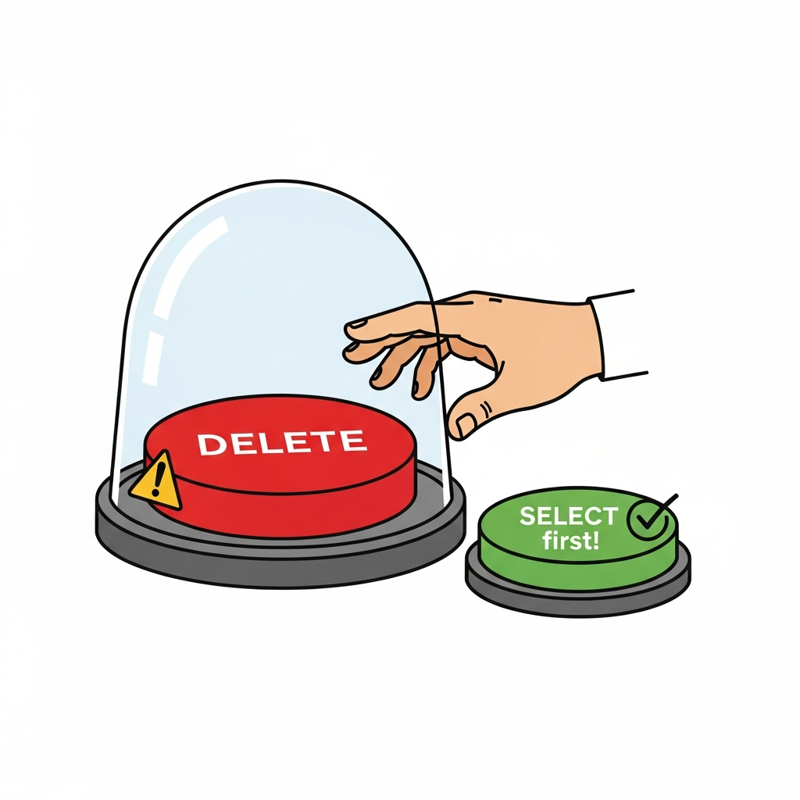
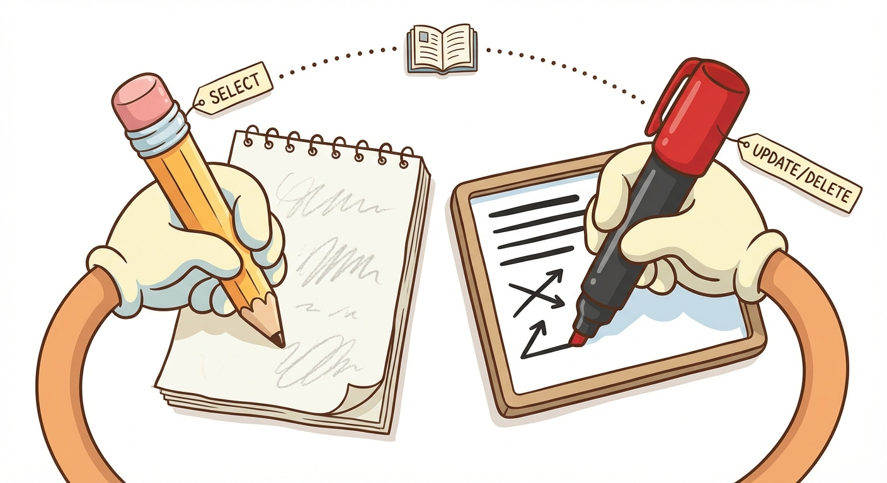
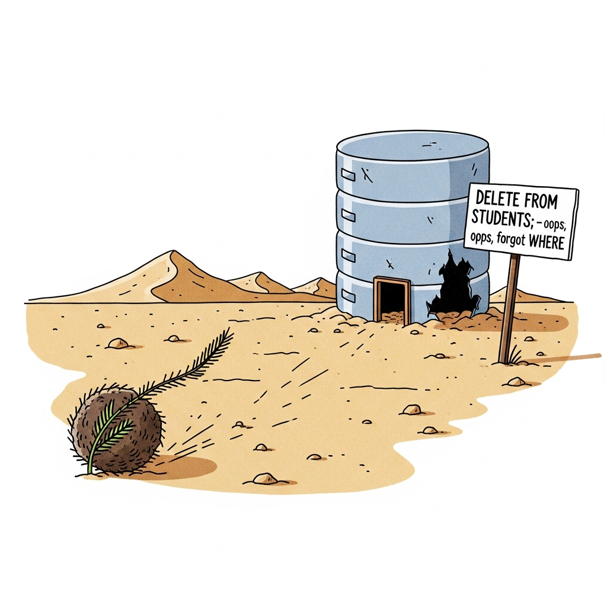
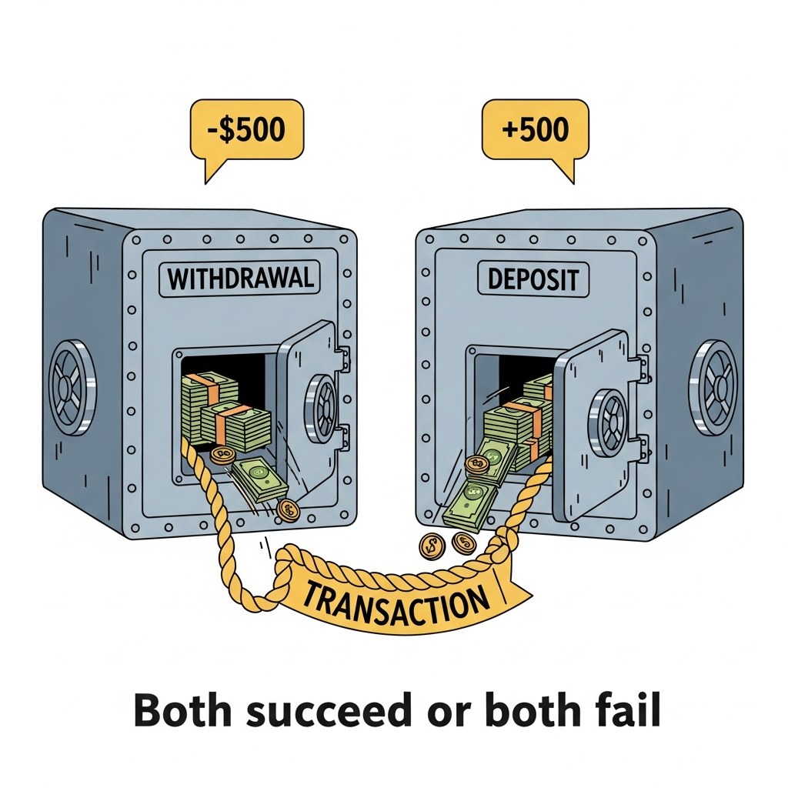

# Module 8: Updating and Deleting Data

## The Permanent Marker Module (or: How to Not Destroy Everything You've Built)

> 🏷️ When You're Ready

---


*Every database administrator's nightmare starts with one missing WHERE clause.*

> 🎯 **Teach:** UPDATE and DELETE are permanent operations that modify or remove data -- unlike SELECT, there is no "just looking" anymore.
> **See:** The contrast between SELECT (safe, read-only) and UPDATE/DELETE (permanent, irreversible without transactions).
> **Feel:** A healthy respect for the power of these commands, balanced with confidence that there are safety practices to protect you.

> 🎙️ Welcome to Module 8. Up until now, everything you've done in SQL has been safe. SELECT queries are like window shopping -- you look, but you don't touch. That changes today. UPDATE and DELETE actually change your data, and in most cases, there's no undo button. So before we write a single UPDATE statement, we're going to talk about safety. Because the difference between a good database administrator and someone updating their resume is often one missing WHERE clause.

---

## SELECT is a pencil. UPDATE and DELETE are permanent markers.

> 🎯 **Teach:** SELECT reads data without changing it; UPDATE modifies existing rows; DELETE removes rows entirely.
> **See:** The three operations side by side -- read, modify, remove -- with clear visual distinction between "safe" and "permanent."
> **Feel:** A gut-level understanding that UPDATE and DELETE are in a different category from everything you've done before.

> 🔄 **Where this fits:** You've learned to CREATE tables (Module 3), INSERT data (Module 4), and SELECT data in increasingly powerful ways (Modules 5-7). Now you're completing the cycle -- modifying and removing the data you've been querying.

Here's the thing about everything you've learned so far: it was all safe. You could run any SELECT query a thousand times and your data would be exactly the same afterward. SELECT is a pencil -- you can sketch, erase, try again.



UPDATE and DELETE? Those are permanent markers on a shared whiteboard.

Think of it like editing a Google Doc that the entire company uses -- except there's no version history. No "undo." No "restore previous version." What you change is changed. What you delete is gone.

*Dramatic? Maybe. But this is one of the few times in this course where a little drama is justified.*

### UPDATE: Change existing data

```sql
-- Update a single row
UPDATE students
SET gpa = 3.8
WHERE id = 1;

-- Update multiple columns at once
UPDATE students
SET gpa = 3.9, major = 'Physics'
WHERE name = 'Alice';
```

The structure is straightforward: tell SQL which table, what to SET, and WHERE to apply it.

### DELETE: Remove rows entirely

```sql
-- Delete specific rows
DELETE FROM enrollments
WHERE grade = 'F';
```

Even simpler. Tell SQL which table and WHERE to delete.

> 🎙️ Notice that both UPDATE and DELETE have the same basic shape -- a table name and a WHERE clause. That WHERE clause is doing all the heavy lifting. It's the difference between "fix Alice's GPA" and "fix everyone's GPA." We'll come back to why that matters in a moment.

---

## The Golden Rule: Test with SELECT First

> 🎯 **Teach:** Before running any UPDATE or DELETE, always preview the affected rows with a SELECT query using the same WHERE clause.
> **See:** The two-step pattern: SELECT to preview, then UPDATE/DELETE to execute -- like checking your parachute before jumping.
> **Feel:** The safety practice becoming automatic, like checking mirrors before changing lanes.

This is the single most important habit you will learn in this entire module. Tattoo it on your brain:

**Before you UPDATE or DELETE anything, run a SELECT with the same WHERE clause first.**


*You wouldn't jump without checking. Don't UPDATE without SELECTing.*

Here's the pattern:

```sql
-- Step 1: Preview what will be affected
SELECT * FROM students WHERE gpa < 2.0;
```

Look at the results. Are these the rows you expected? Is the count right? Are there any surprises?

```sql
-- Step 2: ONLY if the results look correct, run the real thing
DELETE FROM students WHERE gpa < 2.0;
```

This takes five seconds and can save you hours of disaster recovery. It's the SQL equivalent of "measure twice, cut once."

> 💡 **Remember this one thing:** Always SELECT before you UPDATE or DELETE. Always. No exceptions. Not even "just this once." Especially not "just this once."

> 🎙️ I cannot stress this enough. Professional database administrators who have been doing this for twenty years still test with SELECT first. It's not a beginner thing -- it's a smart thing. The five seconds it takes to preview your results can save you from explaining to your boss why the customer table is empty.

---

## UPDATE in Detail

> 🎯 **Teach:** UPDATE can modify one column, multiple columns, and even use calculated values -- all controlled by the WHERE clause.
> **See:** Progressively more complex UPDATE examples, from single-value changes to conditional logic.
> **Feel:** Comfortable writing UPDATE statements because you understand exactly what each part does.

Let's get comfortable with UPDATE by working through increasingly complex examples.

### Updating a single column

```sql
UPDATE students
SET gpa = 3.75
WHERE id = 1;
```

This finds the student with `id = 1` and changes their GPA to 3.75. Everything else about that row stays the same.

### Updating multiple columns

```sql
UPDATE students
SET gpa = 3.6, major = 'Data Science'
WHERE major = 'Computer Science' AND gpa < 3.0;
```

You can SET as many columns as you need, separated by commas. This changes both the major and GPA for Computer Science students who are below a 3.0.

### Updating with calculations

```sql
UPDATE products
SET price = price * 1.10
WHERE category = 'Electronics';
```

You can reference the current value of a column in your SET clause. This gives every electronics product a 10% price increase. The old value of `price` is used to calculate the new one.

### UPDATE with CASE: Conditional updates

What if different rows need different updates? That's where CASE expressions come in. Think of it as an if/else inside your SET clause.

```sql
UPDATE students
SET gpa = CASE
    WHEN gpa >= 3.5 THEN MIN(gpa + 0.1, 4.0)
    WHEN gpa >= 2.5 THEN MIN(gpa + 0.2, 4.0)
    ELSE MIN(gpa + 0.3, 4.0)
END;
```

This is a grade curve -- high-GPA students get a small bump, low-GPA students get a bigger one, and nobody goes above 4.0. One statement, multiple conditions, all handled cleanly.

> 🎙️ CASE expressions in UPDATE are incredibly powerful. Instead of writing three separate UPDATE statements and scanning the table three times, you write one statement that handles all the logic. It's more efficient, and more importantly, it's atomic -- all the changes happen together.

---

## DELETE in Detail

> 🎯 **Teach:** DELETE removes entire rows that match the WHERE clause -- there is no "delete just one column" (that's UPDATE with SET to NULL).
> **See:** DELETE examples from simple to subquery-based, with the critical warning about omitting WHERE.
> **Feel:** Confidence in using DELETE correctly, paired with a healthy fear of using it carelessly.

DELETE is simpler than UPDATE because there's nothing to SET. You're not changing data -- you're removing it.

### Basic DELETE

```sql
DELETE FROM enrollments
WHERE grade = 'F';
```

Every enrollment with a grade of 'F' is gone. Not changed to something else -- *gone*.

### DELETE with multiple conditions

```sql
DELETE FROM enrollments
WHERE semester = 'Fall 2024'
AND grade IS NULL;
```

You can use any WHERE clause you'd use in a SELECT. AND, OR, IN, BETWEEN -- all fair game.

### The nuclear option: DELETE without WHERE

```sql
-- DO NOT RUN THIS
DELETE FROM students;
```

**This deletes every single row in the table.** The table still exists (it's not DROP TABLE), but it's completely empty. Every student, gone.


*This is what your students table looks like after DELETE without WHERE.*

There are legitimate reasons to empty a table (resetting test data, for example), but in production? This is the kind of mistake that makes the news.

> 💡 **Remember this one thing:** DELETE without WHERE deletes EVERYTHING. UPDATE without WHERE updates EVERYTHING. The WHERE clause isn't optional -- it's your safety net.

> 🎙️ DELETE is blunt. It's not a soft delete, it's not a hide, it's not a move-to-archive. It's gone. That's why the WHERE clause is the most important part of any DELETE statement. Read your DELETE statement out loud before running it -- "delete from enrollments where grade equals F" sounds right. But "delete from enrollments" with no WHERE -- that's the one that shows up in post-mortems. Every professional DBA has a war story about a missing WHERE clause. Don't add yours to the pile.

---

## UPDATE and DELETE with Subqueries

> 🎯 **Teach:** Subqueries let you target rows for UPDATE or DELETE based on conditions in other tables.
> **See:** Real examples of cross-table operations -- deleting enrollments based on student data, updating grades based on GPA.
> **Feel:** The power of combining subqueries with data modification, and the importance of testing even more carefully.

Sometimes you need to modify data in one table based on conditions in another. That's where subqueries come in -- and where things get really interesting (and really dangerous if you're not careful).

### DELETE with a subquery

```sql
-- First, preview what you're about to delete!
SELECT e.* FROM enrollments e
WHERE e.student_id IN (SELECT id FROM students WHERE major = 'Art');

-- Then delete
DELETE FROM enrollments
WHERE student_id IN (SELECT id FROM students WHERE major = 'Art');
```

This removes all enrollments for Art majors. The subquery finds the student IDs, and the DELETE uses them as targets.

### UPDATE with a subquery

```sql
-- Preview first
SELECT * FROM enrollments
WHERE student_id IN (SELECT id FROM students WHERE gpa > 3.9);

-- Then update
UPDATE enrollments
SET grade = 'A+'
WHERE student_id IN (SELECT id FROM students WHERE gpa > 3.9);
```

Every enrollment belonging to a student with a GPA above 3.9 gets bumped to A+.

### UPDATE to fix orphaned data

```sql
-- Find students with no enrollments
SELECT * FROM students
WHERE id NOT IN (SELECT DISTINCT student_id FROM enrollments);

-- Mark them as undeclared
UPDATE students
SET major = 'Undeclared'
WHERE id NOT IN (SELECT DISTINCT student_id FROM enrollments);
```

This is a common real-world pattern: finding rows that *don't* match anything in a related table and updating them.

> 🎙️ Subqueries in UPDATE and DELETE are where the golden rule matters most. You're now modifying data based on a chain of logic -- "delete enrollments for students whose major is this, in courses from that department." The more complex the logic, the more critical it is to preview with SELECT first. Test every layer of the subquery before you pull the trigger.

---

## 🗨️ There Are No Dumb Questions

> 🎯 **Teach:** Common concerns about UPDATE and DELETE have practical, reassuring answers.
> **See:** Four Q&A pairs addressing recovery, cascading effects, and the difference between DELETE and DROP.
> **Feel:** Reassured that these are normal concerns and that there are real safeguards.

**Q: I accidentally deleted the wrong rows. Can I get them back?**

A: If you weren't using a transaction (we'll cover those next), then no -- the data is gone. This is exactly why we test with SELECT first. Some database systems have backup and recovery tools, but in SQLite, once it's committed, it's committed. Prevention is your best recovery strategy.

**Q: What's the difference between DELETE FROM students and DROP TABLE students?**

A: DELETE removes the *rows* but keeps the table structure. The table still exists, it's just empty. DROP TABLE removes the entire table -- structure, data, indexes, everything. It's like the difference between emptying a filing cabinet (DELETE) and throwing the entire cabinet in a dumpster (DROP).

**Q: If I delete a student, what happens to their enrollments?**

A: That depends on how the foreign key was set up. If it was created with `ON DELETE CASCADE`, the enrollments are automatically deleted too. If not, SQLite might prevent the delete (if foreign keys are enabled) or leave orphaned enrollment records pointing to a student that no longer exists. This is why schema design matters.

**Q: Can I UPDATE or DELETE rows in a view?**

A: In most cases, no. Views are virtual tables based on queries. Some databases support updatable views under certain conditions, but in SQLite, views are read-only. You need to UPDATE or DELETE from the underlying tables directly.

> 🎙️ The cascade question is the most important one here. When you delete a student, what happens to their enrollments? If you set up the foreign key with ON DELETE CASCADE, the enrollments vanish too -- automatic cleanup. Without cascade, you either get blocked by the foreign key or you leave orphan records behind. Neither is a disaster, but both need to be a conscious choice when you design the schema. Don't just copy-paste foreign keys. Think about what should happen when the parent row goes away.

---

## Transactions: Your Undo Button

> 🎯 **Teach:** Transactions group multiple SQL statements into a single atomic unit -- either everything succeeds together, or nothing happens at all.
> **See:** The BEGIN/COMMIT/ROLLBACK pattern, and the bank transfer analogy that makes atomicity intuitive.
> **Feel:** Relief that there IS a safety mechanism for complex operations, and excitement about what becomes possible when you can "undo."

OK, we've spent a lot of time talking about how permanent everything is. Time for some good news.

**Transactions are the closest thing SQL has to an undo button.**

A transaction wraps multiple SQL statements into a single unit. Either *all* of them succeed, or *none* of them take effect. It's all or nothing.

```sql
BEGIN TRANSACTION;

UPDATE students SET gpa = 3.5 WHERE id = 1;
UPDATE students SET gpa = 3.6 WHERE id = 2;

COMMIT;  -- Both changes are now permanent
```

Or, if something goes wrong:

```sql
BEGIN TRANSACTION;

UPDATE students SET gpa = 3.5 WHERE id = 1;
UPDATE students SET gpa = 3.6 WHERE id = 2;

ROLLBACK;  -- Neither change happened. The database is exactly as it was before.
```


*Either BOTH the withdrawal and deposit happen, or NEITHER does. That's a transaction.*

> 🎙️ Think of a transaction like an envelope. You put all your SQL statements inside the envelope, and you don't mail it until you're ready. BEGIN opens the envelope. Each statement goes inside. COMMIT seals it and sends it. ROLLBACK shreds the whole thing. Nothing inside the envelope affects the database until you COMMIT.

---

## Why Transactions Matter: The Bank Transfer Problem

> 🎯 **Teach:** Without transactions, multi-step operations can fail halfway through, leaving data in an inconsistent state.
> **See:** The classic bank transfer scenario where money disappears without transactions, and is protected with them.
> **Feel:** A visceral understanding of why atomicity isn't just a nice feature -- it's essential for data integrity.

Here's the scenario that makes transactions click for everyone.

You're transferring $500 from Account A to Account B. This requires two operations:

1. Withdraw $500 from Account A
2. Deposit $500 into Account B

**Without a transaction:**

```sql
UPDATE accounts SET balance = balance - 500 WHERE id = 'A';
-- Power goes out here. Or the server crashes. Or a bug stops execution.
UPDATE accounts SET balance = balance + 500 WHERE id = 'B';
```

Account A lost $500. Account B never got it. The money just... vanished. Your customer is furious, and rightfully so.

**With a transaction:**

```sql
BEGIN TRANSACTION;

UPDATE accounts SET balance = balance - 500 WHERE id = 'A';
UPDATE accounts SET balance = balance + 500 WHERE id = 'B';

COMMIT;
```

If anything goes wrong between BEGIN and COMMIT, **neither** update takes effect. The money stays in Account A. No disappearing acts.

### More real-world scenarios

**Order processing:**
```sql
BEGIN TRANSACTION;

-- Reduce inventory
UPDATE products SET stock = stock - 1 WHERE id = 42;

-- Create the order
INSERT INTO orders (customer_id, product_id, quantity)
VALUES (7, 42, 1);

-- Charge the customer
UPDATE customers SET balance = balance - 29.99 WHERE id = 7;

COMMIT;
```

If the inventory update succeeds but the order insert fails, you don't want a "phantom" stock reduction. The transaction ensures all three steps happen together or not at all.

**Course registration:**
```sql
BEGIN TRANSACTION;

-- Add the enrollment
INSERT INTO enrollments (student_id, course_id, semester)
VALUES (15, 101, 'Fall 2025');

-- Update the course seat count
UPDATE courses SET seats_available = seats_available - 1
WHERE id = 101;

COMMIT;
```

Without a transaction, you could end up with an enrollment but no seat reduction -- or worse, a seat reduction but no enrollment record.

> 🎙️ The pattern is always the same: multiple related changes that must succeed or fail together. Anytime you find yourself writing two or more statements that are logically connected -- where one without the other would leave your data in a broken state -- wrap them in a transaction. It's cheap insurance.

---

## Putting Transactions to Work

> 🎯 **Teach:** The practical mechanics of BEGIN, COMMIT, and ROLLBACK -- including how to use ROLLBACK as a safety tool during development.
> **See:** A successful transaction and a rolled-back transaction side by side, with verification queries.
> **Feel:** Confident enough to use transactions in your own work, starting today.

### A successful transaction

```sql
BEGIN TRANSACTION;

-- Add a new student
INSERT INTO students (name, major, gpa)
VALUES ('Diana Prince', 'Political Science', 3.85);

-- Enroll them immediately
INSERT INTO enrollments (student_id, course_id, semester)
VALUES (last_insert_rowid(), 101, 'Fall 2025');

COMMIT;

-- Verify both records exist
SELECT s.name, c.name AS course_name, e.semester
FROM students s
JOIN enrollments e ON s.id = e.student_id
JOIN courses c ON c.id = e.course_id
WHERE s.name = 'Diana Prince';
```

### A rolled-back transaction (the safety net in action)

```sql
BEGIN TRANSACTION;

-- Oops, let's delete all enrollments for student 5
DELETE FROM enrollments WHERE student_id = 5;
-- And delete the student
DELETE FROM students WHERE id = 5;

-- Wait, wrong student! Undo everything!
ROLLBACK;

-- Verify nothing changed
SELECT * FROM students WHERE id = 5;
SELECT * FROM enrollments WHERE student_id = 5;
```

Everything is still there. ROLLBACK saved the day.

> 💡 **Remember this one thing:** When in doubt, wrap it in a transaction. You can always ROLLBACK if something looks wrong, but you can't un-COMMIT.

> 🎙️ Here's the workflow I want you to internalize. Type BEGIN TRANSACTION. Run your changes. Run a SELECT to verify the result looks right. If it does, COMMIT. If it doesn't, ROLLBACK. That sequence -- begin, change, verify, commit or rollback -- is the safest way to do surgery on a database. Do that every single time until it becomes muscle memory. It turns every risky operation into a preview you can walk away from.

---

## The Danger Zone: Common Mistakes

> 🎯 **Teach:** The most common UPDATE and DELETE mistakes, and how to avoid every single one of them.
> **See:** Specific examples of what goes wrong when you forget WHERE, skip the SELECT preview, or mix up your conditions.
> **Feel:** Warned but not scared -- these mistakes are avoidable with the habits you've already learned.

Let's talk about what can go wrong so you know exactly what to watch for.

### Mistake 1: Forgetting the WHERE clause

```sql
-- You meant to do this:
UPDATE students SET major = 'Undeclared' WHERE id = 42;

-- But you accidentally ran this:
UPDATE students SET major = 'Undeclared';
-- Congratulations, EVERY student is now Undeclared.
```

### Mistake 2: Wrong WHERE condition

```sql
-- You wanted students with GPA below 2.0
DELETE FROM students WHERE gpa > 2.0;
-- Oops, that's greater than, not less than. You just deleted your best students.
```

### Mistake 3: Not considering related data

```sql
-- You delete a course
DELETE FROM courses WHERE id = 101;
-- But 200 students were enrolled in that course.
-- Now their enrollment records point to a course that doesn't exist.
```

### How to stay safe

1. **Always test with SELECT first** (you knew this was coming)
2. **Use transactions** for anything beyond a single simple change
3. **Double-check your WHERE clause** -- especially > vs < and = vs !=
4. **Think about related tables** before deleting anything
5. **Back up your database** before major operations

> 🎙️ None of these mistakes require advanced SQL knowledge to make. They're typos, mental slips, and moments of inattention. That's exactly what makes them so dangerous -- and exactly why the safety habits we've been drilling matter so much. The SELECT-first rule and transactions are your two best friends here.

---

## ✏️ Sharpen Your Pencil

> 🎯 **Teach:** Practice UPDATE, DELETE, and transactions with exercises that reinforce the safety-first mindset.
> **See:** Three practical exercises that require the SELECT-first pattern and transaction usage.
> **Feel:** Ready to apply these skills independently with confidence.

1. **The safe UPDATE:** Write a SELECT query to find all students with a GPA below 3.0 in the 'Computer Science' major. Then write an UPDATE that changes their major to 'Undeclared'. Include both the preview SELECT and the UPDATE.

2. **CASE expression challenge:** Write a single UPDATE with a CASE expression that adjusts all student GPAs:
   - GPA of 4.0: no change
   - GPA 3.5-3.99: increase by 0.05
   - GPA 3.0-3.49: increase by 0.1
   - GPA below 3.0: increase by 0.15
   - Cap all GPAs at 4.0

3. **Transaction exercise:** Write a transaction that:
   - Deletes all enrollments for a student with id = 5
   - Deletes that student from the students table
   - Then uses ROLLBACK instead of COMMIT
   - Write SELECT queries to prove the student and enrollments still exist after the ROLLBACK

> 🎙️ The transaction exercise is the one I really want you to do. Seeing ROLLBACK actually undo a DELETE you just ran is a genuinely reassuring experience -- it turns transactions from an abstract concept into a tool you trust. Run the DELETE statements, check that the rows are gone with a SELECT, then ROLLBACK, then SELECT again and watch the rows come back. That moment is why we teach transactions.

---

## Bullet Points

> 🎯 **Teach:** A concise summary of every critical concept from this module.
> **See:** Each bullet distilling one key takeaway.
> **Feel:** Confidence that you can UPDATE and DELETE safely.

- **UPDATE** changes existing data with SET and WHERE. Without WHERE, it changes every row.
- **DELETE** removes rows entirely. Without WHERE, it removes every row.
- **Always test with SELECT first.** Use the same WHERE clause to preview affected rows before modifying them.
- **UPDATE with CASE** lets you apply different changes to different rows in a single statement.
- **Subqueries** in UPDATE and DELETE let you target rows based on data in other tables.
- **Transactions** (BEGIN, COMMIT, ROLLBACK) group multiple statements into an atomic unit -- all succeed or none take effect.
- **COMMIT** makes changes permanent. **ROLLBACK** undoes everything back to BEGIN.
- **Use transactions** whenever multiple related changes must succeed or fail together (bank transfers, order processing, registration).
- **The biggest danger** is forgetting the WHERE clause. That single oversight can wipe out an entire table.

> 🎙️ Let's recap. UPDATE and DELETE are powerful and permanent. Your safety net is a three-part system: test with SELECT first, use transactions for multi-step operations, and always double-check your WHERE clause. Master those three habits and you can confidently modify data without losing sleep. Next up, we'll look at how to make your queries faster and your databases more secure.

---

## Up Next

> 🎯 **Teach:** The next module covers performance, security, and design -- the big-picture thinking that separates beginners from professionals.
> **See:** The link to Module 9 with a preview of indexes, SQL injection, and normalization.
> **Feel:** Eager to learn the "why" behind database design decisions.

[Module 9: Indexes and Best Practices](./module-09-indexes-and-best-practices.md) -- You've learned how to build, fill, query, and modify databases. Now it's time to make them fast, secure, and well-designed. We'll cover indexes (the turbo button for queries), SQL injection (the security hole you need to close), and normalization (the art of organizing data so it doesn't fall apart).

> 🎙️ You now know how to do everything with data -- create it, read it, update it, delete it. The full CRUD cycle. In Module 9, we zoom out and ask the bigger questions: how do we make this fast? How do we make this secure? How do we design databases that don't become a tangled mess? See you there.
