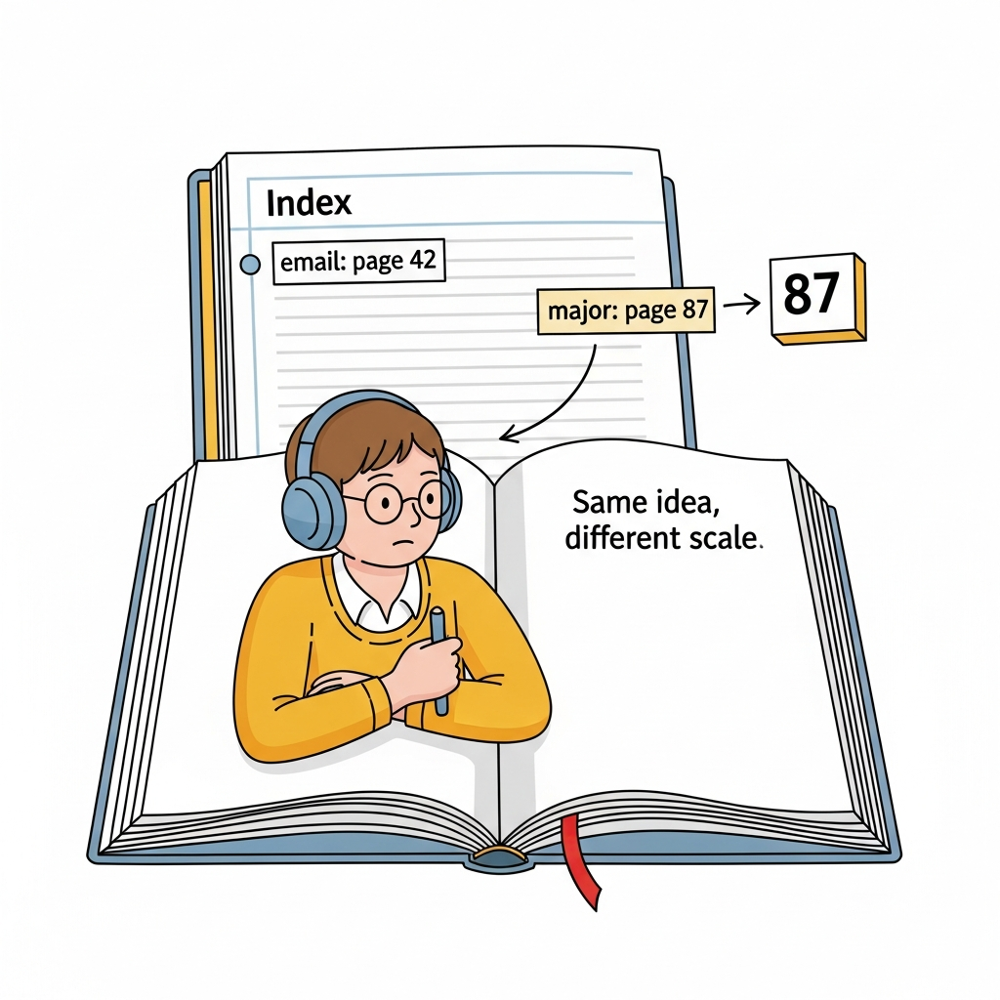
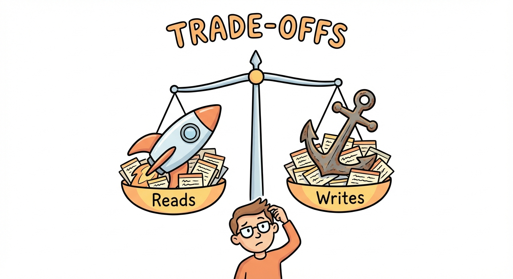

# Module 9: Indexes and Best Practices

## The Big Picture (or: Making Your Database Fast, Secure, and Not a Total Mess)

> 🏷️ Advanced

---


*Finding a needle in a haystack is hard. Finding a needle in an indexed haystack? Instant.*

> 🎯 **Teach:** This module covers the three pillars of professional database work: performance (indexes), security (SQL injection prevention), and design (normalization and conventions).
> **See:** The shift from "writing queries that work" to "writing queries that work well, safely, and at scale."
> **Feel:** Ready to think like a database professional, not just someone who knows the syntax.

> 🎙️ Welcome to Module 9, the final module. Up until now, you've been learning how to talk to databases -- how to create tables, insert data, query it, join it, and modify it. All essential skills. But there's a difference between a query that works and a query that works well. Between a database that functions and one that's fast, secure, and well-organized. That's what this module is about. We're zooming out to the big picture.

---

## Indexes: The Back of the Textbook

> 🎯 **Teach:** An index is a data structure that lets the database jump directly to matching rows instead of scanning every row in the table.
> **See:** The textbook analogy -- flipping through every page vs. looking up "photosynthesis" in the index and going straight to page 247.
> **Feel:** An intuitive understanding of why indexes exist and what they do.

> 🔄 **Where this fits:** You've been writing SELECT queries with WHERE clauses since Module 5. Indexes make those WHERE clauses dramatically faster by changing how the database finds matching rows.

You know the index at the back of a textbook? The alphabetical list that says "Photosynthesis, see page 247"?

That's literally what a database index is.

Without an index, when you run `SELECT * FROM students WHERE major = 'Biology'`, SQLite has to look at *every single row* in the table and check: "Is this student's major Biology? No. How about this one? No. This one? Yes!" If you have 10 rows, no big deal. If you have 10 million rows, you're going to be waiting a while.

This is called a **full table scan**, and it's the equivalent of reading an entire textbook cover to cover because you need one fact about photosynthesis.

With an index on the `major` column, SQLite can jump straight to the Biology students. No scanning. No waiting.


*One of these approaches scales. The other one will make your users hate you.*

### Creating an index

```sql
-- Create an index on the major column
CREATE INDEX idx_students_major ON students(major);
```

That's it. One line. SQLite now maintains a separate, sorted data structure that maps `major` values to row locations. Your queries on `major` just got dramatically faster.

### Creating a unique index

```sql
-- Enforce uniqueness AND speed up lookups
CREATE UNIQUE INDEX idx_students_email ON students(email);
```

A unique index does double duty: it speeds up lookups AND prevents duplicate values. If you try to insert a student with an email that already exists, SQLite will reject it. This is how you enforce "no two students can have the same email" at the database level.

### Dropping an index

```sql
DROP INDEX idx_students_major;
```

If an index isn't helping (or is actively hurting performance -- more on that soon), you can remove it.

> 🎙️ Here's the key insight: you don't change your queries at all. You write the same SELECT statements you've always written. The index works behind the scenes, silently making things faster. The database optimizer sees the index, recognizes it can skip the full table scan, and uses the shortcut. You just have to create it.

---

## When to Index (and When NOT To)

> 🎯 **Teach:** Indexes speed up reads but slow down writes -- knowing when to use them is as important as knowing how.
> **See:** Clear rules of thumb for when indexes help and when they hurt.
> **Feel:** Judgment about indexing decisions, not just mechanical knowledge of the syntax.

Indexes sound like magic. Why not index everything?

Because indexes have a cost. Every time you INSERT, UPDATE, or DELETE a row, the database has to update not just the table, but every index on that table too. More indexes means slower writes.

### When to create indexes

Create indexes on columns that appear frequently in:

- **WHERE clauses** -- `WHERE major = 'Biology'`
- **JOIN conditions** -- `ON students.id = enrollments.student_id`
- **ORDER BY clauses** -- `ORDER BY gpa DESC`

If a column shows up in these places constantly, it's a strong candidate for an index.

### When NOT to create indexes

Avoid indexes when:

- **The table has very few rows.** A table with 5 rows doesn't need an index. The full scan is already instant.
- **The column has very few distinct values.** A `gender` column with only 'M' and 'F'? An index won't help much because half the table matches each value. This is called "low cardinality."
- **The table is write-heavy.** A logging table that receives thousands of inserts per second? Every index slows down every insert. If you rarely query the table, the indexes are all cost and no benefit.



| Scenario | Index? | Why |
|----------|--------|-----|
| `users` table, 10M rows, frequent WHERE on `email` | Yes | High cardinality, read-heavy |
| `settings` table, 5 rows | No | Too small to matter |
| `logs` table, 10K inserts/sec, rarely queried | No | Write cost outweighs read benefit |
| `products` table, 50K rows, frequent ORDER BY `price` | Yes | Speeds up sorting |
| `is_active` column (0 or 1) | No | Low cardinality |

> 🎙️ Indexing is about trade-offs. Every index you create makes reads faster and writes slower. The art is finding the columns where the read benefit far outweighs the write cost. In most applications, that's your WHERE columns, your JOIN columns, and your ORDER BY columns.

---

## Composite Indexes and Column Order

> 🎯 **Teach:** Composite indexes cover multiple columns, but the order of those columns determines which queries benefit.
> **See:** The phone book analogy -- sorted by last name then first name, so "find all Smiths" works but "find everyone named John" doesn't.
> **Feel:** Understanding of why column order matters, not just memorizing the rule.

A composite index covers multiple columns at once:

```sql
CREATE INDEX idx_enrollments_student_course
ON enrollments(student_id, course_id);
```

Think of it like a phone book. A phone book is sorted by last name, then first name. That means:

- "Find all Smiths" -- works great (first column)
- "Find John Smith" -- works great (both columns)
- "Find everyone named John" -- terrible (second column only, not sorted by first name)

The same logic applies to composite indexes. The index above helps queries that:

- Filter by `student_id` alone -- yes
- Filter by `student_id` AND `course_id` -- yes
- Filter by `course_id` alone -- **no** (it's the "find everyone named John" problem)

**Column order matters.** Put the most frequently filtered column first.

> 💡 **Remember this one thing:** A composite index on (A, B) helps queries on A alone or A+B together, but NOT queries on B alone. Order matters.

> 🎙️ The phone book analogy is the one that sticks for most people. A phone book is sorted by last name, then first name. You can find all the Smiths instantly because last name is the primary sort. You can find John Smith quickly because within the Smiths, it's sorted by first name. But finding every John in the book? You'd have to read every page. That's exactly how composite indexes work. Put the column you filter on most often first, and the index earns its keep on almost every query.

---

## EXPLAIN QUERY PLAN: Seeing What the Database Sees

> 🎯 **Teach:** EXPLAIN QUERY PLAN reveals whether the database is using your indexes or doing expensive full table scans.
> **See:** Before-and-after output showing the dramatic difference between SCAN and SEARCH.
> **Feel:** Empowered to diagnose slow queries instead of guessing.

How do you know if your index is actually being used? You ask the database.

```sql
EXPLAIN QUERY PLAN
SELECT * FROM students WHERE major = 'Biology';
```

**Before creating an index**, you might see:

```
SCAN students
```

That's a full table scan. Every row, one by one. Slow.

**After creating the index**, run the same thing:

```sql
CREATE INDEX idx_students_major ON students(major);

EXPLAIN QUERY PLAN
SELECT * FROM students WHERE major = 'Biology';
```

Now you see:

```
SEARCH students USING INDEX idx_students_major (major=?)
```

**SEARCH** instead of **SCAN**. The database is using the index. It's jumping straight to the matching rows instead of reading everything.

This is your diagnostic tool. If a query is slow, run EXPLAIN QUERY PLAN on it. If you see SCAN on a large table, you probably need an index.

> 🎙️ EXPLAIN QUERY PLAN is like asking the database to show its work. Instead of guessing whether your index is helping, you can see exactly what strategy the database is using. SCAN means slow. SEARCH USING INDEX means fast. That's all you need to know to start optimizing.

---

## SQL Injection: The Security Hole You Must Close

> 🎯 **Teach:** SQL injection allows attackers to execute arbitrary SQL by inserting malicious code through user input fields.
> **See:** The attack in action -- user input that becomes part of the SQL query -- and the fix (parameterized queries).
> **Feel:** Alarmed at how easy the attack is, and relieved at how simple the fix is.

Time to talk about security. SQL injection is one of the most common and most dangerous security vulnerabilities in web applications, and it's been in the OWASP Top 10 for decades.

Here's how it works.

### The vulnerable code

Imagine you have a login form. The user types their name, and your code builds a SQL query:

```python
# DANGEROUS -- never do this
user_input = request.form['username']
query = "SELECT * FROM students WHERE name = '" + user_input + "'"
```

If the user types `Alice`, the query becomes:

```sql
SELECT * FROM students WHERE name = 'Alice'
```

Perfectly fine. But what if the user types something... creative?

### The attack

```python
user_input = "'; DROP TABLE students; --"
```

Now your query becomes:

```sql
SELECT * FROM students WHERE name = ''; DROP TABLE students; --'
```


*SQL injection is like someone slipping a forged instruction into your inbox.*

That's THREE statements: a SELECT that returns nothing, a DROP TABLE that destroys your entire students table, and a comment (`--`) that neutralizes the trailing quote. Your table is gone. Because someone typed something into a text field.

### Another common attack

```python
user_input = "' OR '1'='1"
```

The query becomes:

```sql
SELECT * FROM students WHERE name = '' OR '1'='1'
```

Since `'1'='1'` is always true, this returns *every row in the table*. If this is a login form, the attacker just bypassed authentication entirely.

### The fix: parameterized queries

```python
# SAFE -- always do this
cursor.execute("SELECT * FROM students WHERE name = ?", (user_input,))
```

That `?` is a placeholder. The database treats `user_input` as a *value*, not as SQL code. Even if someone types `'; DROP TABLE students; --`, it just looks for a student whose name is literally that string (and finds nobody, harmlessly).

**The rule is simple: never concatenate user input into SQL queries. Use parameterized queries. Always.**

> 💡 **Remember this one thing:** Never build SQL queries by concatenating strings with user input. Use parameterized queries (the `?` placeholder). This one rule prevents the entire class of SQL injection attacks.

> 🎙️ SQL injection has been around for decades and it's still one of the top security vulnerabilities. Not because it's hard to prevent -- the fix is literally one line of code -- but because developers forget. Or they think "nobody would try that on my little app." They would. They do. Use parameterized queries everywhere, every time, no exceptions.

---

## 🗨️ There Are No Dumb Questions

> 🎯 **Teach:** Common questions about indexes, security, and performance.
> **See:** Four Q&A pairs addressing practical concerns.
> **Feel:** Clarity on the concepts that feel the most abstract.

**Q: If indexes make reads faster, why doesn't the database just index every column automatically?**

A: Because indexes take up disk space and slow down writes. Every INSERT, UPDATE, and DELETE has to update every index on the table. If you indexed all 20 columns on a table, every single write operation would be updating 20 indexes. The database lets you choose which columns are worth the trade-off.

**Q: Can SQL injection happen in SQLite? I thought it was just a file.**

A: Absolutely. SQL injection happens whenever user input is concatenated into a query, regardless of the database. SQLite, PostgreSQL, MySQL -- they're all vulnerable if you build queries with string concatenation. The database engine doesn't matter; the coding practice does.

**Q: How do I know if my queries are "slow enough" to need indexing?**

A: For small datasets (hundreds or even thousands of rows), you probably won't notice. Indexing becomes critical when tables grow to tens of thousands of rows or more. That said, building good indexing habits now means you won't have to retroactively fix slow queries later. Use EXPLAIN QUERY PLAN to check.

**Q: Is 3NF always the right answer for normalization?**

A: For most applications, yes. 3NF eliminates the most common redundancy problems without making queries overly complex. There are higher normal forms (BCNF, 4NF, 5NF), but they're rarely needed in practice. And sometimes you *intentionally* denormalize for performance -- but you should understand the rules before you decide to break them.

> 🎙️ The question about why databases don't just auto-index everything is a really common one. The answer is always a trade-off. Every index makes reads faster and writes slower and takes up disk space. On a tiny table, none of that matters. On a table with millions of rows and lots of inserts, it matters a lot. Your job as the developer is to decide which columns get indexes based on how that table is actually used. There's no automatic answer -- it's a design call.

---

## Normalization: Organizing the Closet

> 🎯 **Teach:** Normalization is a systematic process for organizing tables to reduce redundancy and prevent data inconsistencies.
> **See:** A messy table progressively cleaned up through 1NF, 2NF, and 3NF, with clear before/after examples.
> **Feel:** The satisfaction of seeing chaos become order, and understanding why it matters.

Normalization is like organizing a messy closet. Right now, everything might be shoved in there -- shirts mixed with shoes, winter coats tangled with swimsuits. It "works" in the sense that all your stuff is in one place. But finding anything is a nightmare, and when you buy a new shirt, you might accidentally create a duplicate because you couldn't see what you already had.

Normalization gives everything its own shelf.


### The messy table (before normalization)

```
orders table:
| order_id | customer_name | customer_email    | items              | item_prices       |
|----------|---------------|-------------------|--------------------|-------------------|
| 1        | Alice         | alice@example.com | Book, Pen, Notebook| 15.99, 2.50, 5.00 |
| 2        | Bob           | bob@example.com   | Pen                | 2.50              |
```

This is a mess. Multiple values crammed into single columns. Customer info repeated if they order again. Let's fix it.

### First Normal Form (1NF): No lists in cells

**Rule:** Each column contains a single value. Each row is unique.

The `items` and `item_prices` columns violate 1NF because they contain comma-separated lists. You can't easily search for "all orders that include a Pen" without parsing strings.

```
-- 1NF: Break out the lists into separate rows
| order_id | customer_name | customer_email    | item     | item_price |
|----------|---------------|-------------------|----------|------------|
| 1        | Alice         | alice@example.com | Book     | 15.99      |
| 1        | Alice         | alice@example.com | Pen      | 2.50       |
| 1        | Alice         | alice@example.com | Notebook | 5.00       |
| 2        | Bob           | bob@example.com   | Pen      | 2.50       |
```

Better. Every cell has one value. But now Alice's name and email are repeated three times. If she changes her email, you have to update three rows -- and if you miss one, your data is inconsistent.

### Second Normal Form (2NF): Every non-key column depends on the WHOLE key

**Rule:** Meets 1NF, and every non-key column depends on the entire primary key, not just part of it.

Customer info doesn't depend on the specific item -- it depends on the order. Let's separate them:

```sql
-- customers table
CREATE TABLE customers (
    id INTEGER PRIMARY KEY,
    name TEXT NOT NULL,
    email TEXT NOT NULL UNIQUE
);

-- orders table
CREATE TABLE orders (
    id INTEGER PRIMARY KEY,
    customer_id INTEGER REFERENCES customers(id)
);

-- order_items table
CREATE TABLE order_items (
    id INTEGER PRIMARY KEY,
    order_id INTEGER REFERENCES orders(id),
    item_name TEXT NOT NULL,
    item_price REAL NOT NULL
);
```

Now Alice's email exists in exactly one place. Change it once, it's changed everywhere.

### Third Normal Form (3NF): No non-key column depends on another non-key column

**Rule:** Meets 2NF, and no non-key column depends on another non-key column.

Here's a classic 3NF violation:

```
students: id, name, major, department_building
```

The `department_building` depends on `major`, not on the student's `id`. If Biology is in Room 301, that's true regardless of which student is a Biology major. To fix it:

```sql
CREATE TABLE departments (
    id INTEGER PRIMARY KEY,
    name TEXT NOT NULL,
    building TEXT NOT NULL
);

CREATE TABLE students (
    id INTEGER PRIMARY KEY,
    name TEXT NOT NULL,
    major_id INTEGER REFERENCES departments(id),
    gpa REAL
);
```

Now the building-to-department mapping lives in one place. No more updating 500 student rows because the Biology department moved buildings.

> 🎙️ The progression is logical. 1NF says no lists in cells. 2NF says every column depends on the whole key. 3NF says no column depends on another non-key column. Each step reduces redundancy and makes your data harder to accidentally mess up. For most applications, getting to 3NF is the sweet spot.

---

## Naming Conventions: The Stuff Nobody Teaches But Everyone Judges

> 🎯 **Teach:** Consistent naming conventions make SQL readable, maintainable, and professional.
> **See:** Clear rules and before/after examples of good vs. bad naming.
> **Feel:** Appreciation for conventions as a form of communication with your future self and teammates.

Naming conventions seem boring. They're not glamorous. Nobody's writing blog posts about snake_case.

But open any professional codebase and you'll see them followed religiously. Why? Because six months from now, when you're debugging a query at 11 PM, the difference between `student_id` and `sid` is the difference between understanding your schema instantly and staring at the screen wondering what `sid` means.

### The rules

| Element | Convention | Example |
|---------|-----------|---------|
| Table names | Plural, lowercase, snake_case | `students`, `course_enrollments` |
| Column names | Singular, lowercase, snake_case | `first_name`, `student_id` |
| Primary keys | `id` or `table_name_id` | `id`, `student_id` |
| Foreign keys | `referenced_table_id` | `student_id` references `students.id` |
| Indexes | `idx_table_column` | `idx_students_major` |

### Bad vs. good

```
BAD:  Table "StudentData", columns "FirstName", "E-mail", "GPA Score"
GOOD: Table "students", columns "first_name", "email", "gpa"

BAD:  Table "class", columns "ID", "Class Name", "dept.", "numberOfCredits"
GOOD: Table "classes", columns "id", "name", "department", "credit_count"

BAD:  Foreign key column "sid" in enrollments
GOOD: Foreign key column "student_id" in enrollments
```

The good versions are self-documenting. You can read `student_id` and immediately know it references the `students` table. You can't do that with `sid`.

> 💡 **Remember this one thing:** Code is read far more often than it's written. Naming conventions are a gift to the person reading your SQL six months from now -- and that person is probably you.

> 🎙️ Nobody teaches naming conventions in a beginner course, but every senior developer has strong opinions about them. Pick a convention and stick to it. Tables plural, columns singular, everything lowercase with underscores. Foreign keys name the table they point to. Indexes name the table and the columns. It looks like fussiness, but it pays off the first time you're reading someone else's schema and can figure out what every column does without having to ask. Consistency is a form of kindness to the next developer.

---

## Query Optimization: Writing Better SQL

> 🎯 **Teach:** Simple changes to how you write queries can make them clearer, faster, and more maintainable.
> **See:** A poorly written query transformed step by step into a clean, optimized version.
> **Feel:** Motivated to write clean SQL from the start, not just SQL that works.

Let's take a real query and make it better.

### The "it works but please don't" version

```sql
SELECT *
FROM students, enrollments, courses
WHERE students.id = enrollments.student_id
AND courses.id = enrollments.course_id
AND students.major = 'Biology';
```

This uses the old-style implicit join (comma-separated tables in FROM). It works, but it's harder to read, easier to make mistakes with, and selects every column whether you need them or not.

### The optimized version

```sql
SELECT
    s.name AS student_name,
    c.name AS course_name,
    e.grade
FROM students s
JOIN enrollments e ON s.id = e.student_id
JOIN courses c ON c.id = e.course_id
WHERE s.major = 'Biology';
```

What changed:

1. **Explicit JOINs** instead of comma-separated tables. The join conditions are right next to the tables they connect, making the query structure obvious.
2. **Select only needed columns** instead of `SELECT *`. Less data transferred, clearer intent.
3. **Table aliases** (`s`, `e`, `c`) keep things concise without sacrificing readability.
4. **Column aliases** (`AS student_name`) make the output self-documenting.

### More optimization tips

- **Avoid SELECT * in production.** It fetches every column, even ones you don't need. Name the columns you want.
- **Filter early.** Put restrictive WHERE conditions first so the database narrows down rows before joining.
- **Use EXISTS instead of IN for large subqueries.** EXISTS stops as soon as it finds one match; IN evaluates the entire subquery.
- **Use LIMIT when you only need a few rows.** Don't fetch 10,000 rows if you only need the top 10.

> 🎙️ The difference between a beginner and a professional often isn't what queries they write -- it's how they write them. Clean SQL is easier to read, easier to debug, and often faster. The habits you build now will serve you for your entire career.

---

## Schema Design: Putting It All Together

> 🎯 **Teach:** Good schema design applies normalization, naming conventions, indexes, and constraints to create a database that's robust from day one.
> **See:** A complete schema design exercise that ties together everything from this module.
> **Feel:** Ready to design a real database from scratch.

Let's combine everything we've learned. Here's what a well-designed schema looks like for a library system:

```sql
-- Authors
CREATE TABLE authors (
    id INTEGER PRIMARY KEY AUTOINCREMENT,
    name TEXT NOT NULL,
    birth_year INTEGER
);

-- Books
CREATE TABLE books (
    id INTEGER PRIMARY KEY AUTOINCREMENT,
    title TEXT NOT NULL,
    isbn TEXT UNIQUE NOT NULL,
    publication_year INTEGER
);

-- Many-to-many: books can have multiple authors
CREATE TABLE book_authors (
    book_id INTEGER NOT NULL REFERENCES books(id),
    author_id INTEGER NOT NULL REFERENCES authors(id),
    PRIMARY KEY (book_id, author_id)
);

-- Library members
CREATE TABLE members (
    id INTEGER PRIMARY KEY AUTOINCREMENT,
    name TEXT NOT NULL,
    email TEXT UNIQUE NOT NULL,
    membership_date TEXT NOT NULL DEFAULT (date('now'))
);

-- Checkouts
CREATE TABLE checkouts (
    id INTEGER PRIMARY KEY AUTOINCREMENT,
    member_id INTEGER NOT NULL REFERENCES members(id),
    book_id INTEGER NOT NULL REFERENCES books(id),
    checkout_date TEXT NOT NULL DEFAULT (date('now')),
    return_date TEXT
);

-- Indexes for common queries
CREATE INDEX idx_checkouts_member ON checkouts(member_id);
CREATE INDEX idx_checkouts_book ON checkouts(book_id);
CREATE INDEX idx_books_isbn ON books(isbn);
CREATE INDEX idx_book_authors_author ON book_authors(author_id);
```

Notice what's happening here:

- **Normalization:** Authors and books are separate tables, connected by a junction table (`book_authors`). No repeated data.
- **Naming conventions:** Plural table names, snake_case everywhere, clear foreign key names.
- **Constraints:** NOT NULL where data is required, UNIQUE on ISBN and email, foreign key references.
- **Indexes:** On columns that will be queried frequently (foreign keys, ISBN).

> 🎙️ This is what it all looks like when you put it together. Every naming convention, every normalization rule, every indexing decision -- they all stack on top of each other to create a database that's fast, consistent, and a pleasure to work with. This is the difference between a hobby database and a professional one.

---

## ✏️ Sharpen Your Pencil

> 🎯 **Teach:** Practice indexing decisions, SQL injection identification, and schema design.
> **See:** Three exercises that require judgment, not just syntax recall.
> **Feel:** Confidence in applying these concepts independently.

1. **Index diagnosis:** Run `EXPLAIN QUERY PLAN` on three different queries in your school database (one with WHERE, one with JOIN, one with ORDER BY). Create indexes for any that show SCAN on large tables, then re-run the EXPLAIN to confirm improvement.

2. **SQL injection detective:** Given this Python code, write out exactly what SQL would be executed if the user types `' OR '1'='1` as the username. Then write the parameterized version that prevents the attack:
   ```python
   query = "SELECT * FROM users WHERE username = '" + user_input + "' AND password = '" + password + "'"
   ```

3. **Schema design challenge:** Design a normalized (3NF) schema for a small e-commerce system. It needs to track:
   - Products (name, price, category)
   - Customers (name, email, shipping address)
   - Orders (which customer, when, total)
   - Order items (which products in which order, quantity, price at time of purchase)

   Write the CREATE TABLE statements, including primary keys, foreign keys, NOT NULL constraints, and at least three indexes.

> 🎙️ The e-commerce schema exercise is the capstone. It pulls together everything -- normalization, foreign keys, constraints, and indexing -- on a problem you've seen a hundred times as a customer. Pay special attention to the order-items table. That's where most beginners stumble, because it stores the price at the time of purchase separately from the current product price. That's deliberate. Prices change. Orders don't. Getting that detail right is the difference between a student schema and a production schema.

---

## Bullet Points

> 🎯 **Teach:** A concise summary of every key concept from this module.
> **See:** Each bullet distilling one essential takeaway.
> **Feel:** Confidence that you have a professional-level understanding of database design fundamentals.

- **Indexes** speed up reads by letting the database jump to matching rows instead of scanning everything. They slow down writes.
- **Index columns** that appear in WHERE, JOIN, and ORDER BY clauses. Skip columns with low cardinality or on write-heavy tables.
- **Composite indexes** on (A, B) help queries on A alone or A+B together, but NOT on B alone. Column order matters.
- **EXPLAIN QUERY PLAN** shows whether queries use SCAN (slow) or SEARCH USING INDEX (fast).
- **SQL injection** happens when user input is concatenated into SQL queries. Fix it with parameterized queries (`?` placeholders).
- **1NF:** No lists in cells, every row unique. **2NF:** Non-key columns depend on the whole key. **3NF:** No non-key column depends on another non-key column.
- **Naming conventions:** Plural snake_case tables, singular snake_case columns, descriptive foreign key names.
- **Write clean SQL:** Use explicit JOINs, select only needed columns, use aliases, avoid SELECT *.
- **Good schema design** combines normalization, naming conventions, constraints, and indexes from day one.

> 🎙️ That wraps up not just this module, but the entire SQL Fundamentals course. You started by learning what a database even is, and now you're designing normalized schemas, optimizing queries with indexes, and defending against SQL injection. That's a real skill set. Whether you're building your own applications or working with a team, you now have the foundation to work with data professionally. Nice work.

---

## Up Next

> 🎯 **Teach:** This is the final module -- celebrate the journey and point toward continued practice.
> **See:** A summary of the full course arc and suggestions for what to explore next.
> **Feel:** Proud of what you've accomplished and excited to apply these skills.

Congratulations -- you've completed SQL Fundamentals! Here's what you've built:

- **Modules 1-2:** What databases are and how to think about them
- **Module 3:** Creating tables and defining structure
- **Module 4:** Inserting data
- **Module 5:** Querying with SELECT and filtering with WHERE
- **Module 6:** Sorting, limiting, and aggregate functions
- **Module 7:** JOINs, subqueries, and views
- **Module 8:** Updating, deleting, and transactions
- **Module 9:** Indexes, security, normalization, and best practices

From here, you might explore: stored procedures, window functions, database administration, or diving into a specific database system like PostgreSQL or MySQL. But the fundamentals you've learned here will serve you no matter where you go.

> 🎙️ You've gone from zero to a solid foundation in SQL. That's not a small thing. Databases are everywhere -- behind every website, every app, every system that stores and retrieves information. You now speak their language. Go build something.
